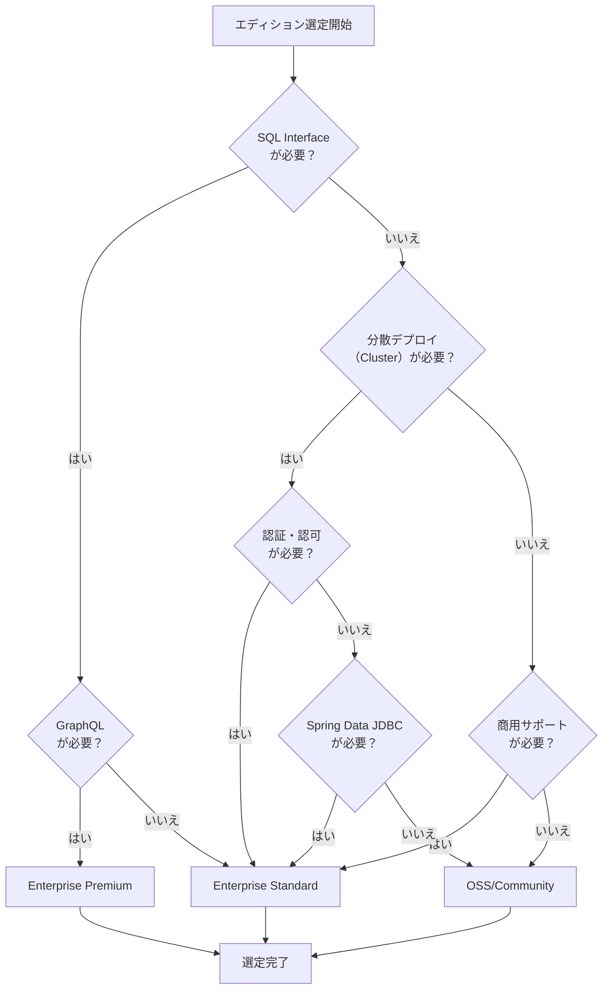

# ScalarDB Edition Profiles

3エディションの中央参照ドキュメント。全ScalarDB関連スキルから参照される。

## 1. エディション比較表

| 機能 | OSS/Community | Enterprise Standard | Enterprise Premium |
|------|---------------|--------------------|--------------------|
| **ライセンス** | Apache 2.0 | 商用ライセンス | 商用 (AWS Marketplace) |
| **デプロイモード** | 組み込み (Javaライブラリ) | ScalarDB Cluster | ScalarDB Cluster |
| **コンテナイメージ** | なし | `scalardb-cluster-node-byol` | `scalardb-cluster-node-byol-premium` |
| **Core Java API** | あり | あり (Cluster経由) | あり (Cluster経由) |
| **SQLインターフェース** | なし | あり | あり |
| **Spring Data JDBC** | なし | あり | あり |
| **GraphQL** | なし | なし | あり |
| **認証・認可** | なし | あり | あり |
| **Multi-Storage** | Javaコード内で設定 | Cluster設定 | Cluster設定 |
| **Two-Phase Commit** | あり (組み込み) | あり (Cluster経由) | あり (Cluster経由) |
| **ScalarDB Analytics** | なし | あり | あり |
| **MCP Server対応** | CRUD mode (Core API) | SQL mode | SQL mode |

### 対応ストレージバックエンド

| ストレージ | OSS/Community | Enterprise Standard | Enterprise Premium |
|-----------|---------------|--------------------|--------------------|
| PostgreSQL | JDBC経由 | JDBC経由 | JDBC経由 |
| MySQL | JDBC経由 | JDBC経由 | JDBC経由 |
| Oracle Database | なし | JDBC経由 | JDBC経由 |
| SQL Server | なし | JDBC経由 | JDBC経由 |
| Amazon Aurora | なし | JDBC経由 | JDBC経由 |
| Amazon DynamoDB | あり | あり | あり |
| Azure Cosmos DB | あり | あり | あり |
| Apache Cassandra | あり | あり | あり |
| SQLite | JDBC経由 | JDBC経由 | JDBC経由 |
| YugabyteDB | なし | JDBC経由 | JDBC経由 |
| MariaDB | なし | JDBC経由 | JDBC経由 |

## 2. 設定テンプレート

### 2A. OSS/Community Edition（組み込みモード）

アプリケーションに直接組み込むJavaライブラリとして使用。

```properties
# scalardb.properties (OSS/Community - Embedded Mode)
# Transaction manager
scalar.db.transaction_manager=consensus-commit
scalar.db.consensus_commit.isolation_level=SERIALIZABLE
scalar.db.consensus_commit.serializable_strategy=EXTRA_READ

# Storage (単一ストレージ)
scalar.db.storage=jdbc
scalar.db.contact_points=jdbc:postgresql://localhost:5432/mydb
scalar.db.username=postgres
scalar.db.password=postgres
```

```properties
# scalardb.properties (OSS/Community - Multi-Storage)
scalar.db.transaction_manager=consensus-commit
scalar.db.storage=multi-storage

# ストレージ定義
scalar.db.multi_storage.storages=postgres,cassandra

scalar.db.multi_storage.storages.postgres.storage=jdbc
scalar.db.multi_storage.storages.postgres.contact_points=jdbc:postgresql://localhost:5432/mydb
scalar.db.multi_storage.storages.postgres.username=postgres
scalar.db.multi_storage.storages.postgres.password=postgres

scalar.db.multi_storage.storages.cassandra.storage=cassandra
scalar.db.multi_storage.storages.cassandra.contact_points=localhost
scalar.db.multi_storage.storages.cassandra.username=cassandra
scalar.db.multi_storage.storages.cassandra.password=cassandra

# Namespace → ストレージマッピング
scalar.db.multi_storage.namespace_mapping=order_service:postgres,inventory_service:cassandra
scalar.db.multi_storage.default_storage=postgres
```

```java
// OSS/Community: 組み込みモード初期化
Properties props = new Properties();
props.load(new FileInputStream("scalardb.properties"));
TransactionFactory factory = TransactionFactory.create(props);
DistributedTransactionManager txManager = factory.getTransactionManager();

// トランザクション実行
DistributedTransaction tx = txManager.start();
try {
    // CRUD operations
    tx.commit();
} catch (Exception e) {
    tx.abort();
    throw e;
}

// シャットダウン時
txManager.close();
```

### 2B. Enterprise Standard Edition（Cluster Client モード）

ScalarDB Cluster に接続するクライアントSDKとして使用。

```properties
# scalardb.properties (Enterprise Standard/Premium - Cluster Client)
scalar.db.transaction_manager=cluster
scalar.db.contact_points=indirect:scalardb-cluster-envoy.default.svc.cluster.local
scalar.db.contact_port=60053

# gRPC設定
scalar.db.cluster.grpc.deadline_duration_millis=60000

# パフォーマンス最適化
scalar.db.cluster.client.scan_fetch_size=100
scalar.db.cluster.client.piggyback_begin.enabled=true
scalar.db.cluster.write_buffering.enabled=true

# TLS (本番環境推奨)
scalar.db.cluster.tls.enabled=true
scalar.db.cluster.tls.ca_root_cert_path=/certs/ca.pem

# 認証 (Enterprise)
scalar.db.cluster.auth.enabled=true
scalar.db.cluster.auth.username=admin
scalar.db.cluster.auth.password=admin_password
```

```properties
# ScalarDB Cluster Server設定 (scalardb-cluster-node.properties)
scalar.db.cluster.membership.type=KUBERNETES
scalar.db.cluster.membership.kubernetes.endpoint.namespace_name=default
scalar.db.cluster.membership.kubernetes.endpoint.name=scalardb-cluster

# ストレージ (サーバー側で設定)
scalar.db.storage=jdbc
scalar.db.contact_points=jdbc:postgresql://postgresql:5432/scalardb
scalar.db.username=${env:SCALAR_DB_CLUSTER_POSTGRES_USERNAME}
scalar.db.password=${env:SCALAR_DB_CLUSTER_POSTGRES_PASSWORD}

# ライセンス
scalar.db.cluster.node.licensing.license_key=<license-key>
scalar.db.cluster.node.licensing.license_check_cert_pem=<license-check-cert-pem>
```

```java
// Enterprise: Cluster Client モード初期化
Properties props = new Properties();
props.put("scalar.db.transaction_manager", "cluster");
props.put("scalar.db.contact_points", "indirect:192.168.10.1");
props.put("scalar.db.contact_port", "60053");
TransactionFactory factory = TransactionFactory.create(props);
DistributedTransactionManager txManager = factory.getTransactionManager();
```

### 2C. Enterprise Premium Edition（Cluster Client + SQL + GraphQL）

Standard の機能に加え、SQL Interface、GraphQL が利用可能。

```properties
# SQL Interface 設定 (Enterprise Standard/Premium)
scalar.db.sql.connection_mode=cluster
scalar.db.sql.cluster_mode.contact_points=indirect:scalardb-cluster-envoy.default.svc.cluster.local
scalar.db.sql.cluster_mode.contact_port=60053
```

```java
// Enterprise: SQL Interface
SqlSessionFactory sqlSessionFactory = SqlSessionFactory.builder()
    .withPropertiesFile("scalardb-sql.properties")
    .build();

SqlSession session = sqlSessionFactory.createSqlSession();
try {
    session.execute("INSERT INTO order_service.orders (id, customer_id, status) VALUES (?, ?, ?)",
        orderId, customerId, "PENDING");
    session.commit();
} catch (Exception e) {
    session.rollback();
    throw e;
}
```

### 2D. Helm Values テンプレート（Enterprise）

```yaml
# scalardb-cluster-custom-values.yaml (Enterprise Standard)
envoy:
  enabled: true
service:
  type: "LoadBalancer"
scalardbCluster:
  image:
    repository: "ghcr.io/scalar-labs/scalardb-cluster-node-byol"
  scalardbClusterNodeProperties: |
    scalar.db.cluster.membership.type=KUBERNETES
    scalar.db.cluster.membership.kubernetes.endpoint.namespace_name=${env:SCALAR_DB_CLUSTER_MEMBERSHIP_KUBERNETES_ENDPOINT_NAMESPACE_NAME}
    scalar.db.cluster.membership.kubernetes.endpoint.name=${env:SCALAR_DB_CLUSTER_MEMBERSHIP_KUBERNETES_ENDPOINT_NAME}
    scalar.db.storage=jdbc
    scalar.db.contact_points=jdbc:postgresql://postgresql:5432/scalardb
    scalar.db.username=${env:SCALAR_DB_CLUSTER_POSTGRES_USERNAME}
    scalar.db.password=${env:SCALAR_DB_CLUSTER_POSTGRES_PASSWORD}
    scalar.db.cluster.node.licensing.license_key=${env:SCALAR_DB_CLUSTER_LICENSE_KEY}
    scalar.db.cluster.node.licensing.license_check_cert_pem=${env:SCALAR_DB_CLUSTER_LICENSE_CHECK_CERT_PEM}
```

```yaml
# scalardb-cluster-custom-values.yaml (Enterprise Premium - AWS Marketplace)
scalardbCluster:
  image:
    repository: "ghcr.io/scalar-labs/scalardb-cluster-node-byol-premium"
  # Premium固有設定は同一（イメージが異なる）
```

## 3. 依存関係テンプレート

### build.gradle

```groovy
// OSS/Community Edition
dependencies {
    implementation 'com.scalar-labs:scalardb:3.14.0'
}

// Enterprise Standard/Premium (Cluster Client SDK)
dependencies {
    implementation 'com.scalar-labs:scalardb-cluster-java-client-sdk:3.14.0'
}

// Enterprise + SQL Interface
dependencies {
    implementation 'com.scalar-labs:scalardb-cluster-java-client-sdk:3.14.0'
    implementation 'com.scalar-labs:scalardb-sql-spring-data:3.14.0'
}

// Enterprise + Spring Data JDBC
dependencies {
    implementation 'com.scalar-labs:scalardb-cluster-java-client-sdk:3.14.0'
    implementation 'com.scalar-labs:scalardb-sql-spring-data:3.14.0'
}
```

## 4. エディション選定ガイドライン

### 選定フローチャート



### 判定基準表

| 要件 | OSS/Community | Standard | Premium |
|------|-----|----------|---------|
| プロトタイプ/PoC | 推奨 | - | - |
| 小規模プロダクション（単一サーバー） | 推奨 | - | - |
| 中規模プロダクション（マルチノード） | - | 推奨 | - |
| 大規模プロダクション（高可用性） | - | 推奨 | 推奨 |
| AWS Marketplace課金 | - | - | 推奨 |
| SQL APIでの開発効率重視 | 不可 | 推奨 | 推奨 |
| GraphQL API | 不可 | 不可 | 推奨 |
| 分析基盤（ScalarDB Analytics） | 不可 | 推奨 | 推奨 |
| ゼロトラストセキュリティ（認証・認可） | 不可 | 推奨 | 推奨 |
| Oracle/SQL Server接続 | 不可 | 推奨 | 推奨 |

## 5. API選択ガイド

| API | 対応エディション | 特徴 | 推奨ユースケース |
|-----|-----------------|------|-----------------|
| **Core Java API** | 全エディション | 低レベル、Get/Put/Delete/Scan | 高パフォーマンス要件、細粒度制御 |
| **SQL API** | Enterprise | SQL構文、JDBC互換 | 既存SQL資産活用、開発効率重視 |
| **Spring Data JDBC** | Enterprise | Spring Data統合、リポジトリ自動生成 | Spring Boot開発、RADアプローチ |
| **GraphQL** | Premium | GraphQL API | フロントエンド直接連携 |

## 6. Context7 MCP参照手順

ScalarDB関連スキル実行時に最新ドキュメントを取得する標準手順：

```
# Context7 Library ID
Library ID: /llmstxt/scalardb_scalar-labs_llms-full_txt

# 使用方法（サブエージェント内で実行）
mcp__context7__query-docs(
  libraryId="/llmstxt/scalardb_scalar-labs_llms-full_txt",
  query="<検索クエリ>"
)

# 推奨クエリ例
- エディション機能: "ScalarDB editions comparison features"
- Cluster設定: "ScalarDB Cluster configuration properties"
- Multi-Storage: "multi-storage transaction configuration"
- 2PC: "two-phase commit transaction manager"
- SQL Interface: "SQL interface configuration connection mode"
- Spring Data: "Spring Data JDBC ScalarDB integration"
- ライセンス: "ScalarDB Enterprise license configuration"
```

## 7. エディション設定ファイル形式

`/select-scalardb-edition` スキルが出力する設定ファイルの形式：

```yaml
---
edition: enterprise-standard  # oss | enterprise-standard | enterprise-premium
deployment_mode: cluster      # embedded | cluster
api_type: sql                 # core | sql | spring-data | graphql
features:
  two_phase_commit: true
  multi_storage: true
  auth: true
  analytics: false
storage_backends:
  - type: jdbc
    database: postgresql
    role: primary
  - type: dynamodb
    role: secondary
scalardb_version: "3.14.0"
---

# ScalarDB Edition Configuration

## 選定理由
[エディション選定の理由を記述]

## 構成概要
[選定したエディションの構成を記述]
```

このファイルは `work/{project}/scalardb-edition-config.md` に保存され、以下のスキルから参照される：
- `/design-scalardb` - データアーキテクチャ設計
- `/design-scalardb-app-patterns` - アプリケーション設計パターン
- `/generate-scalardb-code` - コード生成
- `/design-implementation` - 実装仕様
- `/scalardb-sizing-estimator` - サイジング見積もり
- `/review-scalardb` - 設計・コードレビュー
