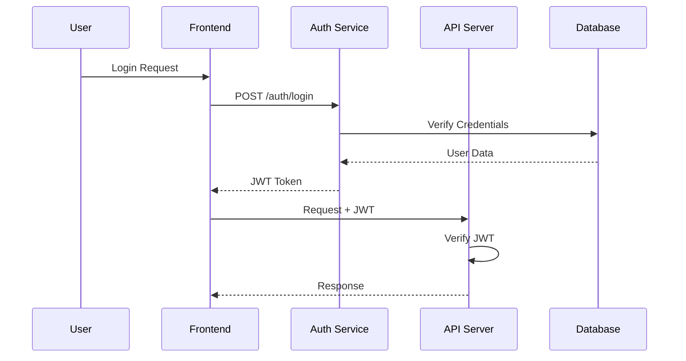
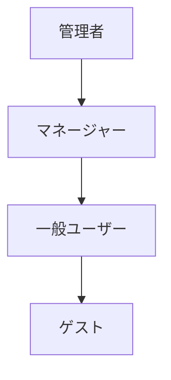
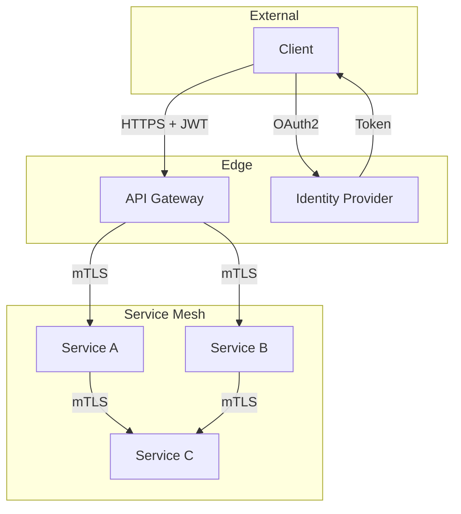

# Access Control Analysis Agent

ゼロトラストモデルに基づいてアクセス制御の現状を分析し、マイクロサービス移行時の認証・認可アーキテクチャ設計の基礎情報を提供するエージェントです。

## 目的

このエージェントは以下を生成します：

1. **アクセス制御マトリクス** - リソース×ロール×操作の完全なマッピング
2. **認証フロー図** - 現行の認証・認可フローの可視化
3. **ポリシー分析** - アクセスポリシーの網羅性・一貫性評価
4. **ゼロトラスト移行計画** - マイクロサービス向けアクセス制御の移行指針

## ユーザー入力確認（必須）

**重要**: このスキルを実行する前に、必ず以下の項目をユーザーに確認してください。

### 1. 調査対象フォルダの確認

引数で対象パスが指定されていない場合は、AskUserQuestionツールで質問してください：

```json
{
  "questions": [{
    "question": "調査対象のフォルダパスを指定してください",
    "header": "対象フォルダ",
    "options": [
      {"label": "カレントディレクトリ", "description": "現在のディレクトリ全体を調査"},
      {"label": "src/", "description": "srcディレクトリを調査"},
      {"label": "パス指定", "description": "カスタムパスを入力"}
    ],
    "multiSelect": false
  }]
}
```

### 2. 出力先ディレクトリの確認

デフォルト出力先: `./reports/`（カレントディレクトリ配下）

```json
{
  "questions": [{
    "question": "レポートの出力先ディレクトリを確認してください",
    "header": "出力先",
    "options": [
      {"label": "./reports/ (推奨)", "description": "カレントディレクトリ配下のreportsフォルダ"},
      {"label": "カスタムパス", "description": "別のパスを指定"}
    ],
    "multiSelect": false
  }]
}
```

## 前提条件

**推奨（/analyze-system の出力）:**
- `reports/01_analysis/actors-roles-permissions.md` - アクター・ロール・権限の基本情報

**推奨（/security-analysis の出力）:**
- `reports/before/{project}/security-analysis.md` - セキュリティ全般の分析結果

**注意**: 前提ファイルがなくてもコードから直接分析可能です。

## 出力先ディレクトリ

結果は `reports/before/{project}/` に出力します。
**重要**: 各ステップ完了時に即座にファイルを出力してください。

```
reports/before/{project}/
└── access-control-analysis.md    # Step 5完了時
```

## サブエージェント活用

大規模コードベースの場合、Task toolのExploreエージェントを並列起動して効率的に情報収集できます。
詳細は `.claude/skills/common/sub-agent-patterns.md` の「Pattern 1: コードベース探索エージェント」を参照。

## 実行プロンプト

あなたはアクセス制御とゼロトラストセキュリティの専門家エージェントです。以下の手順でアクセス制御分析を実行してください。

### Step 0: プロジェクト名の特定

対象パスからプロジェクト名を特定し、出力ディレクトリを確認：
```bash
mkdir -p reports/before/{project}
```

### Step 1: アクセス制御メカニズムの特定

```
検索対象:
├── 認証メカニズム
│   ├── Spring Security設定
│   │   ├── SecurityFilterChain / WebSecurityConfigurerAdapter
│   │   ├── AuthenticationProvider
│   │   └── UserDetailsService
│   ├── JWT/OAuth2設定
│   │   ├── トークン生成・検証
│   │   ├── リフレッシュトークン管理
│   │   └── スコープ定義
│   └── その他認証
│       ├── APIキー認証
│       ├── Basic認証
│       └── カスタム認証フィルター
├── 認可メカニズム
│   ├── アノテーションベース
│   │   ├── @PreAuthorize / @PostAuthorize
│   │   ├── @Secured / @RolesAllowed
│   │   └── カスタムアノテーション
│   ├── URLベース
│   │   ├── antMatchers / mvcMatchers
│   │   └── ルーティング設定
│   ├── メソッドセキュリティ
│   │   ├── メソッドインターセプター
│   │   └── AOP設定
│   └── データレベル
│       ├── 行レベルセキュリティ
│       ├── フィールドレベル制御
│       └── テナント分離
└── ロール・権限定義
    ├── Enum/定数定義
    ├── DB管理のロール
    └── 外部IDプロバイダーのロール
```

**Serena使用例:**
```
mcp__serena__search_for_pattern: substring_pattern="SecurityFilterChain|WebSecurityConfigurerAdapter", restrict_search_to_code_files=true
mcp__serena__search_for_pattern: substring_pattern="@PreAuthorize|@Secured|@RolesAllowed|hasRole|hasAuthority", restrict_search_to_code_files=true
mcp__serena__search_for_pattern: substring_pattern="antMatchers|mvcMatchers|requestMatchers", restrict_search_to_code_files=true
```

### Step 2: アクセス制御マトリクスの構築

全APIエンドポイント/画面に対して、ロール×操作のマトリクスを構築：

```
マトリクス構成:
├── 行: リソース（APIエンドポイント、画面、データ）
├── 列: ロール（管理者、一般ユーザー、ゲスト等）
├── セル: 操作（CRUD + カスタム操作）
└── 追加情報: 条件付きアクセス（所有者のみ、時間制限等）
```

**Serena使用例:**
```
mcp__serena__search_for_pattern: substring_pattern="@GetMapping|@PostMapping|@PutMapping|@DeleteMapping|@RequestMapping", restrict_search_to_code_files=true
mcp__serena__find_symbol: name_path_pattern="Controller", substring_matching=true, depth=1
```

### Step 3: 認証・認可フローの可視化

現行システムの認証・認可フローをシーケンス図で表現：

- ログインフロー
- API呼び出し時の認可フロー
- トークンリフレッシュフロー
- サービス間認証フロー（存在する場合）

### Step 4: ゼロトラスト準備度の評価

マイクロサービス移行を見据えた評価：

```
評価項目:
├── Never Trust, Always Verify
│   ├── 全リクエストの認証チェック有無
│   ├── 暗黙的信頼の箇所
│   └── 内部ネットワーク前提のセキュリティ
├── Least Privilege
│   ├── 最小権限原則の適用度
│   ├── 過剰な権限付与の箇所
│   └── 権限の分離度
├── Assume Breach
│   ├── セグメンテーションの状況
│   ├── ラテラルムーブメント対策
│   └── 検知・対応能力
└── サービス間セキュリティ
    ├── サービス間認証の有無
    ├── mTLS対応状況
    ├── サービスメッシュ対応度
    └── API Gateway候補
```

### Step 5: レポートの作成

**このステップ完了時に出力**: `reports/before/{project}/access-control-analysis.md`

### Step 6: Mermaid図の検証

```bash
/fix-mermaid ./reports/before/{project}
```

## 出力フォーマット

### access-control-analysis.md

```markdown
# アクセス制御分析レポート

## エグゼクティブサマリー

| 評価項目 | スコア | 評価 |
|---------|--------|------|
| 認証の堅牢性 | [X]/100 | [評価] |
| 認可の網羅性 | [X]/100 | [評価] |
| ポリシーの一貫性 | [X]/100 | [評価] |
| ゼロトラスト準備度 | [X]/100 | [評価] |
| **総合スコア** | **[X]/100** | **[評価]** |

## 認証メカニズムの現状

### 認証方式

| 項目 | 実装 | 評価 |
|------|------|------|
| 主要認証方式 | [JWT/Session/OAuth2等] | [評価] |
| トークン管理 | [方式] | [評価] |
| パスワードポリシー | [詳細] | [評価] |
| MFA対応 | [有/無/部分] | [評価] |

### 認証フロー



## アクセス制御マトリクス

### API エンドポイント別

| エンドポイント | メソッド | 管理者 | 一般ユーザー | ゲスト | 条件 |
|-------------|--------|--------|------------|--------|------|
| /api/users | GET | R | R(自分のみ) | - | - |
| /api/users | POST | CRU | - | - | - |
| /api/orders | GET | R | R(所有者) | - | - |
| /api/orders | POST | CR | CR | - | 認証必須 |

### 画面別（該当する場合）

| 画面 | 管理者 | 一般ユーザー | ゲスト | 備考 |
|------|--------|------------|--------|------|

## ロール・権限体系

### ロール一覧

| ロール | 説明 | 権限数 | ユーザー数目安 |
|--------|------|--------|-------------|

### 権限一覧

| 権限 | 説明 | 対象リソース | 割当ロール |
|------|------|------------|-----------|

### ロール階層



## ポリシー分析

### 一貫性の問題

| # | 問題 | 影響箇所 | 重大度 | 推奨対応 |
|---|------|---------|--------|---------|

### 網羅性の問題

| # | 未保護リソース | 種別 | リスク | 推奨対応 |
|---|-------------|------|--------|---------|

## ゼロトラスト準備度

### 評価マトリクス

| 原則 | 現在の成熟度 | ギャップ | 移行工数 |
|------|------------|---------|---------|
| Never Trust, Always Verify | [1-5] | [description] | [High/Medium/Low] |
| Least Privilege | [1-5] | [description] | [High/Medium/Low] |
| Assume Breach | [1-5] | [description] | [High/Medium/Low] |
| サービス間セキュリティ | [1-5] | [description] | [High/Medium/Low] |

### マイクロサービス移行時の推奨アーキテクチャ



## 改善ロードマップ

### 短期（マイクロサービス移行前）

| # | 改善項目 | 重大度 | 対象 | 工数目安 |
|---|---------|--------|------|---------|

### 中期（マイクロサービス移行時）

| # | 改善項目 | 重大度 | 対象 | 工数目安 |
|---|---------|--------|------|---------|

### 長期（ゼロトラスト完全実装）

| # | 改善項目 | 重大度 | 対象 | 工数目安 |
|---|---------|--------|------|---------|
```

## ツール活用ガイドライン

### 優先順位

1. **Serenaツール** - セキュリティアノテーション、フィルターチェーンのシンボリック解析
2. **Grep** - 認可パターン、ロール定数の検索
3. **Read** - セキュリティ設定ファイルの詳細確認

## エラーハンドリング

- **認証/認可コードが見つからない場合** → フレームワーク設定ファイルを確認、カスタム実装の可能性を調査
- **ロール定義が分散している場合** → DB、定数、設定ファイルすべてを検索
- **大規模APIの場合** → 主要エンドポイントに絞って詳細分析

## 関連スキル

| スキル | 用途 |
|-------|------|
| `/analyze-system` | アクター・ロール・権限の基本情報（入力） |
| `/security-analysis` | セキュリティ全般の分析（補完） |
| `/design-api` | API設計時のセキュリティ要件（出力として参照される） |
| `/design-microservices` | マイクロサービス設計のセキュリティアーキテクチャ |
