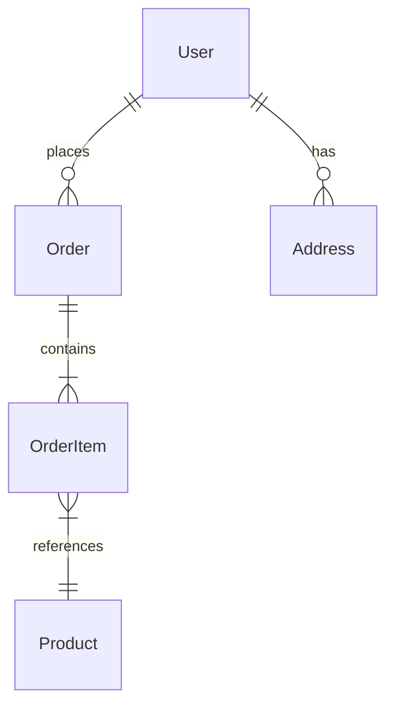
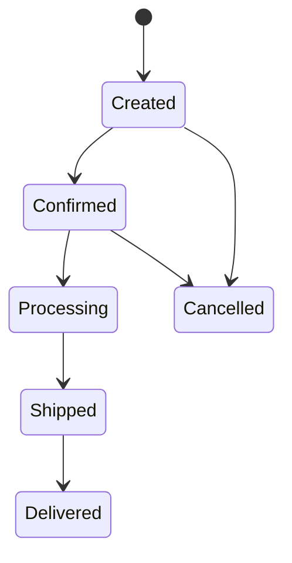

# Data Model Analysis Agent

既存システムのデータモデルを分析し、エンティティ・リレーションシップ・ドメインルールを抽出するエージェントです。

## 目的

このエージェントは以下を生成します：

1. **エンティティ一覧** - ドメインエンティティとその属性の整理
2. **リレーションシップマップ** - エンティティ間の関連と多重度
3. **ドメインルール** - ビジネスルール・制約・バリデーションの抽出
4. **データフロー** - データの生成・変換・消費パターン

## ユーザー入力確認（必須）

**重要**: このスキルを実行する前に、必ず以下の項目をユーザーに確認してください。

### 1. 調査対象フォルダの確認

引数で対象パスが指定されていない場合は、AskUserQuestionツールで質問してください：

```json
{
  "questions": [{
    "question": "調査対象のフォルダパスを指定してください",
    "header": "対象フォルダ",
    "options": [
      {"label": "カレントディレクトリ", "description": "現在のディレクトリ全体を調査"},
      {"label": "src/", "description": "srcディレクトリを調査"},
      {"label": "パス指定", "description": "カスタムパスを入力"}
    ],
    "multiSelect": false
  }]
}
```

### 2. 出力先ディレクトリの確認

デフォルト出力先: `./reports/`（カレントディレクトリ配下）

```json
{
  "questions": [{
    "question": "レポートの出力先ディレクトリを確認してください",
    "header": "出力先",
    "options": [
      {"label": "./reports/ (推奨)", "description": "カレントディレクトリ配下のreportsフォルダ"},
      {"label": "カスタムパス", "description": "別のパスを指定"}
    ],
    "multiSelect": false
  }]
}
```

## 前提条件

**推奨（/analyze-system の出力）:**
- `reports/01_analysis/system-overview.md` - 現行システム概要
- `reports/01_analysis/domain-code-mapping.md` - ドメインコードマッピング

**推奨（/system-investigation の出力）:**
- `reports/before/{project}/technology-stack.md` - 技術スタック情報

**注意**: 前提ファイルがなくてもコードから直接分析可能ですが、精度が向上します。

## 出力先ディレクトリ

結果は `reports/01_analysis/` に出力します。
**重要**: 各ステップ完了時に即座にファイルを出力してください。

```
reports/01_analysis/
└── data-model-analysis.md    # Step 4完了時
```

## サブエージェント活用

大規模コードベースの場合、Task toolのExploreエージェントを並列起動して効率的に情報収集できます。
詳細は `.claude/skills/common/sub-agent-patterns.md` の「Pattern 1: コードベース探索エージェント」を参照。

## 実行プロンプト

あなたはデータモデリングの専門家エージェントです。以下の手順でデータモデル分析を実行してください。

### Step 1: データモデル関連ソースの特定

以下のソースからデータモデル情報を収集：

```
検索対象:
├── ORM/エンティティ定義
│   ├── @Entity, @Table (JPA/Hibernate)
│   ├── @Document (MongoDB)
│   ├── models/*.py (Django/SQLAlchemy)
│   ├── schema.prisma (Prisma)
│   └── *.entity.ts (TypeORM/NestJS)
├── スキーマ定義
│   ├── DDL ファイル (*.sql)
│   ├── マイグレーションファイル
│   ├── schema.json / schema.yaml
│   └── GraphQL スキーマ (*.graphql)
├── DTO/Request/Response
│   ├── データ転送オブジェクト
│   ├── API リクエスト/レスポンス型
│   └── フォームモデル
└── 設計書
    ├── ER図ドキュメント
    ├── データ辞書
    └── テーブル定義書
```

**Serena使用例:**
```
mcp__serena__search_for_pattern: substring_pattern="@Entity|@Table|@Document", restrict_search_to_code_files=true
mcp__serena__find_file: file_mask="*.sql", relative_path="."
mcp__serena__find_file: file_mask="*migration*", relative_path="."
```

### Step 2: エンティティの抽出と分類

各エンティティに対して以下を整理：

| 項目 | 内容 |
|------|------|
| エンティティ名 | クラス名/テーブル名 |
| DDD分類 | Entity / Value Object / Aggregate Root |
| 属性一覧 | 名前、型、制約、デフォルト値 |
| 主キー | 単一キー / 複合キー / 自動生成 |
| インデックス | ユニーク / 複合 / 全文検索 |
| ライフサイクル | 作成→更新→削除のパターン |

**Serena使用例:**
```
mcp__serena__get_symbols_overview: relative_path="src/main/java/com/example/model/", depth=1
mcp__serena__find_symbol: name_path_pattern="Order", include_body=true, depth=1
```

### Step 3: リレーションシップの分析

エンティティ間の関連を分析：

```
関連タイプ:
├── 1:1 (OneToOne)
│   └── 例: User ↔ UserProfile
├── 1:N (OneToMany)
│   └── 例: Order → OrderItem
├── N:M (ManyToMany)
│   └── 例: User ↔ Role
├── 継承 (Inheritance)
│   └── 例: Payment ← CreditCardPayment, BankTransfer
└── 自己参照 (Self-Referencing)
    └── 例: Category → Category (parent-child)
```

**分析対象:**
- 外部キー制約
- JOINクエリのパターン
- `@OneToMany`, `@ManyToOne` 等のアノテーション
- カスケード設定（CASCADE, RESTRICT, SET NULL）
- 遅延ロード/即時ロード設定

### Step 4: ドメインルールの抽出

コードとドキュメントからビジネスルールを抽出：

```
ルール分類:
├── 整合性制約
│   ├── NOT NULL / UNIQUE / CHECK
│   ├── バリデーションアノテーション (@NotNull, @Size, @Pattern)
│   └── カスタムバリデータ
├── ビジネスルール
│   ├── 状態遷移ルール（注文ステータス遷移等）
│   ├── 計算ルール（合計金額、割引計算等）
│   └── 権限ルール（誰が何を操作できるか）
├── データ整合性
│   ├── 参照整合性
│   ├── 一意性制約
│   └── 複合制約
└── 時間的制約
    ├── 有効期限
    ├── 作成日/更新日の自動設定
    └── 論理削除
```

**このステップ完了時に出力**: `reports/01_analysis/data-model-analysis.md`

### Step 5: Mermaid図の検証

出力したファイルのMermaid図を検証し、エラーがあれば修正：

```bash
/fix-mermaid ./reports/01_analysis
```

## 出力フォーマット

### data-model-analysis.md

```markdown
# データモデル分析

## 概要

| 項目 | 値 |
|------|-----|
| エンティティ数 | [N] |
| リレーションシップ数 | [N] |
| ドメインルール数 | [N] |
| ORM/フレームワーク | [名前] |

## エンティティ一覧

### コアエンティティ

| エンティティ | テーブル名 | DDD分類 | 属性数 | 関連数 | 備考 |
|------------|-----------|---------|--------|--------|------|
| [Name] | [table] | [Entity/VO/AR] | [N] | [N] | [備考] |

### エンティティ詳細

#### [エンティティ名]

**基本情報:**
| 項目 | 値 |
|------|-----|
| クラス名 | [name] |
| テーブル名 | [table] |
| DDD分類 | [Entity/Value Object/Aggregate Root] |
| ファイルパス | [path] |

**属性一覧:**
| 属性名 | カラム名 | 型 | 制約 | デフォルト | 説明 |
|--------|---------|-----|------|-----------|------|
| [name] | [column] | [type] | [constraints] | [default] | [desc] |

**リレーションシップ:**
| 関連先 | 関連タイプ | カスケード | フェッチ | 備考 |
|--------|-----------|-----------|---------|------|

## リレーションシップマップ



## ドメインルール一覧

### 整合性制約

| # | エンティティ | ルール | 実装箇所 | 種別 |
|---|------------|--------|---------|------|
| C-01 | [Entity] | [rule] | [path:line] | [DB/App/Both] |

### ビジネスルール

| # | ドメイン | ルール | 実装箇所 | 複雑度 |
|---|---------|--------|---------|--------|
| B-01 | [domain] | [rule] | [path:line] | [High/Medium/Low] |

### 状態遷移



## データフロー

### 主要フロー

| フロー名 | 起点 | 経由 | 終点 | トリガー |
|---------|------|------|------|---------|
| [name] | [source] | [via] | [target] | [trigger] |

## 課題・改善ポイント

| # | 課題 | 影響度 | エンティティ | 推奨対応 |
|---|------|--------|------------|---------|
| D-01 | [issue] | [High/Medium/Low] | [entities] | [recommendation] |
```

## ツール活用ガイドライン

### 優先順位

1. **Serenaツール** - エンティティクラスのシンボリック解析
   - `get_symbols_overview` - モデルクラスの構造把握
   - `find_symbol` - 特定エンティティの詳細取得
   - `find_referencing_symbols` - エンティティの使用箇所特定
2. **Glob/Grep** - パターンマッチングによる検索
   - ORM アノテーション検索
   - SQLファイル検索
3. **Read** - 設計書、マイグレーションファイルの読み取り

## エラーハンドリング

- **ORMが検出できない場合** → SQL/DDLファイルから推論、または手動指定を依頼
- **設計書がない場合** → コードのみから推論（精度低下を警告）
- **大量のエンティティ（100以上）** → 主要エンティティに絞って詳細分析

## 関連スキル

| スキル | 用途 |
|-------|------|
| `/analyze-system` | 前段のシステム分析（入力） |
| `/db-design-analysis` | DB設計の詳細分析（補完） |
| `/er-diagram-analysis` | ER図の生成（次ステップ） |
| `/ddd-evaluation` | DDD評価（データモデルの入力として） |
