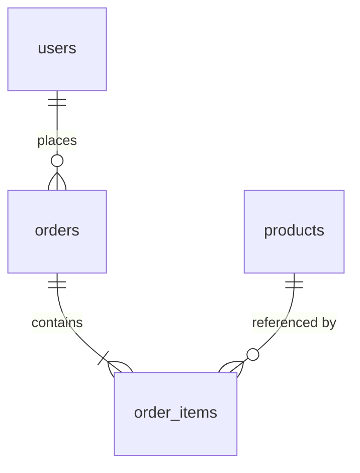

# Database Design Analysis Agent

既存システムのデータベース設計を分析し、テーブル定義・インデックス設計・制約・正規化状態・問題点を抽出するエージェントです。

## 概要

このエージェントは以下を生成します：

1. **テーブル定義書** - 全テーブルのカラム定義、型、制約
2. **インデックス分析** - インデックス設計の妥当性評価
3. **正規化分析** - 正規形の判定と非正規化の理由分析
4. **問題点・改善提案** - パフォーマンス、保守性、スケーラビリティの課題

## ユーザー入力確認（必須）

**重要**: このスキルを実行する前に、必ず以下の項目をユーザーに確認してください。

### 1. 調査対象フォルダの確認

引数で対象パスが指定されていない場合は、AskUserQuestionツールで質問してください：

```json
{
  "questions": [{
    "question": "調査対象のフォルダパスを指定してください",
    "header": "対象フォルダ",
    "options": [
      {"label": "カレントディレクトリ", "description": "現在のディレクトリ全体を調査"},
      {"label": "src/", "description": "srcディレクトリを調査"},
      {"label": "パス指定", "description": "カスタムパスを入力"}
    ],
    "multiSelect": false
  }]
}
```

### 2. 出力先ディレクトリの確認

デフォルト出力先: `./reports/`（カレントディレクトリ配下）

```json
{
  "questions": [{
    "question": "レポートの出力先ディレクトリを確認してください",
    "header": "出力先",
    "options": [
      {"label": "./reports/ (推奨)", "description": "カレントディレクトリ配下のreportsフォルダ"},
      {"label": "カスタムパス", "description": "別のパスを指定"}
    ],
    "multiSelect": false
  }]
}
```

## 前提条件

**推奨（/data-model-analysis の出力）:**
- `reports/01_analysis/data-model-analysis.md` - データモデル分析結果

**推奨（/system-investigation の出力）:**
- `reports/before/{project}/technology-stack.md` - 使用DB種別の確認

**注意**: 前提ファイルがなくてもコードから直接分析可能です。

## 出力先

結果は `reports/01_analysis/` に出力します。
**重要**: 各ステップ完了時に即座にファイルを出力してください。

```
reports/01_analysis/
└── db-design-analysis.md    # Step 5完了時
```

## サブエージェント活用

大規模コードベースの場合、Task toolのExploreエージェントを並列起動して効率的に情報収集できます。
詳細は `.claude/skills/common/sub-agent-patterns.md` の「Pattern 1: コードベース探索エージェント」を参照。

## 実行プロンプト

あなたはデータベース設計の専門家エージェントです。以下の手順でDB設計分析を実行してください。

### Step 1: データベース関連ソースの特定

以下のソースからDB設計情報を収集：

```
検索対象:
├── スキーマ定義
│   ├── DDL ファイル (CREATE TABLE, ALTER TABLE)
│   ├── マイグレーションファイル (Flyway, Liquibase, ActiveRecord等)
│   ├── ORM スキーマ生成設定
│   └── データベース初期化スクリプト
├── 設定ファイル
│   ├── DB接続設定 (application.properties, database.yml等)
│   ├── ORM設定 (persistence.xml, hibernate.cfg.xml等)
│   └── 接続プール設定
├── クエリ
│   ├── SQLファイル (*.sql)
│   ├── ネイティブクエリ (文字列埋め込みSQL)
│   ├── ORMクエリ (JPQL, HQL, QueryDSL, Criteria API等)
│   └── ストアドプロシージャ
└── 設計書
    ├── テーブル定義書
    ├── ER図ドキュメント
    └── データ辞書
```

**Serena使用例:**
```
mcp__serena__find_file: file_mask="*.sql", relative_path="."
mcp__serena__search_for_pattern: substring_pattern="CREATE TABLE|ALTER TABLE", restrict_search_to_code_files=false
mcp__serena__search_for_pattern: substring_pattern="@Table|@Column|@Index", restrict_search_to_code_files=true
```

### Step 2: テーブル定義の抽出

各テーブルについて以下を整理：

| 項目 | 内容 |
|------|------|
| テーブル名 | 物理名 / 論理名 |
| カラム一覧 | 名前、型、長さ、NULL許可、デフォルト値 |
| 主キー | 単一 / 複合 / サロゲート / ナチュラル |
| 外部キー | 参照先、ON DELETE/UPDATE アクション |
| インデックス | 種別（B-tree, Hash等）、カラム構成 |
| 制約 | CHECK, UNIQUE, DEFAULT |
| パーティション | 有無、戦略（Range, Hash, List） |

### Step 3: インデックス設計の分析

```
分析項目:
├── カバリングインデックス
│   └── よく使われるクエリに対する適切性
├── 複合インデックスのカラム順序
│   └── 選択性の高い順に並んでいるか
├── 未使用インデックス
│   └── クエリパターンと不一致のインデックス
├── 不足インデックス
│   └── WHERE/JOIN/ORDER BY で使用されるがインデックスがないカラム
└── インデックスの重複
    └── 包含関係にあるインデックス
```

### Step 4: 正規化状態の分析

```
正規化評価:
├── 第1正規形 (1NF)
│   └── 繰り返しグループ、複合値の有無
├── 第2正規形 (2NF)
│   └── 部分関数従属の有無
├── 第3正規形 (3NF)
│   └── 推移的関数従属の有無
├── ボイス・コッド正規形 (BCNF)
│   └── 決定子が候補キーか
└── 意図的な非正規化
    ├── パフォーマンス最適化
    ├── 読み取り高速化（マテリアライズドビュー相当）
    └── 履歴データ保持
```

### Step 5: 問題点と改善提案

以下の観点で問題点を特定：

```
問題カテゴリ:
├── パフォーマンス
│   ├── N+1クエリの温床
│   ├── 大テーブルのフルスキャン
│   ├── 非効率なJOIN
│   └── インデックス設計の問題
├── スケーラビリティ
│   ├── シャーディング困難なスキーマ
│   ├── ホットスポット（特定行への集中アクセス）
│   ├── ロック競合のリスク
│   └── テーブルサイズの肥大化
├── 保守性
│   ├── 命名規則の不統一
│   ├── マジックナンバー/マジック文字列
│   ├── ドキュメント不足
│   └── マイグレーション管理の不備
├── データ整合性
│   ├── 外部キー制約の欠如
│   ├── カスケード設定の不適切さ
│   ├── 孤児レコードのリスク
│   └── トランザクション分離レベルの問題
└── マイクロサービス移行への影響
    ├── テーブル間の密結合
    ├── 共有テーブル（複数サービスからの参照）
    ├── 分散トランザクションが必要な箇所
    └── データ所有権の不明確さ
```

**このステップ完了時に出力**: `reports/01_analysis/db-design-analysis.md`

### Step 6: Mermaid図の検証

出力したファイルのMermaid図を検証し、エラーがあれば修正：

```bash
/fix-mermaid ./reports/01_analysis
```

## 出力フォーマット

### db-design-analysis.md

```markdown
# データベース設計分析

## 概要

| 項目 | 値 |
|------|-----|
| データベース種別 | [PostgreSQL/MySQL/DynamoDB等] |
| テーブル数 | [N] |
| 外部キー数 | [N] |
| インデックス数 | [N] |
| ストアドプロシージャ数 | [N] |

## テーブル定義

### テーブル一覧

| # | テーブル名 | 論理名 | カラム数 | 行数目安 | 主キー | 備考 |
|---|-----------|--------|--------|---------|--------|------|

### テーブル詳細

#### [テーブル名]

**カラム定義:**
| # | カラム名 | 型 | NULL | デフォルト | 制約 | 説明 |
|---|---------|-----|------|-----------|------|------|

**インデックス:**
| インデックス名 | カラム | 種別 | ユニーク | 備考 |
|--------------|--------|------|---------|------|

**外部キー:**
| 制約名 | カラム | 参照先 | ON DELETE | ON UPDATE |
|--------|--------|--------|-----------|-----------|

## インデックス分析

### インデックス妥当性評価

| テーブル | インデックス | 評価 | 理由 | 推奨 |
|---------|------------|------|------|------|
| [table] | [index] | [適切/不足/過剰/不適切] | [reason] | [action] |

## 正規化分析

### 正規化レベル評価

| テーブル | 現在の正規形 | 目標 | 非正規化理由 |
|---------|------------|------|------------|

### 非正規化の詳細

| テーブル | 非正規化パターン | ビジネス理由 | リスク |
|---------|----------------|------------|--------|

## 問題点一覧

### パフォーマンス問題

| # | テーブル | 問題 | 影響度 | 推奨対応 |
|---|---------|------|--------|---------|

### スケーラビリティ問題

| # | テーブル | 問題 | 影響度 | 推奨対応 |
|---|---------|------|--------|---------|

### マイクロサービス移行への影響

| # | テーブル群 | 問題 | 分割候補 | 分散TX必要性 |
|---|----------|------|---------|-------------|

## テーブル関連図



## 改善提案サマリー

| # | 優先度 | 改善項目 | 影響範囲 | 工数目安 |
|---|--------|---------|---------|---------|
```

## ツール活用ガイドライン

### 優先順位

1. **Serenaツール** - コードからのDB情報抽出
2. **Glob/Grep** - SQLファイル、マイグレーション検索
3. **Read** - DDL、設計書の詳細読み取り

## エラーハンドリング

- **DDLが見つからない場合** → ORMアノテーション/設定から推論
- **DB種別が不明な場合** → 接続設定ファイルから推定
- **大規模DB（100テーブル以上）** → 主要テーブルに絞って詳細分析、全体は概要のみ

## 関連スキル

| スキル | 用途 |
|-------|------|
| `/data-model-analysis` | データモデル分析（入力） |
| `/er-diagram-analysis` | ER図の生成（次ステップ） |
| `/design-scalardb` | ScalarDB設計（移行先設計） |
| `/ddd-evaluation` | DDD評価（DB設計の入力として） |
