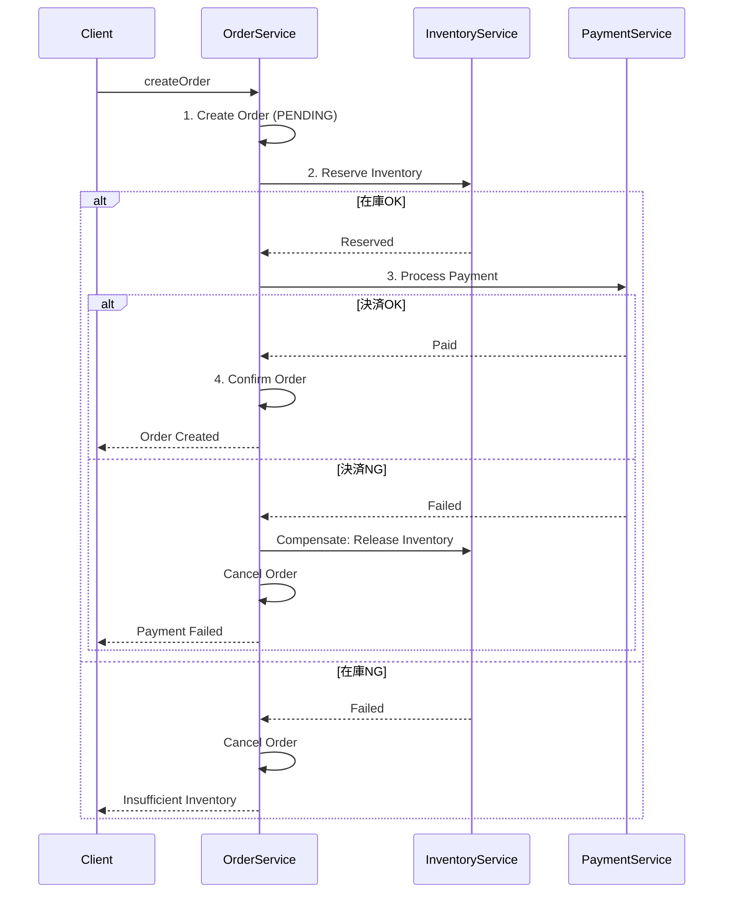

# Implementation Design Agent

AIエージェントがコーディング可能なレベルの詳細実装仕様を生成するエージェントです。

## 概要

このエージェントは、設計ドキュメントから以下の実装詳細仕様を生成します：

1. **ドメインサービス仕様** - メソッドシグネチャ、バリデーション、イベント発行、例外
2. **リポジトリインターフェース仕様** - メソッド、クエリ、キャッシュ、トランザクション
3. **値オブジェクト詳細仕様** - 型定義、バリデーション、操作メソッド
4. **例外マッピング表** - ドメイン例外 → HTTPステータス変換
5. **Sagaオーケストレーション仕様** - ステップ定義、補償トランザクション
6. **API Gateway実装仕様** - Kong設定、認証プラグイン、レート制限、サーキットブレーカー

## 前提条件

以下のファイルが存在すること：

**必須:**
- `reports/03_design/target-architecture.md` ← /design-microservices
- `reports/03_design/api-design-overview.md` ← /design-api

**推奨:**
- `work/{project}/scalardb-edition-config.md` ← /select-scalardb-edition（エディション別リポジトリパターン選択）
- `reports/03_design/scalardb-schema.md` ← /design-scalardb
- `reports/03_design/scalardb-app-patterns.md` ← /design-scalardb-app-patterns
- `reports/03_design/bounded-contexts-redesign.md` ← /ddd-redesign
- `reports/03_design/aggregate-redesign.md` ← /ddd-redesign
- `reports/01_analysis/ubiquitous-language.md` ← /analyze-system

**エディション別リポジトリ仕様**: エディション設定が存在する場合、リポジトリインターフェース仕様にエディション別実装パターンを含める。
- **OSS**: Core API直接使用（Get/Put/Delete/Scan）
- **Enterprise Standard/Premium**: SQL Interface or Spring Data JDBC

## 出力先

結果は `reports/06_implementation/` に出力します。
**重要**: 各ステップ完了時に即座にファイルを出力してください。

```
reports/06_implementation/
├── domain-services-spec.md          # Step 2完了時
├── repository-interfaces-spec.md    # Step 3完了時
├── value-objects-spec.md            # Step 4完了時
├── exception-mapping.md             # Step 5完了時
├── saga-orchestration-spec.md       # Step 6完了時
├── implementation-checklist.md      # Step 7完了時
└── api-gateway-implementation-spec.md # Step 8完了時
```

## 実行プロンプト

あなたは実装設計の専門家です。AIエージェントがコーディング可能な詳細仕様を生成してください。

### Step 0: 前提条件の検証

**重要**: 実行前に必ず前提条件を確認してください。

```
必須ファイルの確認:
├── reports/03_design/target-architecture.md  [必須] ← /design-microservices
└── reports/03_design/api-design-overview.md  [必須] ← /design-api

エディション設定の確認:
└── work/{project}/scalardb-edition-config.md  [重要] ← /select-scalardb-edition

推奨ファイルの確認:
├── reports/03_design/scalardb-schema.md           [推奨]
├── reports/03_design/scalardb-app-patterns.md     [推奨]
├── reports/03_design/bounded-contexts-redesign.md [推奨]
├── reports/03_design/aggregate-redesign.md        [推奨]
└── reports/01_analysis/ubiquitous-language.md     [推奨]
```

**エラーハンドリング:**
- 必須ファイルが存在しない場合 → 該当スキルを先に実行するよう案内
- 推奨ファイルが存在しない場合 → 警告を表示して続行

**エディション設定の確認:**
- `work/{project}/scalardb-edition-config.md` が存在する場合 → `edition`, `api_type` を読み込み、リポジトリ実装パターンを自動決定
- 存在しない場合 → 以下のAskUserQuestionでリポジトリパターンを確認:

```json
{
  "questions": [{
    "question": "エディション設定が見つかりません。リポジトリ実装パターンを選択してください（先に /select-scalardb-edition の実行を推奨）",
    "header": "リポジトリ",
    "options": [
      {"label": "SQL Interface (推奨)", "description": "Enterprise Edition - SQL構文でデータ操作。JDBC互換"},
      {"label": "Spring Data JDBC", "description": "Enterprise Edition - Spring Data統合。リポジトリ自動生成"},
      {"label": "Core Java API", "description": "全エディション - 低レベルGet/Put/Delete/Scan操作"},
      {"label": "エディション選定から実施", "description": "/select-scalardb-edition を先に実行"}
    ],
    "multiSelect": false
  }]
}
```

**設計への反映:**
- SQL Interface → Step 3 リポジトリ仕様にSQL文ベースのクエリ例を含める。`SqlSession` 使用パターン
- Spring Data JDBC → Step 3 ScalarDbRepository継承インターフェースとアダプター。Spring Data自動生成メソッド活用
- Core API → Step 3 Get/Put/Delete/Scan操作ベースのリポジトリ実装。`DistributedTransactionManager` 直接使用
- エディション選定から実施 → スキルを中断し `/select-scalardb-edition` 実行を案内

### Step 1: 設計ドキュメントの読み込み

前提ファイルから以下の情報を抽出：

1. **境界コンテキスト一覧** - サービス境界
2. **集約一覧** - 集約ルート、エンティティ、値オブジェクト
3. **APIエンドポイント** - 操作一覧
4. **データスキーマ** - テーブル定義
5. **ユビキタス言語** - 用語定義

### Step 2: ドメインサービス仕様の生成

**出力**: `reports/06_implementation/domain-services-spec.md`

各サービスのドメインサービス仕様を以下の形式で出力：

```yaml
# domain-services-spec.md

## Order Service

### OrderApplicationService

クラス: OrderApplicationService
責務: 注文に関するユースケースを実装
依存:
  - OrderRepository
  - InventoryService (外部)
  - PaymentService (外部)
  - EventPublisher

#### createOrder

```java
/**
 * 注文を作成する
 *
 * @param command 注文作成コマンド
 * @return 作成された注文
 * @throws InsufficientInventoryException 在庫不足
 * @throws CustomerNotFoundException 顧客が存在しない
 * @throws InvalidOrderException 注文内容が不正
 */
Order createOrder(CreateOrderCommand command);
```

入力:
  CreateOrderCommand:
    customerId: CustomerId (必須)
    items: List<OrderItemCommand> (必須, 1件以上)
    shippingAddress: Address (必須)
    notes: String (任意, 最大500文字)

  OrderItemCommand:
    productId: ProductId (必須)
    quantity: Quantity (必須, 1以上)

バリデーション:
  - items.size() > 0: "注文には1件以上の商品が必要"
  - items.size() <= 100: "注文は100件以下の商品まで"
  - 各itemのquantity > 0: "数量は1以上"
  - 各itemのquantity <= 999: "数量は999以下"
  - shippingAddress != null: "配送先住所は必須"

ビジネスロジック:
  1. 顧客存在確認 (CustomerRepository.findById)
  2. 在庫確認・予約 (InventoryService.reserveInventory)
  3. 注文生成 (Order.create)
  4. 注文保存 (OrderRepository.save)
  5. イベント発行 (OrderCreatedEvent)

発行イベント:
  OrderCreatedEvent:
    orderId: OrderId
    customerId: CustomerId
    items: List<OrderItemDto>
    totalAmount: Money
    occurredAt: Instant

例外:
  - CustomerNotFoundException: 顧客ID {customerId} が存在しない
  - InsufficientInventoryException: 商品 {productId} の在庫が不足 (要求: {requested}, 在庫: {available})
  - InvalidOrderException: {validation_message}

トランザクション境界: REQUIRED (Saga開始点)
```

### Step 3: リポジトリインターフェース仕様の生成

**出力**: `reports/06_implementation/repository-interfaces-spec.md`

```yaml
# repository-interfaces-spec.md

## Order Service

### OrderRepository

インターフェース: OrderRepository
集約ルート: Order
テーブル: orders, order_items

#### findById

```java
/**
 * IDで注文を取得
 *
 * @param orderId 注文ID
 * @return 注文（存在しない場合はEmpty）
 */
Optional<Order> findById(OrderId orderId);
```

ScalarDBクエリ:
  ```java
  // Primary Key lookup
  Get get = Get.newBuilder()
      .namespace("order")
      .table("orders")
      .partitionKey(Key.ofText("order_id", orderId.value()))
      .build();
  ```

キャッシュ:
  enabled: true
  ttl: 300 (5分)
  key: "order:{orderId}"
  invalidation: 更新時に削除

#### findByCustomerId

```java
/**
 * 顧客IDで注文一覧を取得
 *
 * @param customerId 顧客ID
 * @param status ステータスフィルタ（null許可）
 * @param pageable ページング
 * @return 注文ページ
 */
Page<Order> findByCustomerId(
    CustomerId customerId,
    @Nullable OrderStatus status,
    Pageable pageable
);
```

ScalarDBクエリ:
  ```java
  // Secondary Index scan
  Scan scan = Scan.newBuilder()
      .namespace("order")
      .table("orders")
      .indexKey(Key.ofText("customer_id", customerId.value()))
      .ordering(Ordering.desc("created_at"))
      .limit(pageable.pageSize())
      .build();
  ```

インデックス:
  - customer_id (GSI)
  - customer_id + status (複合インデックス推奨)

キャッシュ:
  enabled: false (リスト系はキャッシュしない)

#### save

```java
/**
 * 注文を保存（新規作成・更新）
 *
 * @param order 注文エンティティ
 * @return 保存された注文
 */
Order save(Order order);
```

トランザクション: REQUIRED
楽観ロック: version カラムで管理
イベント発行: 保存後にドメインイベントをパブリッシュ

ScalarDB操作:
  ```java
  // Upsert with optimistic locking
  Put put = Put.newBuilder()
      .namespace("order")
      .table("orders")
      .partitionKey(Key.ofText("order_id", order.id().value()))
      .condition(ConditionBuilder.putIf(/* version check */))
      .values(/* columns */)
      .build();
  ```

#### delete

```java
/**
 * 注文を削除（論理削除）
 *
 * @param orderId 注文ID
 */
void delete(OrderId orderId);
```

実装: deleted_at カラムに現在時刻を設定（論理削除）
```

### Step 4: 値オブジェクト詳細仕様の生成

**出力**: `reports/06_implementation/value-objects-spec.md`

```yaml
# value-objects-spec.md

## 共通値オブジェクト

### Money

```java
/**
 * 金額を表す値オブジェクト
 * 不変オブジェクト、スレッドセーフ
 */
public record Money(
    long amount,      // 最小単位（円）
    Currency currency // 通貨
) {
```

フィールド:
  amount:
    type: long
    description: 金額（最小単位）
    validation:
      - amount >= 0: "金額は0以上"
      - amount <= 999_999_999_999: "金額は999,999,999,999以下"

  currency:
    type: Currency (enum)
    description: 通貨コード
    values: [JPY, USD, EUR]
    default: JPY

ファクトリメソッド:
  - of(long amount): Money - JPYで生成
  - of(long amount, Currency currency): Money - 指定通貨で生成
  - zero(): Money - 0円
  - zero(Currency currency): Money - 指定通貨で0

操作メソッド:
  - add(Money other): Money
    制約: 通貨が同じであること
    例外: CurrencyMismatchException

  - subtract(Money other): Money
    制約: 通貨が同じ、結果が負にならない
    例外: CurrencyMismatchException, NegativeMoneyException

  - multiply(BigDecimal multiplier): Money
    端数処理: HALF_UP

  - multiply(int quantity): Money

  - isGreaterThan(Money other): boolean
  - isLessThan(Money other): boolean
  - isZero(): boolean

等価性:
  - amount と currency が両方等しい場合に等価

シリアライズ:
  JSON: { "amount": 1000, "currency": "JPY" }
  DB: amount (BIGINT), currency (VARCHAR(3))

### OrderId

```java
/**
 * 注文IDを表す値オブジェクト
 */
public record OrderId(String value) {
```

フィールド:
  value:
    type: String
    format: UUID v7 (時間順ソート可能)
    validation:
      - value != null: "注文IDは必須"
      - UUID形式: "注文IDはUUID形式"

ファクトリメソッド:
  - generate(): OrderId - 新規生成
  - of(String value): OrderId - 既存値から生成

シリアライズ:
  JSON: "01234567-89ab-cdef-0123-456789abcdef"
  DB: VARCHAR(36)

### Address

```java
/**
 * 住所を表す値オブジェクト
 */
public record Address(
    String postalCode,
    String prefecture,
    String city,
    String street,
    @Nullable String building
) {
```

フィールド:
  postalCode:
    type: String
    format: "000-0000"
    validation:
      - pattern: "^\\d{3}-\\d{4}$"
      - 必須

  prefecture:
    type: String
    validation:
      - 必須
      - 日本の都道府県名 (47種)

  city:
    type: String
    validation:
      - 必須
      - 最大100文字

  street:
    type: String
    validation:
      - 必須
      - 最大200文字

  building:
    type: String (nullable)
    validation:
      - 最大100文字

検証メソッド:
  - validate(): List<ValidationError>
  - isValid(): boolean

フォーマット:
  - toFullAddress(): String
    例: "〒100-0001 東京都千代田区千代田1-1 皇居ビル101"

### Quantity

```java
/**
 * 数量を表す値オブジェクト
 */
public record Quantity(int value) {
```

フィールド:
  value:
    type: int
    validation:
      - value > 0: "数量は1以上"
      - value <= 9999: "数量は9999以下"

ファクトリメソッド:
  - of(int value): Quantity

操作メソッド:
  - add(Quantity other): Quantity
  - subtract(Quantity other): Quantity
    例外: 結果が0以下になる場合 IllegalArgumentException
  - multiply(int factor): Quantity

### OrderStatus

```java
/**
 * 注文ステータス
 */
public enum OrderStatus {
    PENDING,      // 保留中（作成直後）
    CONFIRMED,    // 確定（支払い完了）
    PROCESSING,   // 処理中（出荷準備）
    SHIPPED,      // 発送済み
    DELIVERED,    // 配達完了
    CANCELLED,    // キャンセル
    REFUNDED      // 返金済み
}
```

状態遷移:
  ```
  PENDING → CONFIRMED → PROCESSING → SHIPPED → DELIVERED
      ↓         ↓           ↓
   CANCELLED  CANCELLED  CANCELLED → REFUNDED
  ```

遷移メソッド:
  - canTransitionTo(OrderStatus next): boolean
  - transition(OrderStatus next): OrderStatus
    例外: InvalidStateTransitionException

有効な遷移:
  PENDING: [CONFIRMED, CANCELLED]
  CONFIRMED: [PROCESSING, CANCELLED]
  PROCESSING: [SHIPPED, CANCELLED]
  SHIPPED: [DELIVERED, CANCELLED]
  DELIVERED: []
  CANCELLED: [REFUNDED]
  REFUNDED: []
```

### Step 5: 例外マッピング表の生成

**出力**: `reports/06_implementation/exception-mapping.md`

```yaml
# exception-mapping.md

## 例外階層

```
RuntimeException
└── DomainException (abstract)
    ├── EntityNotFoundException
    │   ├── OrderNotFoundException
    │   ├── CustomerNotFoundException
    │   └── ProductNotFoundException
    ├── BusinessRuleViolationException
    │   ├── InsufficientInventoryException
    │   ├── InvalidOrderException
    │   └── OrderAlreadyCancelledException
    ├── ConcurrencyException
    │   └── OptimisticLockException
    └── ExternalServiceException
        ├── PaymentFailedException
        └── InventoryServiceUnavailableException
```

## 例外 → HTTPステータス マッピング

| ドメイン例外 | HTTP | エラーコード | リトライ | 説明 |
|------------|------|------------|--------|------|
| OrderNotFoundException | 404 | ORDER_NOT_FOUND | No | 注文が見つからない |
| CustomerNotFoundException | 404 | CUSTOMER_NOT_FOUND | No | 顧客が見つからない |
| ProductNotFoundException | 404 | PRODUCT_NOT_FOUND | No | 商品が見つからない |
| InvalidOrderException | 400 | INVALID_ORDER | No | 注文内容が不正 |
| InsufficientInventoryException | 422 | INSUFFICIENT_INVENTORY | No | 在庫不足 |
| OrderAlreadyCancelledException | 409 | ORDER_ALREADY_CANCELLED | No | 既にキャンセル済み |
| OptimisticLockException | 409 | CONCURRENT_MODIFICATION | Yes | 同時更新エラー |
| PaymentFailedException | 502 | PAYMENT_FAILED | Yes | 決済サービスエラー |
| InventoryServiceUnavailableException | 503 | SERVICE_UNAVAILABLE | Yes | 在庫サービス停止 |

## 例外詳細定義

### OrderNotFoundException

```java
public class OrderNotFoundException extends EntityNotFoundException {
    private final OrderId orderId;

    public OrderNotFoundException(OrderId orderId) {
        super("Order not found: " + orderId.value());
        this.orderId = orderId;
    }

    public OrderId getOrderId() {
        return orderId;
    }

    @Override
    public String getErrorCode() {
        return "ORDER_NOT_FOUND";
    }
}
```

HTTPレスポンス:
```json
{
  "code": "ORDER_NOT_FOUND",
  "message": "注文が見つかりません",
  "details": [
    {
      "field": "orderId",
      "value": "123e4567-e89b-12d3-a456-426614174000",
      "reason": "指定された注文IDは存在しません"
    }
  ],
  "traceId": "abc123"
}
```

### InsufficientInventoryException

```java
public class InsufficientInventoryException extends BusinessRuleViolationException {
    private final ProductId productId;
    private final Quantity requested;
    private final Quantity available;

    public InsufficientInventoryException(
        ProductId productId,
        Quantity requested,
        Quantity available
    ) {
        super(String.format(
            "Insufficient inventory for product %s: requested=%d, available=%d",
            productId.value(), requested.value(), available.value()
        ));
        this.productId = productId;
        this.requested = requested;
        this.available = available;
    }

    @Override
    public String getErrorCode() {
        return "INSUFFICIENT_INVENTORY";
    }
}
```

HTTPレスポンス:
```json
{
  "code": "INSUFFICIENT_INVENTORY",
  "message": "在庫が不足しています",
  "details": [
    {
      "field": "items[0].quantity",
      "productId": "prod-123",
      "requested": 10,
      "available": 3,
      "reason": "商品の在庫が不足しています"
    }
  ]
}
```

## 例外ハンドラ実装指針

```java
@RestControllerAdvice
public class GlobalExceptionHandler {

    @ExceptionHandler(EntityNotFoundException.class)
    public ResponseEntity<ErrorResponse> handleNotFound(EntityNotFoundException ex) {
        return ResponseEntity
            .status(HttpStatus.NOT_FOUND)
            .body(ErrorResponse.of(ex));
    }

    @ExceptionHandler(BusinessRuleViolationException.class)
    public ResponseEntity<ErrorResponse> handleBusinessRule(BusinessRuleViolationException ex) {
        HttpStatus status = ex instanceof InsufficientInventoryException
            ? HttpStatus.UNPROCESSABLE_ENTITY
            : HttpStatus.BAD_REQUEST;
        return ResponseEntity
            .status(status)
            .body(ErrorResponse.of(ex));
    }

    @ExceptionHandler(OptimisticLockException.class)
    public ResponseEntity<ErrorResponse> handleConcurrency(OptimisticLockException ex) {
        return ResponseEntity
            .status(HttpStatus.CONFLICT)
            .header("Retry-After", "1")
            .body(ErrorResponse.of(ex));
    }

    @ExceptionHandler(ExternalServiceException.class)
    public ResponseEntity<ErrorResponse> handleExternalService(ExternalServiceException ex) {
        HttpStatus status = ex instanceof InventoryServiceUnavailableException
            ? HttpStatus.SERVICE_UNAVAILABLE
            : HttpStatus.BAD_GATEWAY;
        return ResponseEntity
            .status(status)
            .header("Retry-After", "5")
            .body(ErrorResponse.of(ex));
    }
}
```
```

### Step 6: Sagaオーケストレーション仕様の生成

**出力**: `reports/06_implementation/saga-orchestration-spec.md`

```yaml
# saga-orchestration-spec.md

## 注文作成Saga

### CreateOrderSaga

目的: 注文作成時の分散トランザクションを管理
参加サービス: OrderService, InventoryService, PaymentService



### ステップ定義

```yaml
saga: CreateOrderSaga
steps:
  - name: createOrder
    service: OrderService
    operation: createPendingOrder
    input:
      - customerId
      - items
      - shippingAddress
    output: orderId
    compensation: cancelOrder
    timeout: 5000ms
    retryPolicy:
      maxAttempts: 0  # 最初のステップはリトライなし

  - name: reserveInventory
    service: InventoryService
    operation: reserveInventory
    input:
      - orderId
      - items
    output: reservationId
    compensation: releaseInventory
    timeout: 3000ms
    retryPolicy:
      maxAttempts: 3
      backoff: exponential
      initialInterval: 100ms
      maxInterval: 1000ms

  - name: processPayment
    service: PaymentService
    operation: processPayment
    input:
      - orderId
      - customerId
      - amount
    output: paymentId
    compensation: refundPayment
    timeout: 10000ms
    retryPolicy:
      maxAttempts: 3
      backoff: exponential
      initialInterval: 500ms
      maxInterval: 5000ms

  - name: confirmOrder
    service: OrderService
    operation: confirmOrder
    input:
      - orderId
      - paymentId
    compensation: null  # 最終ステップは補償不要
    timeout: 5000ms
```

### 補償トランザクション

```yaml
compensations:
  cancelOrder:
    operation: OrderService.cancelOrder
    input: [orderId]
    idempotent: true

  releaseInventory:
    operation: InventoryService.releaseInventory
    input: [reservationId]
    idempotent: true
    retryPolicy:
      maxAttempts: 5
      backoff: exponential

  refundPayment:
    operation: PaymentService.refundPayment
    input: [paymentId]
    idempotent: true
    retryPolicy:
      maxAttempts: 5
      backoff: exponential
```

### 冪等性設計

```yaml
idempotency:
  keyGeneration: "{sagaType}:{sagaId}:{stepName}"
  storage: Redis
  ttl: 24h

  example:
    key: "CreateOrderSaga:saga-123:reserveInventory"
    value:
      status: COMPLETED
      result: { reservationId: "res-456" }
      completedAt: "2024-01-15T10:30:00Z"
```

### Saga状態管理

```yaml
sagaState:
  storage: ScalarDB (saga_instances table)

  schema:
    saga_id: VARCHAR(36) PK
    saga_type: VARCHAR(100)
    current_step: VARCHAR(100)
    status: ENUM(STARTED, RUNNING, COMPENSATING, COMPLETED, FAILED)
    payload: JSON
    created_at: TIMESTAMP
    updated_at: TIMESTAMP

  transitions:
    STARTED → RUNNING → COMPLETED
    RUNNING → COMPENSATING → FAILED
```
```

### Step 7: 実装チェックリストの生成

**出力**: `reports/06_implementation/implementation-checklist.md`

```markdown
# 実装チェックリスト

## サービス別実装タスク

### Order Service

#### ドメイン層
- [ ] エンティティ
  - [ ] Order (集約ルート)
  - [ ] OrderItem (エンティティ)
- [ ] 値オブジェクト
  - [ ] OrderId
  - [ ] OrderStatus
  - [ ] Money
  - [ ] Quantity
  - [ ] Address
- [ ] ドメインサービス
  - [ ] OrderDomainService
- [ ] ドメインイベント
  - [ ] OrderCreatedEvent
  - [ ] OrderConfirmedEvent
  - [ ] OrderCancelledEvent
  - [ ] OrderStatusChangedEvent
- [ ] 例外
  - [ ] OrderNotFoundException
  - [ ] InvalidOrderException
  - [ ] OrderAlreadyCancelledException

#### アプリケーション層
- [ ] アプリケーションサービス
  - [ ] OrderApplicationService
    - [ ] createOrder()
    - [ ] getOrder()
    - [ ] listOrders()
    - [ ] cancelOrder()
    - [ ] updateOrderStatus()
- [ ] コマンド/クエリ
  - [ ] CreateOrderCommand
  - [ ] CancelOrderCommand
  - [ ] GetOrderQuery
  - [ ] ListOrdersQuery
- [ ] Saga
  - [ ] CreateOrderSaga

#### インフラ層
- [ ] リポジトリ実装
  - [ ] ScalarDbOrderRepository
- [ ] イベントパブリッシャー
  - [ ] KafkaOrderEventPublisher
- [ ] 外部サービスクライアント
  - [ ] InventoryServiceClient
  - [ ] PaymentServiceClient

#### プレゼンテーション層
- [ ] REST Controller
  - [ ] OrderController
- [ ] Request/Response DTO
  - [ ] CreateOrderRequest
  - [ ] OrderResponse
  - [ ] OrderListResponse
- [ ] 例外ハンドラ
  - [ ] OrderExceptionHandler

### 共通コンポーネント

- [ ] 基底クラス
  - [ ] AggregateRoot<ID>
  - [ ] Entity<ID>
  - [ ] ValueObject
  - [ ] DomainEvent
  - [ ] DomainException
- [ ] ユーティリティ
  - [ ] IdGenerator
  - [ ] Clock
  - [ ] JsonMapper
- [ ] 設定
  - [ ] ScalarDbConfig
  - [ ] KafkaConfig
  - [ ] SecurityConfig

## 実装順序

1. **フェーズ1: 基盤** (共通コンポーネント)
2. **フェーズ2: ドメイン層** (エンティティ、値オブジェクト、例外)
3. **フェーズ3: インフラ層** (リポジトリ、イベント)
4. **フェーズ4: アプリケーション層** (サービス、Saga)
5. **フェーズ5: プレゼンテーション層** (API)
6. **フェーズ6: 統合テスト**
```

### Step 8: API Gateway実装仕様の生成

**出力**: `reports/06_implementation/api-gateway-implementation-spec.md`

```yaml
# api-gateway-implementation-spec.md

## Kong Gateway設定

### デプロイメントモード

モード: DB-less (declarative configuration)
理由: GitOps対応、バージョン管理、ロールバック容易

### 基本設定

```yaml
_format_version: "3.0"
_transform: true

services:
  - name: order-service
    url: http://order-service.microservices.svc.cluster.local:8080
    connect_timeout: 5000
    write_timeout: 60000
    read_timeout: 60000
    retries: 3
    routes:
      - name: order-service-route
        paths:
          - /api/v1/orders
        strip_path: false
        preserve_host: true
        protocols:
          - https

  - name: customer-service
    url: http://customer-service.microservices.svc.cluster.local:8080
    routes:
      - name: customer-service-route
        paths:
          - /api/v1/customers
```

## プラグイン設定

### JWT認証プラグイン

```yaml
plugins:
  - name: jwt
    service: order-service
    config:
      uri_param_names:
        - jwt
      cookie_names: []
      key_claim_name: iss
      secret_is_base64: false
      claims_to_verify:
        - exp
        - nbf
      run_on_preflight: true
      maximum_expiration: 3600
```

JWT検証フロー:
```
1. Authorization ヘッダーから Bearer トークン抽出
2. JWT署名検証 (RS256 / JWKS endpoint)
3. Claims検証 (exp, nbf, iss, aud)
4. ヘッダーにユーザー情報を追加してバックエンドへ転送
   X-User-Id: {sub}
   X-User-Roles: {roles}
```

### JWKS設定

```yaml
plugins:
  - name: jwt
    config:
      # JWKS endpoint (Keycloak/Auth0)
      # Kong will cache keys automatically
consumers:
  - username: order-service-consumer
    jwt_secrets:
      - key: https://auth.example.com/realms/main
        algorithm: RS256
        # RSA public key は JWKS から自動取得
```

### カスタム認証ミドルウェア

認可チェック用カスタムプラグイン:

```lua
-- kong/plugins/rbac-check/handler.lua
local RBACHandler = {
    PRIORITY = 900,  -- JWT plugin (1005) の後に実行
    VERSION = "1.0.0",
}

function RBACHandler:access(conf)
    local user_roles = kong.request.get_header("X-User-Roles")
    local required_roles = conf.required_roles
    local path = kong.request.get_path()
    local method = kong.request.get_method()

    -- 権限チェック
    if not has_permission(user_roles, required_roles, path, method) then
        return kong.response.exit(403, {
            code = "FORBIDDEN",
            message = "Insufficient permissions"
        })
    end
end

return RBACHandler
```

プラグイン設定:
```yaml
plugins:
  - name: rbac-check
    service: order-service
    config:
      required_roles:
        - role: admin
          paths: ["/api/v1/orders/*"]
          methods: ["DELETE"]
        - role: user
          paths: ["/api/v1/orders", "/api/v1/orders/*"]
          methods: ["GET", "POST", "PUT"]
```

### CORSプラグイン

```yaml
plugins:
  - name: cors
    config:
      origins:
        - https://app.example.com
        - https://admin.example.com
      methods:
        - GET
        - POST
        - PUT
        - PATCH
        - DELETE
        - OPTIONS
      headers:
        - Accept
        - Authorization
        - Content-Type
        - X-Request-ID
        - X-Correlation-ID
      exposed_headers:
        - X-Request-ID
        - X-Correlation-ID
        - X-RateLimit-Remaining
      credentials: true
      max_age: 3600
      preflight_continue: false
```

## レート制限設定

### 分散レート制限 (Redis)

```yaml
plugins:
  - name: rate-limiting
    service: order-service
    config:
      minute: 100        # 1分あたり100リクエスト
      hour: 2000         # 1時間あたり2000リクエスト
      policy: redis
      redis_host: redis-rate-limit.cache.svc.cluster.local
      redis_port: 6379
      redis_password: ${REDIS_PASSWORD}
      redis_database: 0
      redis_timeout: 2000
      redis_ssl: true
      redis_ssl_verify: true
      fault_tolerant: true  # Redis障害時は許可
      hide_client_headers: false
      error_code: 429
      error_message: "Rate limit exceeded"
```

レート制限ヘッダー:
```
X-RateLimit-Limit-Minute: 100
X-RateLimit-Remaining-Minute: 85
X-RateLimit-Reset: 1705312800
```

### ユーザー別レート制限

```yaml
plugins:
  - name: rate-limiting
    config:
      minute: 60
      policy: redis
      limit_by: credential  # JWT subject でカウント
      header_name: X-User-Id
```

### プラン別レート制限

```yaml
# Free tier
plugins:
  - name: rate-limiting
    consumer: free-tier
    config:
      minute: 20
      hour: 500

# Pro tier
plugins:
  - name: rate-limiting
    consumer: pro-tier
    config:
      minute: 200
      hour: 10000

# Enterprise tier
plugins:
  - name: rate-limiting
    consumer: enterprise-tier
    config:
      minute: 1000
      hour: 100000
```

## サーキットブレーカー設定

### Kong Circuit Breaker Plugin

```yaml
plugins:
  - name: circuit-breaker
    service: payment-service
    config:
      # 障害検出設定
      error_threshold_percentage: 50   # エラー率50%でOPEN
      min_calls: 10                     # 最小リクエスト数
      window_duration: 60              # 評価ウィンドウ（秒）

      # OPEN状態
      timeout_duration: 30             # OPEN維持時間（秒）

      # HALF-OPEN状態
      half_open_requests: 5            # 試行リクエスト数

      # エラーとみなすステータス
      error_status_codes:
        - 500
        - 502
        - 503
        - 504

      # フォールバック
      fallback_response:
        status_code: 503
        body: |
          {
            "code": "SERVICE_UNAVAILABLE",
            "message": "決済サービスは現在利用できません。しばらくしてから再試行してください。",
            "retryAfter": 30
          }
        headers:
          Content-Type: application/json
          Retry-After: "30"
```

### バックエンドサービス側 (Resilience4j)

```yaml
# application.yml
resilience4j:
  circuitbreaker:
    instances:
      inventoryService:
        registerHealthIndicator: true
        slidingWindowType: COUNT_BASED
        slidingWindowSize: 10
        minimumNumberOfCalls: 5
        failureRateThreshold: 50
        waitDurationInOpenState: 30s
        permittedNumberOfCallsInHalfOpenState: 3
        automaticTransitionFromOpenToHalfOpenEnabled: true
        recordExceptions:
          - java.io.IOException
          - java.net.SocketTimeoutException
          - feign.FeignException.ServiceUnavailable
        ignoreExceptions:
          - com.example.BusinessException

  retry:
    instances:
      inventoryService:
        maxAttempts: 3
        waitDuration: 500ms
        enableExponentialBackoff: true
        exponentialBackoffMultiplier: 2
        retryExceptions:
          - java.io.IOException
          - java.net.SocketTimeoutException

  timelimiter:
    instances:
      inventoryService:
        timeoutDuration: 3s
        cancelRunningFuture: true
```

## ロギング・メトリクス設定

### 構造化ログ (JSON)

```yaml
plugins:
  - name: file-log
    config:
      path: /dev/stdout
      reopen: false

  - name: http-log
    config:
      http_endpoint: http://fluentd.logging.svc.cluster.local:9880/kong.access
      method: POST
      timeout: 10000
      keepalive: 60000
      flush_timeout: 2
      retry_count: 3
      custom_fields_by_lua:
        service_name: "return kong.router.get_service().name"
        route_name: "return kong.router.get_route().name"
```

ログフォーマット:
```json
{
  "timestamp": "2024-01-15T10:30:00.123Z",
  "level": "INFO",
  "service": "kong",
  "trace_id": "abc123def456",
  "span_id": "789xyz",
  "request": {
    "method": "POST",
    "uri": "/api/v1/orders",
    "headers": {
      "X-Request-ID": "req-123",
      "X-Correlation-ID": "corr-456",
      "User-Agent": "Mozilla/5.0..."
    },
    "body_size": 256
  },
  "response": {
    "status": 201,
    "latency_ms": 145,
    "body_size": 512
  },
  "client": {
    "ip": "192.168.1.100",
    "user_id": "user-789"
  },
  "upstream": {
    "service": "order-service",
    "latency_ms": 120
  }
}
```

### OpenTelemetry設定

```yaml
plugins:
  - name: opentelemetry
    config:
      endpoint: http://otel-collector.observability.svc.cluster.local:4318/v1/traces
      resource_attributes:
        service.name: kong-gateway
        service.namespace: api-gateway
        deployment.environment: production
      headers:
        Authorization: "Bearer ${OTEL_TOKEN}"
      batch_span_count: 100
      batch_flush_delay: 2
      connect_timeout: 1000
      send_timeout: 5000
      read_timeout: 5000
```

### Prometheus メトリクス

```yaml
plugins:
  - name: prometheus
    config:
      per_consumer: true
      status_code_metrics: true
      latency_metrics: true
      bandwidth_metrics: true
      upstream_health_metrics: true
```

エクスポートされるメトリクス:
```
# リクエストカウント
kong_http_requests_total{service="order-service",route="order-service-route",code="200"}

# レイテンシ
kong_latency_ms_bucket{service="order-service",type="kong",le="100"}
kong_latency_ms_bucket{service="order-service",type="upstream",le="500"}

# 帯域幅
kong_bandwidth_bytes{service="order-service",direction="egress"}

# アップストリームヘルス
kong_upstream_target_health{upstream="order-service",target="order-service.svc:8080",state="healthy"}

# サーキットブレーカー状態
kong_circuit_breaker_state{service="payment-service",state="closed"}
kong_circuit_breaker_failures_total{service="payment-service"}
```

## リクエストID伝播

### コリレーションID生成

```yaml
plugins:
  - name: correlation-id
    config:
      header_name: X-Correlation-ID
      generator: uuid
      echo_downstream: true
```

### ヘッダー伝播設定

```yaml
# バックエンドに伝播するヘッダー
plugins:
  - name: request-transformer
    config:
      add:
        headers:
          - X-Forwarded-Proto:https
          - X-Real-IP:$(client_ip)
      rename:
        headers:
          - X-Correlation-ID:X-Request-Trace-ID
```

バックエンドサービス側の設定 (Spring Boot):
```yaml
# application.yml
spring:
  sleuth:
    propagation-keys:
      - X-Correlation-ID
      - X-Request-ID
    baggage:
      correlation-fields:
        - X-Correlation-ID
      remote-fields:
        - X-Correlation-ID
```

## Health Check設定

```yaml
upstreams:
  - name: order-service-upstream
    targets:
      - target: order-service.svc.cluster.local:8080
        weight: 100
    healthchecks:
      active:
        healthy:
          interval: 5
          successes: 2
          http_statuses:
            - 200
            - 302
        unhealthy:
          interval: 5
          http_failures: 3
          tcp_failures: 3
          timeouts: 3
          http_statuses:
            - 500
            - 502
            - 503
        type: http
        http_path: /actuator/health
        timeout: 5
        concurrency: 10
      passive:
        healthy:
          successes: 5
          http_statuses:
            - 200
            - 201
            - 204
        unhealthy:
          http_failures: 5
          http_statuses:
            - 500
            - 502
            - 503
          tcp_failures: 5
          timeouts: 5
```

## 実装チェックリスト

### Kong設定
- [ ] kong.yaml (宣言的設定)
- [ ] サービス・ルート定義
- [ ] JWTプラグイン設定
- [ ] RBACカスタムプラグイン
- [ ] CORSプラグイン設定
- [ ] レート制限設定 (Redis)
- [ ] サーキットブレーカー設定
- [ ] ログプラグイン設定
- [ ] OpenTelemetry設定
- [ ] Prometheusメトリクス
- [ ] ヘルスチェック設定

### インフラ
- [ ] Redis (レート制限用)
- [ ] Fluentd/Fluent Bit (ログ収集)
- [ ] OpenTelemetry Collector
- [ ] Prometheus/Grafana

### バックエンドサービス
- [ ] Resilience4j設定
- [ ] コリレーションIDフィルター
- [ ] ヘルスチェックエンドポイント
```

### Step 9: Mermaid図の検証

出力したファイルのMermaid図を検証し、エラーがあれば修正：

```bash
/fix-mermaid ./reports/06_implementation
```

## 出力フォーマット

| ファイル | 内容 |
|---------|------|
| `domain-services-spec.md` | ドメインサービスのメソッドシグネチャ、バリデーション、イベント |
| `repository-interfaces-spec.md` | リポジトリインターフェース、クエリ、キャッシュ設定 |
| `value-objects-spec.md` | 値オブジェクトの型定義、バリデーション、操作 |
| `exception-mapping.md` | 例外階層、HTTPマッピング、ハンドラ実装 |
| `saga-orchestration-spec.md` | Sagaステップ、補償トランザクション、冪等性 |
| `implementation-checklist.md` | 実装タスクチェックリスト |
| `api-gateway-implementation-spec.md` | Kong設定、認証、レート制限、サーキットブレーカー、ロギング |

## ツール活用ガイドライン

### 設計ドキュメント読み込み

```bash
# 境界コンテキスト確認
Read reports/03_design/bounded-contexts-redesign.md

# 集約設計確認
Read reports/03_design/aggregate-redesign.md

# API設計確認
Read reports/03_design/api-design-overview.md
```

### コード解析（既存実装がある場合）

```bash
# サービスクラス検索
mcp__serena__find_symbol で Service クラスを検索

# リポジトリ実装確認
mcp__serena__get_symbols_overview でメソッド一覧を取得
```

## エラーハンドリング

- 前提ファイル不足 → 該当スキルの実行を案内
- 設計情報不足 → 最小限の仕様で生成、TODO注記を追加
- 矛盾検出 → 警告を出力、両方の仕様を記載

## 関連スキル

| スキル | 用途 |
|-------|-----|
| `/design-microservices` | ターゲットアーキテクチャ（入力） |
| `/design-api` | API仕様（入力） |
| `/design-scalardb` | DBスキーマ（入力） |
| `/ddd-redesign` | DDD設計（入力） |
| `/generate-test-specs` | テスト仕様生成（後続） |
