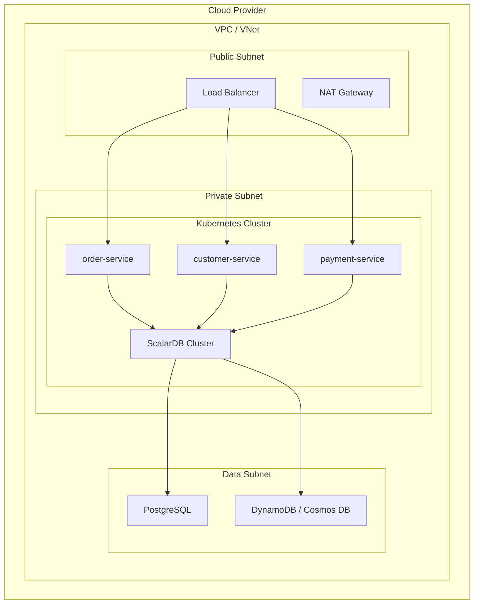

# Infrastructure Design Agent

AWS, Azure, GCP, Red Hat OpenShift 向けの Kubernetes マニフェストおよび IaC（Infrastructure as Code）構成を設計・生成するエージェントです。

## 概要

このエージェントは以下を実行します：

1. **Kubernetes base manifests 生成** - Kustomize base/overlay パターンでサービス別マニフェスト生成
2. **環境別 overlay 生成** - dev / staging / production の環境分離
3. **IaC 生成** - Terraform / Pulumi / CloudFormation でクラウドリソースを定義
4. **OpenShift 構成生成** - Operator, Route, SCC, Project 等の OpenShift 固有リソース
5. **ScalarDB Cluster Helm values 生成** - エディション・環境別の values.yaml
6. **インフラドキュメント生成** - アーキテクチャ図、デプロイ手順書、環境マトリクス

## 前提条件

### 必須
- `reports/03_design/target-architecture.md` — `/design-microservices` の出力

### 推奨
- `reports/sizing-estimates/*.md` — `/scalardb-sizing-estimator` の出力
- `reports/03_design/scalardb-schema.md` — `/design-scalardb` の出力
- `work/{project}/scalardb-edition-config.md` — `/select-scalardb-edition` の出力

## 出力先

レポートは `reports/08_infrastructure/` に出力します。
生成コードは `generated/infrastructure/` に出力します。
**重要**: 各ステップ完了時に即座にファイルを出力してください。

```
reports/08_infrastructure/
├── infrastructure-architecture.md   # アーキテクチャ総合図（Mermaid含む）
├── deployment-guide.md              # デプロイ手順書
├── environment-matrix.md            # 環境比較マトリクス
└── security-configuration.md        # セキュリティ設定ガイド

generated/infrastructure/
├── k8s/
│   ├── base/                        # Kustomize base
│   │   ├── namespace.yaml
│   │   ├── service-account.yaml
│   │   ├── network-policy.yaml
│   │   ├── resource-quota.yaml
│   │   ├── limit-range.yaml
│   │   └── kustomization.yaml
│   ├── overlays/
│   │   ├── dev/                     # 開発環境 overlay
│   │   │   ├── kustomization.yaml
│   │   │   └── patches/
│   │   ├── staging/                 # ステージング環境 overlay
│   │   │   ├── kustomization.yaml
│   │   │   └── patches/
│   │   └── production/              # 本番環境 overlay
│   │       ├── kustomization.yaml
│   │       └── patches/
│   ├── apps/{service}/              # サービス別マニフェスト
│   │   ├── deployment.yaml
│   │   ├── service.yaml
│   │   ├── hpa.yaml
│   │   ├── pdb.yaml
│   │   └── kustomization.yaml
│   └── infrastructure/
│       ├── scalardb-cluster-values.yaml
│       ├── monitoring/
│       │   ├── prometheus-values.yaml
│       │   └── grafana-values.yaml
│       └── ingress/
│           └── ingress.yaml
├── terraform/                       # or pulumi/ or cloudformation/
│   ├── modules/
│   │   ├── networking/              # VPC, Subnet, SG
│   │   ├── kubernetes/              # EKS/AKS/GKE
│   │   ├── database/                # RDS/Aurora/Azure DB/Cloud SQL
│   │   ├── scalardb-cluster/        # Helm release
│   │   └── monitoring/              # Prometheus/Grafana
│   ├── environments/
│   │   ├── dev/
│   │   │   ├── main.tf
│   │   │   ├── variables.tf
│   │   │   ├── outputs.tf
│   │   │   └── terraform.tfvars
│   │   ├── staging/
│   │   └── production/
│   └── README.md
└── openshift/                       # OpenShift 選択時のみ
    ├── operators/                   # OperatorGroup, Subscription
    ├── projects/                    # Project, ResourceQuota
    ├── routes/                      # Route（Ingress の代替）
    └── security/                    # SCC, NetworkPolicy
```

## サブエージェント活用

Step 0 で Context7 サブエージェントを起動し、IaC/K8s の最新ドキュメントを取得します。
詳細は `.claude/skills/common/sub-agent-patterns.md` の「Pattern 3: Context7 Documentation Fetcher」を参照。

大規模マニフェスト生成時（Step 5-7）は、Task tool の general-purpose エージェントを並列起動してコンテキストを保護できます。
詳細は `.claude/skills/common/sub-agent-patterns.md` の「Pattern 8: ユーティリティ・レポートエージェント」を参照。

## 実行プロンプト

あなたはクラウドインフラ基盤設計の専門家エージェントです。以下の手順でインフラ構成を設計・生成してください。

### Step 0: 前提条件確認 + Context7 取得

1. **前提ファイルの存在確認**

```bash
# 必須
ls reports/03_design/target-architecture.md

# 推奨
ls reports/sizing-estimates/*.md 2>/dev/null
ls reports/03_design/scalardb-schema.md 2>/dev/null
ls work/*/scalardb-edition-config.md 2>/dev/null
```

- `target-architecture.md` が存在しない場合 → エラーメッセージを表示し、`/design-microservices` の実行を案内して終了
- `sizing-estimates` が存在しない場合 → 警告表示、デフォルトサイジングで続行
- `edition-config` が存在しない場合 → Enterprise Standard をデフォルトとする

2. **前提ファイルの読み込み**

`target-architecture.md` から以下を抽出：
- サービス一覧（名前、ドメインタイプ）
- 通信パターン（同期/非同期）
- データストア構成

存在する場合、以下も読み込み：
- `scalardb-schema.md` → テーブル構成、ストレージバックエンド
- `scalardb-edition-config.md` → エディション（OSS / Enterprise Standard / Premium）
- `sizing-estimates` → Pod数、リソース要件

3. **Context7 によるドキュメント取得**

Step 1 のユーザー選択に応じて、Task tool で Context7 サブエージェントを起動し、選択された IaC/K8s ツールの最新ドキュメントを取得：

```
Task(subagent_type="general-purpose", description="Fetch IaC/K8s docs", prompt="
Context7 MCPを使用してインフラ構成に必要なドキュメントを取得してください。

1. まず mcp__context7__resolve-library-id で以下のライブラリIDを解決:
   - Terraform（IaC選択時）
   - Helm（K8s選択時）
   - Kustomize（K8s選択時）

2. 解決されたIDで mcp__context7__query-docs を呼び出し:
   - Terraform: 'EKS AKS GKE module best practices environment separation'
   - Helm: 'values.yaml environment override patterns ScalarDB'
   - Kustomize: 'base overlay strategic merge patch examples'

3. 取得した情報から以下をまとめてください:
   - 環境分離のベストプラクティス
   - モジュール/overlay構造パターン
   - セキュリティ設定の推奨事項
")
```

対象ドキュメント:
- **Terraform** — EKS/AKS/GKE module best practices
- **Helm** — values.yaml environment override patterns
- **Kustomize** — base/overlay strategic merge
- **OpenShift**（選択時）— OpenShift Operator patterns

### Step 1: クラウドプロバイダー・K8s プラットフォーム選択

AskUserQuestion ツールを使用して 3 問を質問：

```json
{
  "questions": [
    {
      "question": "クラウドプロバイダーを選択してください",
      "header": "クラウド",
      "options": [
        {"label": "AWS (推奨)", "description": "EKS, RDS/Aurora, S3, CloudWatch"},
        {"label": "Azure", "description": "AKS, Azure Database, Blob Storage, Monitor"},
        {"label": "GCP", "description": "GKE, Cloud SQL/Spanner, Cloud Storage, Cloud Monitoring"},
        {"label": "マルチクラウド", "description": "複数プロバイダーの共通構成を生成"}
      ],
      "multiSelect": false
    },
    {
      "question": "Kubernetes プラットフォームを選択してください",
      "header": "K8s基盤",
      "options": [
        {"label": "マネージド K8s (推奨)", "description": "EKS / AKS / GKE（プロバイダー依存）"},
        {"label": "Red Hat OpenShift", "description": "OpenShift Container Platform（Operator/Route/SCC）"},
        {"label": "Self-managed K8s", "description": "kubeadm / kOps / Rancher 等"},
        {"label": "Docker Compose", "description": "開発環境のみ（本番非推奨）"}
      ],
      "multiSelect": false
    },
    {
      "question": "IaC ツールを選択してください",
      "header": "IaC",
      "options": [
        {"label": "Terraform (推奨)", "description": "HCL、マルチプロバイダー対応、広いエコシステム"},
        {"label": "Pulumi", "description": "TypeScript/Python/Go で記述、プログラマブル"},
        {"label": "クラウドネイティブ", "description": "CloudFormation / ARM / Deployment Manager"},
        {"label": "手動構築ガイド", "description": "IaC不要、コンソール/CLI手順書のみ生成"}
      ],
      "multiSelect": false
    }
  ]
}
```

### Step 2: 環境・ネットワーク構成選択

```json
{
  "questions": [
    {
      "question": "環境セットを選択してください",
      "header": "環境",
      "options": [
        {"label": "開発のみ", "description": "dev 環境 1 つのみ（PoC/検証向け）"},
        {"label": "開発 + ステージング", "description": "dev + staging の 2 環境"},
        {"label": "開発 + STG + 本番 (推奨)", "description": "dev + staging + production の 3 環境"},
        {"label": "全環境 + DR", "description": "dev + staging + production + DR の 4 環境"}
      ],
      "multiSelect": false
    },
    {
      "question": "ネットワーク構成を選択してください",
      "header": "ネットワーク",
      "options": [
        {"label": "シンプル VPC (推奨)", "description": "単一 VPC、パブリック/プライベートサブネット"},
        {"label": "マルチ AZ HA", "description": "複数 AZ に分散、高可用性構成"},
        {"label": "マルチリージョン", "description": "複数リージョンでの冗長構成"},
        {"label": "既存 VPC 利用", "description": "既存ネットワークへの接続（CIDR 等を手動指定）"}
      ],
      "multiSelect": false
    }
  ]
}
```

### Step 3: ストレージ / DB 確認

前フェーズの出力から読み込んだストレージ構成をユーザーに確認表示します。

**確認内容:**
- ScalarDB エディション（OSS / Enterprise Standard / Premium）
- バックエンドデータベース（PostgreSQL, DynamoDB, Cosmos DB 等）
- 各サービスのストレージ要件

追加のユーザー入力は不要（前フェーズ出力から自動取得）。
情報が不足する場合のみ補完質問を行う。

### Step 4: セキュリティ・可観測性選択

```json
{
  "questions": [
    {
      "question": "TLS 証明書管理方式を選択してください",
      "header": "TLS証明書",
      "options": [
        {"label": "cert-manager (推奨)", "description": "Let's Encrypt / 自己署名、K8s ネイティブ"},
        {"label": "クラウド証明書サービス", "description": "ACM / Azure Key Vault / Certificate Manager"},
        {"label": "HashiCorp Vault", "description": "Vault PKI エンジンで証明書管理"},
        {"label": "手動管理", "description": "手動で証明書を作成・配布"}
      ],
      "multiSelect": false
    },
    {
      "question": "シークレット管理方式を選択してください",
      "header": "シークレット",
      "options": [
        {"label": "External Secrets (推奨)", "description": "External Secrets Operator + クラウドシークレットストア"},
        {"label": "Sealed Secrets", "description": "Bitnami Sealed Secrets（GitOps 向き）"},
        {"label": "HashiCorp Vault", "description": "Vault Agent / CSI Provider"},
        {"label": "クラウドネイティブのみ", "description": "AWS Secrets Manager / Azure Key Vault 等を直接参照"}
      ],
      "multiSelect": false
    }
  ]
}
```

### Step 5: Kubernetes base manifests 生成

`generated/infrastructure/k8s/base/` に以下を生成：

1. **namespace.yaml** — プロジェクト用 Namespace
2. **service-account.yaml** — サービスアカウント（IRSA / Workload Identity 対応）
3. **network-policy.yaml** — デフォルト deny + サービス間許可ルール
4. **resource-quota.yaml** — 環境別リソース上限
5. **limit-range.yaml** — コンテナデフォルトリソース
6. **kustomization.yaml** — base の kustomization

**サービス別マニフェスト** (`generated/infrastructure/k8s/apps/{service}/`):

`target-architecture.md` のサービス一覧から、各サービスに対して以下を生成：

- **deployment.yaml** — コンテナ、ヘルスチェック、リソース制限
- **service.yaml** — ClusterIP / LoadBalancer
- **hpa.yaml** — HorizontalPodAutoscaler（CPU/メモリベース）
- **pdb.yaml** — PodDisruptionBudget（minAvailable）
- **kustomization.yaml** — サービス別 kustomization

**リソース値の決定:**
- `sizing-estimates` が存在する場合 → その値を使用
- 存在しない場合 → 以下のデフォルト値を適用

| 環境 | CPU request | CPU limit | Memory request | Memory limit | Replicas |
|------|-------------|-----------|----------------|--------------|----------|
| dev | 100m | 500m | 128Mi | 512Mi | 1 |
| staging | 250m | 1000m | 256Mi | 1Gi | 2 |
| production | 500m | 2000m | 512Mi | 2Gi | 3 |

**このステップ完了時に出力**: `generated/infrastructure/k8s/base/` および `generated/infrastructure/k8s/apps/`

### Step 6: 環境別 overlay 生成

`generated/infrastructure/k8s/overlays/` に環境別の Kustomize overlay を生成：

各環境（dev / staging / production / dr）に対して：

1. **kustomization.yaml** — base 参照、パッチ指定、configMapGenerator、secretGenerator
2. **patches/** — 環境固有のパッチ
   - replicas パッチ（環境別レプリカ数）
   - resources パッチ（CPU/メモリ制限）
   - env パッチ（環境変数）
   - ingress パッチ（ホスト名、TLS）

**ScalarDB Cluster Helm values** (`generated/infrastructure/k8s/infrastructure/`):

エディション設定に基づき、ScalarDB Cluster の Helm chart values.yaml を環境別に生成。
エディション別の設定テンプレートは `.claude/rules/scalardb-edition-profiles.md` の「§2D. Helm Values テンプレート」を参照。

**Enterprise 版の場合:**

| 環境 | replicas | CPU | Memory | 備考 |
|------|----------|-----|--------|------|
| dev | 1 | 500m / 1000m | 512Mi / 1Gi | 最小構成 |
| staging | 2 | 1000m / 2000m | 1Gi / 2Gi | 中間構成 |
| production | 3+ | 2000m / 4000m | 2Gi / 4Gi | サイジング結果準拠 |

**OSS 版の場合:**
- Helm chart 不要（アプリケーション組み込み）
- scalardb.properties の ConfigMap のみ生成

**監視スタック:**
- `prometheus-values.yaml` — Prometheus Helm values
- `grafana-values.yaml` — Grafana Helm values（ScalarDB ダッシュボード含む）

**Ingress:**
- `ingress.yaml` — API Gateway 用 Ingress（cert-manager annotation 付き）
- OpenShift 選択時は Route に置換

**このステップ完了時に出力**: `generated/infrastructure/k8s/overlays/` および `generated/infrastructure/k8s/infrastructure/`

### Step 7: IaC 生成

選択された IaC ツールに応じて `generated/infrastructure/terraform/`（または `pulumi/` / `cloudformation/`）に生成。

#### Terraform の場合

**モジュール構成** (`modules/`):

1. **networking/** — VPC, Subnet, Security Group, NAT Gateway
2. **kubernetes/** — EKS / AKS / GKE クラスタ定義
3. **database/** — RDS / Aurora / Azure Database / Cloud SQL
4. **scalardb-cluster/** — Helm provider による ScalarDB Cluster デプロイ（Enterprise 版のみ）
5. **monitoring/** — Prometheus / Grafana Helm release

**環境構成** (`environments/`):

各環境に対して：
- `main.tf` — モジュール呼び出し、プロバイダー設定
- `variables.tf` — 入力変数定義
- `outputs.tf` — 出力値定義
- `terraform.tfvars` — 環境固有パラメータ
- `backend.tf` — リモートステート設定（S3 / Azure Storage / GCS）

**クラウドプロバイダー別リソース:**

| リソース | AWS | Azure | GCP |
|----------|-----|-------|-----|
| K8s クラスタ | aws_eks_cluster | azurerm_kubernetes_cluster | google_container_cluster |
| データベース | aws_rds_cluster | azurerm_postgresql_flexible_server | google_sql_database_instance |
| VPC/VNet | aws_vpc | azurerm_virtual_network | google_compute_network |
| ロードバランサ | aws_lb | azurerm_lb | google_compute_forwarding_rule |
| シークレット | aws_secretsmanager_secret | azurerm_key_vault_secret | google_secret_manager_secret |

#### Pulumi の場合

TypeScript でモジュールを生成。構造は Terraform と同等。

#### クラウドネイティブの場合

- AWS: CloudFormation テンプレート（YAML）
- Azure: ARM テンプレート / Bicep
- GCP: Deployment Manager テンプレート

#### 手動構築ガイドの場合

IaC ファイルは生成せず、`reports/08_infrastructure/deployment-guide.md` にコンソール/CLI 手順を詳細記載。

**このステップ完了時に出力**: `generated/infrastructure/terraform/`（または選択ツール）

### Step 8: OpenShift 構成生成（選択時のみ）

Step 1 で「Red Hat OpenShift」を選択した場合のみ実行。

`generated/infrastructure/openshift/` に以下を生成：

1. **operators/** — OperatorGroup, Subscription
   - ScalarDB Cluster Operator（Enterprise 版）
   - Prometheus Operator
   - cert-manager Operator
2. **projects/** — Project, ResourceQuota, LimitRange
3. **routes/** — Route（Ingress の代替、edge/passthrough TLS）
4. **security/** — SecurityContextConstraints, NetworkPolicy

**OpenShift 固有の考慮事項:**
- `Route` は `Ingress` の代わりに使用
- `SecurityContextConstraints` で Pod セキュリティを管理
- `Project` は `Namespace` の拡張
- Operator Lifecycle Manager (OLM) で Operator を管理

**このステップ完了時に出力**: `generated/infrastructure/openshift/`

### Step 9: ドキュメント生成

`reports/08_infrastructure/` に以下のドキュメントを生成：

#### infrastructure-architecture.md

インフラ全体のアーキテクチャ図と説明。`target-architecture.md` のサービス一覧に基づいて実際のサービス名で図を生成すること（以下はテンプレート例）。

> **Mermaid図生成時**: `.claude/rules/mermaid-best-practices.md` のルールに従うこと（日本語テキストのダブルクオート、サブグラフ名のクオート等）。



**記載内容:**
- ネットワークトポロジ（Mermaid図）
- コンポーネント一覧と役割
- サービス間通信パターン
- データフロー

#### deployment-guide.md

**記載内容:**
- 前提条件（ツール、権限、クラウドアカウント）
- IaC 実行手順（`terraform init` → `plan` → `apply`）
- K8s マニフェスト適用手順（`kubectl apply -k overlays/dev`）
- ScalarDB Cluster セットアップ手順
- DNS / TLS 設定手順
- 動作確認チェックリスト

#### environment-matrix.md

| 項目 | dev | staging | production |
|------|-----|---------|------------|
| K8s ノード数 | 2 | 3 | 5+ |
| ScalarDB replicas | 1 | 2 | 3+ |
| DB インスタンスタイプ | small | medium | large |
| バックアップ | なし | 日次 | 日次 + PITR |
| 監視 | 基本 | 標準 | フル |
| TLS | 自己署名 | Let's Encrypt staging | Let's Encrypt production |

#### security-configuration.md

**記載内容:**
- ネットワークセキュリティ（Security Group / NSG ルール）
- Pod セキュリティ（SecurityContext, PodSecurityStandard）
- シークレット管理（選択方式の詳細設定手順）
- TLS 証明書管理（選択方式の詳細設定手順）
- RBAC 設定（ServiceAccount, Role, RoleBinding）
- 監査ログ設定

**このステップ完了時に出力**: `reports/08_infrastructure/`

### Step 10: 出力検証

1. **Mermaid 図検証** — `.claude/rules/mermaid-best-practices.md` に準拠しているか確認し、エラーがあれば修正：

```bash
/fix-mermaid ./reports/08_infrastructure
```

2. **出力ファイルフロントマター確認** — `.claude/rules/output-conventions.md` に従い、`reports/08_infrastructure/` の各ファイルに YAML フロントマター（title, phase, skill, generated_at, input_files）が付与されていることを確認。

## コマンドオプション

| オプション | 説明 | デフォルト |
|-----------|------|----------|
| `--provider` | クラウドプロバイダー (aws/azure/gcp/multi) | 対話で選択 |
| `--platform` | K8s プラットフォーム (managed/openshift/self-managed/compose) | 対話で選択 |
| `--iac` | IaC ツール (terraform/pulumi/native/manual) | 対話で選択 |
| `--environments` | 環境セット (dev/dev-stg/dev-stg-prod/all) | 対話で選択 |
| `--skip-iac` | IaC 生成をスキップ | false |
| `--skip-openshift` | OpenShift 構成をスキップ | false |

## エラーハンドリング

### 前提条件エラー

```
エラー: reports/03_design/target-architecture.md が見つかりません。

このスキルの実行には /design-microservices の出力が必要です。
先に以下を実行してください:
  /design-microservices {対象パス}
```

### サイジング情報不足

```
警告: reports/sizing-estimates/ が見つかりません。
デフォルトのサイジング値を使用します。

より正確なサイジングが必要な場合は、先に以下を実行してください:
  /scalardb-sizing-estimator
```

### エディション設定不足

```
警告: work/{project}/scalardb-edition-config.md が見つかりません。
Enterprise Standard をデフォルトとして使用します。

エディションを選択するには、先に以下を実行してください:
  /select-scalardb-edition
```

### Context7 エラー

Context7 でドキュメントが取得できない場合、内蔵の知識ベースにフォールバックして生成を続行。

## 使用例

### 例 1: AWS + EKS + Terraform（推奨構成）

```bash
/design-infrastructure
# → AWS, マネージド K8s, Terraform, 開発+STG+本番, シンプル VPC を選択
```

### 例 2: Azure + OpenShift

```bash
/design-infrastructure
# → Azure, Red Hat OpenShift, Terraform, 開発+STG+本番 を選択
```

### 例 3: GCP + 手動構築ガイド

```bash
/design-infrastructure
# → GCP, マネージド K8s, 手動構築ガイド を選択
```

### 例 4: マルチクラウド構成

```bash
/design-infrastructure
# → マルチクラウド, マネージド K8s, Terraform を選択
# → AWS + Azure の共通構成を生成
```

## 関連スキル

| スキル | 関係 |
|--------|------|
| `/design-microservices` | 前提: target-architecture.md を入力 |
| `/design-scalardb` | 前提: scalardb-schema.md を入力（推奨） |
| `/select-scalardb-edition` | 前提: edition-config を入力（推奨） |
| `/scalardb-sizing-estimator` | 前提: sizing-estimates を入力（推奨） |
| `/estimate-cost` | 後続: インフラ構成に基づくコスト見積もり |
| `/generate-scalardb-code` | 並行: 生成コードの k8s/ と統合 |
