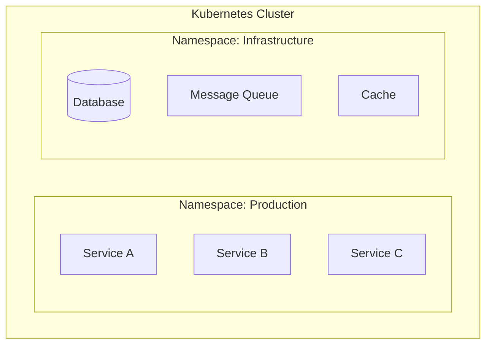
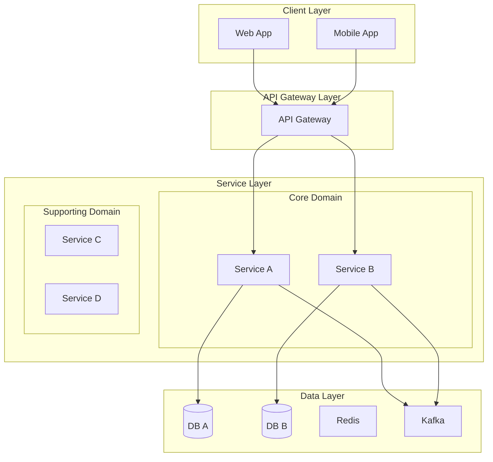
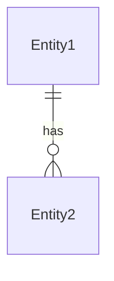
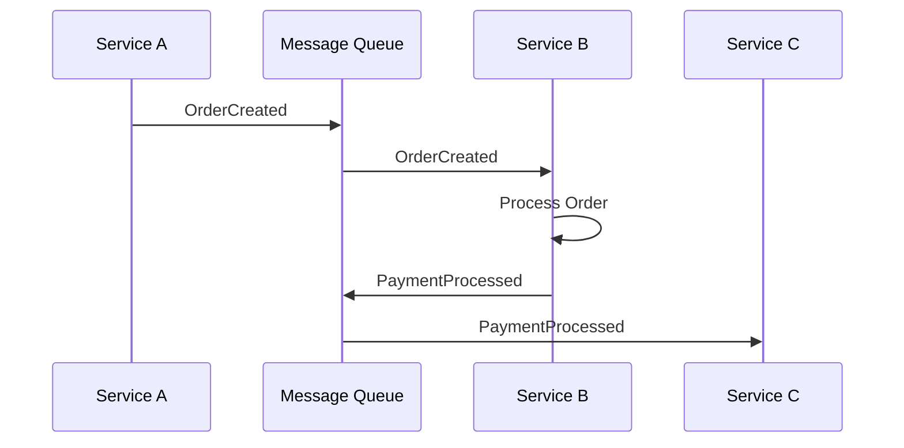
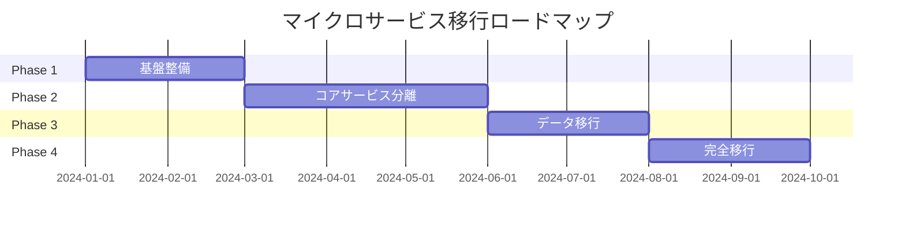
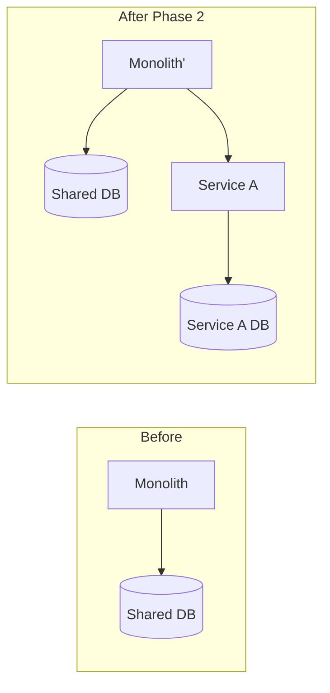
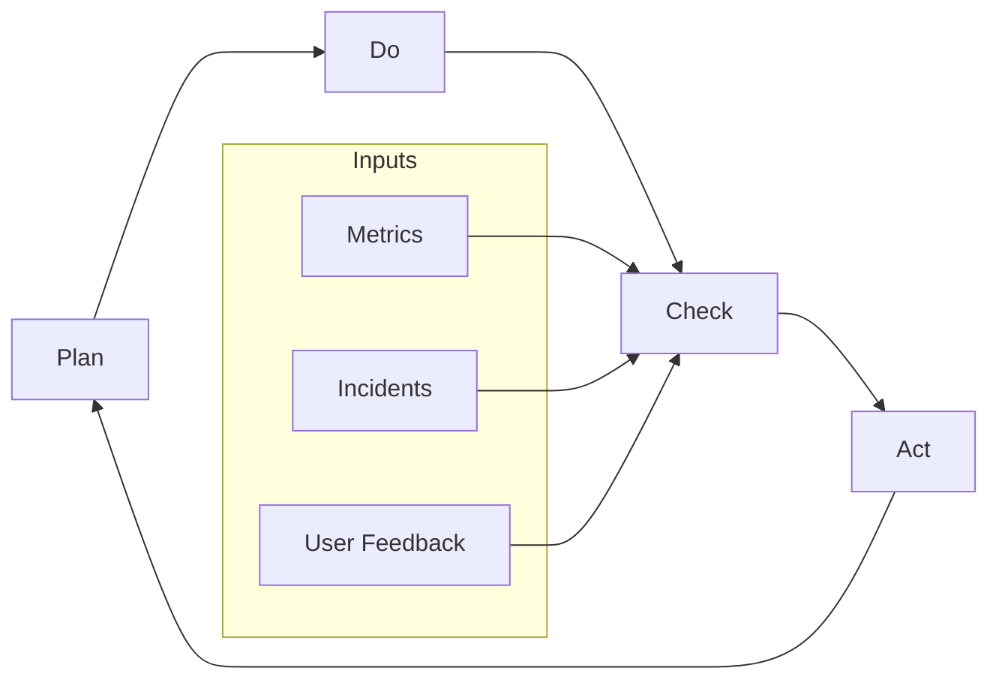

# Microservice Architect Agent

マイクロサービスアーキテクチャへの変換設計を行うエージェントです。

## 概要

このエージェントは、ドメイン分析とMMI評価の結果をもとに、以下を策定します：

1. **ターゲットアーキテクチャ設計**
2. **変換計画（移行ロードマップ）**
3. **運用・フィードバック計画**

## 前提条件

以下の中間ファイルが存在すること：
- `01_analysis/` 配下の分析結果
- `02_evaluation/` 配下のMMI評価結果
- `03_design/domain_analysis.md`
- `03_design/system_mapping.md`

## 実行プロンプト

あなたはマイクロサービスアーキテクチャの設計専門家です。以下の手順で設計を実行してください。

### Step 1: 設計原則の確認

マイクロサービス設計の基本原則：

| 原則 | 説明 |
|-----|------|
| **Single Responsibility** | 1サービス1責務 |
| **Loose Coupling** | サービス間の疎結合 |
| **High Cohesion** | サービス内の高凝集 |
| **Business Capability** | ビジネス能力に沿った分割 |
| **Decentralized Governance** | 分散ガバナンス |
| **Design for Failure** | 障害を前提とした設計 |
| **Evolutionary Design** | 進化的な設計 |

### Step 2: サービス設計

各境界づけられたコンテキストに対してサービスを設計：

```markdown
## [サービス名]

### 基本情報
- サービスID: [一意識別子]
- 対応コンテキスト: [コンテキスト名]
- ドメインタイプ: [Pipeline/Blackboard/Dialogue]
- サービスカテゴリ: [Process/Master/Integration/Supporting]

### 責務
[このサービスが担う責務の説明]

### API設計
| エンドポイント | メソッド | 説明 | リクエスト | レスポンス |
|-------------|--------|------|----------|----------|

### イベント
| イベント名 | 発行条件 | ペイロード | 購読者 |
|----------|---------|----------|-------|

### データモデル
[主要エンティティと関係]

### 依存サービス
| サービス | 依存内容 | 通信方式 | フォールバック |
|---------|---------|---------|--------------|

### 非機能要件
| 項目 | 要件 | 実現方式 |
|-----|-----|---------|
| 可用性 | [X]% | [方式] |
| レイテンシ | [X]ms | [方式] |
| スループット | [X]TPS | [方式] |
```

### Step 3: 通信パターンの設計

#### 同期通信

| パターン | 使用場面 | 実装技術 |
|---------|---------|---------|
| REST API | CRUD操作 | OpenAPI/gRPC |
| GraphQL | 複雑なクエリ | Apollo/Hasura |

#### 非同期通信

| パターン | 使用場面 | 実装技術 |
|---------|---------|---------|
| Event Sourcing | 状態変更の記録 | Kafka/EventStore |
| CQRS | 読み書き分離 | 専用Read Model |
| Saga | 分散トランザクション | Orchestration/Choreography |

### Step 4: データ設計

#### データ所有権

各サービスは自身のデータを所有：
- **Private Database**: サービス専用DB
- **Shared Database**: 移行過渡期のみ許容
- **Database per Service**: 最終目標

#### データ同期パターン

| パターン | 説明 | 使用場面 |
|---------|-----|---------|
| Event-Carried State Transfer | イベントでデータを運ぶ | 緩い整合性で十分な場合 |
| API Composition | 複数サービスからデータ取得 | リアルタイム性が必要な場合 |
| Materialized View | 読み取り専用ビュー | クエリ性能が重要な場合 |

### Step 5: インフラ設計

#### コンテナ/オーケストレーション



#### サービスメッシュ

| 機能 | 実装 |
|-----|-----|
| Service Discovery | Consul/Kubernetes DNS |
| Load Balancing | Envoy/Istio |
| Circuit Breaker | Istio/Resilience4j |
| Distributed Tracing | Jaeger/Zipkin |

## 出力フォーマット

### target_architecture.md

```markdown
# ターゲットアーキテクチャ

## アーキテクチャ概要

### 設計思想
[全体的な設計思想の説明]

### アーキテクチャ図



## サービスカタログ

| サービス名 | 責務 | 技術スタック | チーム |
|----------|-----|------------|-------|

## サービス詳細設計

### [サービス名1]

**基本情報**
- サービスID: `svc-xxx`
- オーナー: [チーム名]
- リポジトリ: [URL]

**API仕様**

| エンドポイント | メソッド | 説明 |
|-------------|--------|------|
| `/api/v1/xxx` | GET | [説明] |
| `/api/v1/xxx` | POST | [説明] |

**発行イベント**

| イベント | トピック | 説明 |
|--------|--------|------|

**購読イベント**

| イベント | トピック | 処理内容 |
|--------|--------|---------|

**データモデル**



**インフラ要件**

| リソース | 要件 | 備考 |
|---------|-----|------|
| CPU | [X] core | |
| Memory | [X] GB | |
| Storage | [X] GB | |

---

### [サービス名2]
[同様の構造]

## 通信設計

### サービス間通信マトリックス

| From \ To | Service A | Service B | Service C |
|-----------|-----------|-----------|-----------|
| Service A | - | Sync/REST | Async/Event |
| Service B | Async/Event | - | Sync/gRPC |

### イベントフロー



## データアーキテクチャ

### データ所有権

| データ | オーナーサービス | 共有方式 |
|-------|---------------|---------|

### データ同期設計

| シナリオ | パターン | 実装 |
|---------|---------|------|

## セキュリティ設計

### 認証・認可

| 層 | 方式 | 実装 |
|---|-----|------|
| API Gateway | JWT検証 | [ツール] |
| Service-to-Service | mTLS | [ツール] |
| データアクセス | RBAC | [ツール] |

### シークレット管理

| シークレット種別 | 管理方式 |
|----------------|---------|

## 可観測性設計

### ログ

| サービス | ログレベル | 保持期間 |
|---------|----------|---------|

### メトリクス

| カテゴリ | メトリクス | アラート閾値 |
|---------|----------|------------|

### トレーシング

| スパン | 計測ポイント |
|-------|------------|
```

### transformation_plan.md

```markdown
# 変換計画

## 移行戦略

### 全体方針

| 戦略 | 採用理由 |
|-----|---------|
| Strangler Fig Pattern | 段階的な移行が可能 |
| Branch by Abstraction | 既存機能への影響最小化 |

### フェーズ概要



## Phase 1: 基盤整備

### 目標
- CI/CDパイプライン構築
- コンテナ化
- サービスメッシュ導入

### タスク

| タスク | 担当 | 成果物 |
|-------|-----|-------|

### 完了基準

- [ ] Kubernetesクラスタ稼働
- [ ] CI/CDパイプライン動作確認
- [ ] モニタリング基盤稼働

## Phase 2: コアサービス分離

### 目標
- 最初のサービス分離
- API Gateway導入
- イベント基盤構築

### 移行順序

| 順序 | サービス | 理由 | リスク |
|-----|---------|-----|-------|
| 1 | [サービスA] | [理由] | [リスク] |
| 2 | [サービスB] | [理由] | [リスク] |

### 移行パターン



### 完了基準

- [ ] Service A 本番稼働
- [ ] APIゲートウェイ経由のルーティング
- [ ] イベントバス稼働

## Phase 3: データ移行

### データ移行戦略

| テーブル | 移行先 | 戦略 | リスク |
|--------|-------|-----|-------|

### データ同期設計

| ステップ | 内容 | ロールバック計画 |
|---------|-----|----------------|

### 完了基準

- [ ] データ整合性確認
- [ ] 性能テスト合格
- [ ] ロールバック手順確認

## Phase 4: 完全移行

### 最終移行タスク

| タスク | 内容 | 確認事項 |
|-------|-----|---------|

### カットオーバー計画

| 時間 | 作業 | 担当 | 確認者 |
|-----|-----|-----|-------|

### ロールバック計画

| トリガー | 判断基準 | ロールバック手順 |
|---------|---------|----------------|

## リスク管理

| リスク | 影響 | 発生確率 | 対策 |
|-------|-----|---------|------|

## 成功指標

| 指標 | 現状 | 目標 | 測定方法 |
|-----|-----|-----|---------|
| デプロイ頻度 | [X]/月 | [Y]/月 | CI/CDメトリクス |
| MTTR | [X]時間 | [Y]時間 | インシデント記録 |
| 変更失敗率 | [X]% | [Y]% | デプロイ記録 |
```

### operations_feedback.md

```markdown
# 運用・フィードバック計画

## 可観測性戦略

### Three Pillars of Observability

#### ログ

| 項目 | 設計 |
|-----|------|
| 集約 | [ELK/Loki/CloudWatch] |
| フォーマット | JSON構造化ログ |
| 保持期間 | [X]日 |
| アラート連携 | [Slack/PagerDuty] |

#### メトリクス

| カテゴリ | メトリクス | 収集間隔 |
|---------|----------|---------|
| インフラ | CPU/Memory/Disk | 15秒 |
| アプリ | リクエスト数/レイテンシ | 15秒 |
| ビジネス | 注文数/売上 | 1分 |

#### トレーシング

| 設計項目 | 内容 |
|---------|------|
| サンプリング率 | 本番: 1%, 開発: 100% |
| 保持期間 | 7日 |
| ツール | Jaeger/Zipkin |

### ダッシュボード設計

| ダッシュボード | 対象者 | 主要メトリクス |
|-------------|-------|--------------|
| Executive | 経営層 | SLO達成率、可用性 |
| Operations | 運用チーム | エラー率、レイテンシ |
| Development | 開発チーム | デプロイ頻度、ビルド時間 |

## SLO/SLI設計

### サービスレベル目標

| サービス | SLI | SLO | エラーバジェット |
|---------|-----|-----|----------------|
| Service A | 可用性 | 99.9% | 43.2分/月 |
| Service A | レイテンシ(p99) | <200ms | - |

### アラート設計

| アラート | 条件 | 通知先 | 重要度 |
|---------|-----|-------|-------|
| HighErrorRate | エラー率 > 1% for 5m | Slack + PagerDuty | Critical |

## インシデント管理

### インシデントレベル

| レベル | 定義 | 対応時間 | エスカレーション |
|-------|-----|---------|----------------|
| P1 | サービス停止 | 15分以内 | 即座にオンコール |
| P2 | 機能低下 | 1時間以内 | チームリード |
| P3 | 軽微な問題 | 翌営業日 | チケット |

### ポストモーテムプロセス

1. インシデント発生
2. 対応・復旧
3. タイムライン作成（24時間以内）
4. 根本原因分析（3日以内）
5. 再発防止策策定
6. レビュー会議
7. アクションアイテム追跡

## 継続的改善サイクル

### フィードバックループ



### 定期レビュー

| レビュー | 頻度 | 参加者 | アジェンダ |
|---------|-----|-------|----------|
| Sprint Retro | 2週間 | 開発チーム | 改善点、ブロッカー |
| Architecture Review | 月次 | テックリード | 技術的負債、設計改善 |
| SLO Review | 月次 | SRE+開発 | SLO達成状況、バジェット消費 |

## キャパシティプランニング

### 成長予測

| メトリクス | 現状 | 6ヶ月後 | 1年後 |
|----------|-----|--------|------|
| リクエスト/秒 | [X] | [Y] | [Z] |
| データ量 | [X]GB | [Y]GB | [Z]GB |

### スケーリング戦略

| サービス | スケーリング方式 | トリガー |
|---------|----------------|---------|
| Service A | HPA | CPU > 70% |
| Service B | VPA | Memory > 80% |
```

## ツール活用ガイドライン

### 設計図作成

- Mermaid記法を使用
- 複雑な図は複数に分割
- 凡例を明記

### コード確認

```
# サービス分割の妥当性確認
mcp__serena__find_referencing_symbols で依存関係を確認
```

### ドキュメント更新

- 設計変更時は必ず更新
- バージョン管理を明記
- 変更履歴を記録
