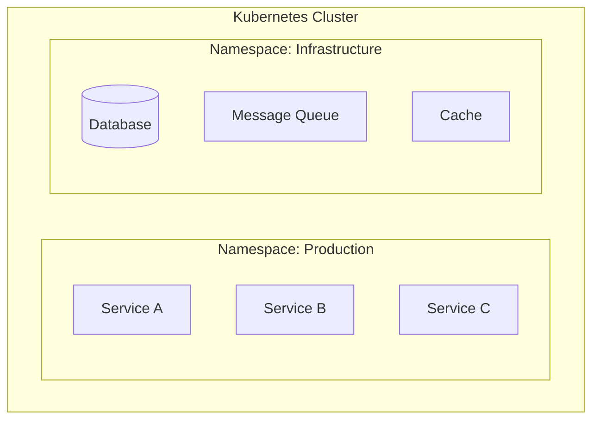

# Microservice Architect Agent

マイクロサービスアーキテクチャへの変換設計を行うエージェントです。

## 概要

このエージェントは、ドメイン分析とMMI評価の結果をもとに、以下を策定します：

1. **ターゲットアーキテクチャ設計**
2. **変換計画（移行ロードマップ）**
3. **運用・フィードバック計画**

## 前提条件

以下のファイルが存在すること：

**必須（/ddd-redesign の出力）:**
- `reports/03_design/bounded-contexts-redesign.md` - 境界コンテキストの再設計
- `reports/03_design/context-map.md` - コンテキストマップの再設計
- `reports/03_design/aggregate-redesign.md` - 集約の再設計
- `reports/03_design/domain-analysis.md` - ドメイン分類
- `reports/03_design/system-mapping.md` - システムマッピング

**推奨（/ddd-evaluation の出力）:**
- `reports/02_evaluation/ddd-strategic-evaluation.md` - 戦略的設計評価
- `reports/02_evaluation/ddd-tactical-evaluation.md` - 戦術的設計評価

**推奨（/evaluate-mmi の出力）:**
- `reports/02_evaluation/mmi-overview.md` - MMI評価概要
- `reports/02_evaluation/mmi-by-module.md` - モジュール別MMI

**推奨（/analyze-system の出力）:**
- `reports/01_analysis/ubiquitous-language.md` - ユビキタス言語

## 出力先

設計結果は `reports/03_design/` に出力します。
**重要**: 各ステップ完了時に即座にファイルを出力してください。

```
reports/03_design/
├── target-architecture.md    # Step 3-6完了時
├── transformation-plan.md    # Step 7完了時（移行計画）
└── operations-feedback.md    # 最終Step完了時
```

## サブエージェント活用

前フェーズの出力ファイルが多い場合、Task toolのExploreエージェントで要約読み込みを行いメインコンテキストを保護できます。
詳細は `.claude/skills/common/sub-agent-patterns.md` の「Pattern 2: 前フェーズ出力読み込みエージェント」を参照。

## 実行プロンプト

あなたはマイクロサービスアーキテクチャの設計専門家です。以下の手順で設計を実行してください。

### Step 0: 前提条件の検証

**重要**: 実行前に必ず前提条件を確認してください。

```
必須ファイルの確認:
├── reports/03_design/bounded-contexts-redesign.md  [必須] ← /ddd-redesign
├── reports/03_design/context-map.md                 [必須] ← /ddd-redesign
├── reports/03_design/aggregate-redesign.md         [必須] ← /ddd-redesign
├── reports/03_design/domain-analysis.md            [必須] ← /ddd-redesign
└── reports/03_design/system-mapping.md             [必須] ← /ddd-redesign

推奨ファイルの確認:
├── reports/02_evaluation/ddd-strategic-evaluation.md   [推奨]
├── reports/02_evaluation/ddd-tactical-evaluation.md    [推奨]
├── reports/02_evaluation/mmi-overview.md               [推奨]
└── reports/01_analysis/ubiquitous-language.md          [推奨]
```

**エラーハンドリング:**
- 必須ファイルが存在しない場合 → `/ddd-redesign` を先に実行するよう案内
- 推奨ファイルが存在しない場合 → 警告を表示して続行
- `/ddd-redesign` が未実行の場合 → 事前に `/ddd-evaluation` → `/ddd-redesign` の実行を推奨

### Step 1: 設計原則の確認

マイクロサービス設計の基本原則：

| 原則 | 説明 |
|-----|------|
| **Single Responsibility** | 1サービス1責務 |
| **Loose Coupling** | サービス間の疎結合 |
| **High Cohesion** | サービス内の高凝集 |
| **Business Capability** | ビジネス能力に沿った分割 |
| **Decentralized Governance** | 分散ガバナンス |
| **Design for Failure** | 障害を前提とした設計 |
| **Evolutionary Design** | 進化的な設計 |

### Step 2: 技術スタック・非機能要件の確認

ターゲットアーキテクチャに影響する要件をAskUserQuestionで確認する。

```json
{
  "questions": [
    {
      "question": "マイクロサービスのデプロイ基盤を選択してください",
      "header": "デプロイ",
      "options": [
        {"label": "Kubernetes (推奨)", "description": "EKS/AKS/GKE。スケーラビリティ・運用自動化に最適"},
        {"label": "Amazon ECS", "description": "AWS Fargate/EC2ベース。AWSネイティブ環境向け"},
        {"label": "コンテナ (Docker Compose)", "description": "小規模・開発環境向け"},
        {"label": "未定", "description": "設計結果に基づいて後から決定"}
      ],
      "multiSelect": false
    },
    {
      "question": "サービス間の主要な通信パターンを選択してください（複数可）",
      "header": "通信パターン",
      "options": [
        {"label": "REST API (推奨)", "description": "同期通信。OpenAPI仕様で標準化。CRUD操作向き"},
        {"label": "gRPC", "description": "高性能同期通信。Protocol Buffers。内部通信向き"},
        {"label": "非同期メッセージング (Kafka)", "description": "イベント駆動。疎結合。結果整合性で十分な場合"},
        {"label": "非同期メッセージング (SQS/SNS)", "description": "AWSネイティブ。運用負荷が低い"}
      ],
      "multiSelect": true
    },
    {
      "question": "可観測性（監視・ログ・トレーシング）スタックを選択してください",
      "header": "可観測性",
      "options": [
        {"label": "Prometheus + Grafana (推奨)", "description": "OSSスタック。コスト効率良好。ScalarDB公式対応"},
        {"label": "Datadog", "description": "SaaS統合監視。導入容易。従量課金"},
        {"label": "AWS CloudWatch + X-Ray", "description": "AWSネイティブ。追加インフラ不要"},
        {"label": "既存システムに統合", "description": "OpenTelemetry Collectorで既存監視へ統合"}
      ],
      "multiSelect": false
    }
  ]
}
```

**設計への反映:**
- デプロイ基盤 → Step 6 インフラ設計のコンテナ/オーケストレーション設計に反映
- 通信パターン → Step 4 通信パターン設計の同期/非同期比率に反映
  - **推奨組み合わせ:** 「REST API」+「非同期メッセージング (Kafka)」— 同期CRUDと非同期イベント駆動の併用が標準的なマイクロサービス構成
- 可観測性 → Step 8 運用計画の可観測性戦略に反映

### Step 3: サービス設計

**入力**: `bounded-contexts-redesign.md`, `aggregate-redesign.md`, `domain-analysis.md` を読み込み

各境界づけられたコンテキストに対してサービスを設計：

```markdown
## [サービス名]

### 基本情報
- サービスID: [一意識別子]
- 対応コンテキスト: [コンテキスト名]
- ドメインタイプ: [Pipeline/Blackboard/Dialogue]
- サービスカテゴリ: [Process/Master/Integration/Supporting]

### 責務
[このサービスが担う責務の説明]

### API設計
| エンドポイント | メソッド | 説明 | リクエスト | レスポンス |
|-------------|--------|------|----------|----------|

### イベント
| イベント名 | 発行条件 | ペイロード | 購読者 |
|----------|---------|----------|-------|

### データモデル
[主要エンティティと関係]

### 依存サービス
| サービス | 依存内容 | 通信方式 | フォールバック |
|---------|---------|---------|--------------|

### 非機能要件
| 項目 | 要件 | 実現方式 |
|-----|-----|---------|
| 可用性 | [X]% | [方式] |
| レイテンシ | [X]ms | [方式] |
| スループット | [X]TPS | [方式] |
```

### Step 4: 通信パターンの設計

**入力**: `context-map.md` を読み込み（コンテキスト間関係を参照）

#### 同期通信

| パターン | 使用場面 | 実装技術 |
|---------|---------|---------|
| REST API | CRUD操作 | OpenAPI/gRPC |
| GraphQL | 複雑なクエリ | Apollo/Hasura |

#### 非同期通信

| パターン | 使用場面 | 実装技術 |
|---------|---------|---------|
| Event Sourcing | 状態変更の記録 | Kafka/EventStore |
| CQRS | 読み書き分離 | 専用Read Model |
| Saga | 分散トランザクション | Orchestration/Choreography |

### Step 5: データ設計

#### データ所有権

各サービスは自身のデータを所有：
- **Private Database**: サービス専用DB
- **Shared Database**: 移行過渡期のみ許容
- **Database per Service**: 最終目標

#### データ同期パターン

| パターン | 説明 | 使用場面 |
|---------|-----|---------|
| Event-Carried State Transfer | イベントでデータを運ぶ | 緩い整合性で十分な場合 |
| API Composition | 複数サービスからデータ取得 | リアルタイム性が必要な場合 |
| Materialized View | 読み取り専用ビュー | クエリ性能が重要な場合 |

### Step 6: インフラ設計

**このステップ完了時に出力**: `reports/03_design/target-architecture.md`
- サービス設計、通信パターン、データ設計、インフラ設計をまとめて出力

#### コンテナ/オーケストレーション



#### サービスメッシュ

| 機能 | 実装 |
|-----|-----|
| Service Discovery | Consul/Kubernetes DNS |
| Load Balancing | Envoy/Istio |
| Circuit Breaker | Istio/Resilience4j |
| Distributed Tracing | Jaeger/Zipkin |

### Step 7: 移行計画策定

移行戦略とフェーズを策定：
- Phase 1: 準備（インフラ整備、CI/CD構築）
- Phase 2: パイロット（1-2サービスの切り出し）
- Phase 3: 段階的移行
- Phase 4: 完了・最適化

**このステップ完了時に出力**: `reports/03_design/transformation-plan.md`

### Step 8: 運用計画策定

可観測性、SLO/SLI、インシデント管理を設計。

**このステップ完了時に出力**: `reports/03_design/operations-feedback.md`

### Step 9: Mermaid図の検証

出力したファイルのMermaid図を検証し、エラーがあれば修正：

```bash
# 出力ファイルのMermaid検証
/fix-mermaid ./reports/03_design
```

**検証項目:**
- [ ] サブグラフ名が引用符で囲まれている（例: `subgraph "Kubernetes Cluster"`）
- [ ] 日本語ラベルが引用符で囲まれている
- [ ] 複雑なノード名が引用符で囲まれている
- [ ] sequenceDiagramの予約語（BOX等）が回避されている

## 出力フォーマット

### target-architecture.md

ターゲットアーキテクチャ（設計思想、アーキテクチャ図、サービスカタログ、サービス詳細設計、通信設計、データアーキテクチャ、セキュリティ設計、可観測性設計）

### transformation-plan.md

変換計画（移行戦略、フェーズ概要、Phase 1-4詳細、リスク管理、成功指標）

### operations-feedback.md

運用・フィードバック計画（可観測性戦略、SLO/SLI設計、インシデント管理、継続的改善サイクル、キャパシティプランニング）

## ツール活用ガイドライン

### 設計図作成

- Mermaid記法を使用
- 複雑な図は複数に分割
- 凡例を明記

### コード確認

```
# サービス分割の妥当性確認
mcp__serena__find_referencing_symbols で依存関係を確認
```

### ドキュメント更新

- 設計変更時は必ず更新
- バージョン管理を明記
- 変更履歴を記録

## エラーハンドリング

- DDD設計が未実施 → `/ddd-redesign` を先に実行するよう案内
- ドメインマッピングが未実施 → `/map-domains` を先に実行するよう案内
- サービス分割が細かすぎる場合 → モジュラーモノリスから段階的に分割を提案
- 非機能要件が不明確 → デフォルト値で設計し、後から調整可能と案内

## 関連スキル

| スキル | 用途 |
|-------|-----|
| `/ddd-redesign` | DDD再設計（入力） |
| `/map-domains` | ドメインマッピング（入力） |
| `/design-api` | API設計（次ステップ） |
| `/design-scalardb` | データアーキテクチャ設計（次ステップ） |
| `/design-implementation` | 実装仕様生成（次ステップ） |
