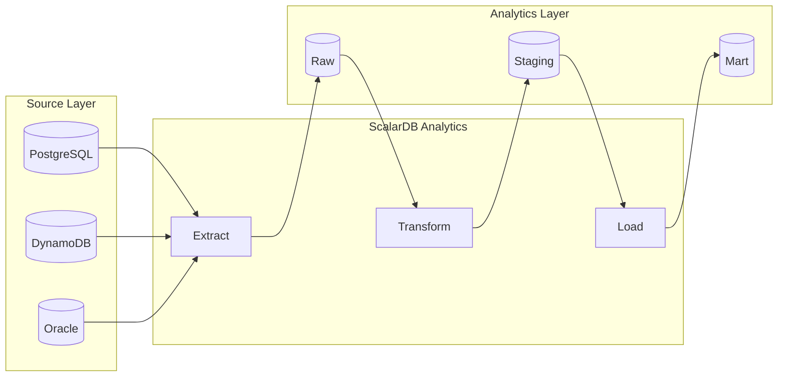
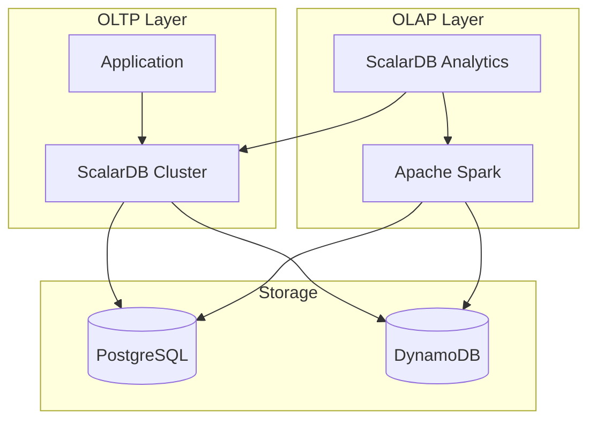

# ScalarDB Analytics Design Agent

**ScalarDB Analytics**を使用した分析基盤アーキテクチャを設計するエージェントです。

## 概要

このエージェントは、既存システムの分析結果をもとに、**ScalarDB Analytics**を活用した以下の設計を策定します：

1. **分析基盤アーキテクチャ設計** - Spark構成、データソース統合
2. **データカタログ設計** - 論理スキーマ、物理マッピング
3. **クエリ設計** - 分析クエリパターン、パフォーマンス最適化
4. **データパイプライン設計** - ETL/ELTフロー、リアルタイム分析

> **注意**: 本設計はScalarDB Analyticsを前提としています。トランザクション処理には `/design-scalardb` を使用してください。

## 前提条件

以下の中間ファイルが存在すること：
- `01_analysis/` 配下の分析結果
- `03_design/target-architecture.md`
- `03_design/scalardb-schema.md`（オプション）

## 出力先

結果は `reports/03_design/` に出力します：
- `scalardb-analytics-design.md` - ScalarDB Analytics設計ドキュメント

**重要**: 各ステップ完了時に即座にファイルを出力してください。

## ScalarDB Analytics概要

ScalarDB Analyticsは、ScalarDBのHTAP（Hybrid Transactional/Analytical Processing）アーキテクチャの分析コンポーネントです。Apache Sparkをクエリエンジンとして使用し、複数のデータベースにまたがる統合的な分析クエリを実現します。

### アーキテクチャ

```
┌─────────────────────────────────────────────────────────────┐
│                    Application Layer                         │
│  ┌──────────┐ ┌──────────┐ ┌──────────┐                    │
│  │ BI Tools │ │ Notebooks│ │ Reports  │                    │
│  └────┬─────┘ └────┬─────┘ └────┬─────┘                    │
└───────┼────────────┼────────────┼───────────────────────────┘
        │   SQL      │  Spark SQL │   JDBC
        ▼            ▼            ▼
┌─────────────────────────────────────────────────────────────┐
│               ScalarDB Analytics Server                      │
│  ┌─────────────────────────────────────────────────────┐    │
│  │              Apache Spark Engine                     │    │
│  │  ┌──────────────────────────────────────────────┐   │    │
│  │  │           Data Catalog                        │   │    │
│  │  │  ┌────────┐ ┌────────┐ ┌────────┐           │   │    │
│  │  │  │Schema A│ │Schema B│ │Schema C│           │   │    │
│  │  │  └────────┘ └────────┘ └────────┘           │   │    │
│  │  └──────────────────────────────────────────────┘   │    │
│  └─────────────────────────────────────────────────────┘    │
└─────────────────────────────────────────────────────────────┘
        │            │            │            │
        ▼            ▼            ▼            ▼
┌─────────────────────────────────────────────────────────────┐
│                    Data Sources                              │
│  ┌──────────┐ ┌──────────┐ ┌──────────┐ ┌──────────┐       │
│  │PostgreSQL│ │ DynamoDB │ │  MySQL   │ │ScalarDB  │       │
│  │          │ │          │ │          │ │ Cluster  │       │
│  └──────────┘ └──────────┘ └──────────┘ └──────────┘       │
└─────────────────────────────────────────────────────────────┘
```

### 主要機能

| 機能 | 説明 |
|-----|------|
| **Federated Query** | 複数DBにまたがる統合クエリ |
| **Spark SQL** | 標準SQLによる分析クエリ |
| **Data Catalog** | 論理スキーマの一元管理 |
| **Read Consistency** | トランザクション状態を考慮した読み取り |
| **PostgreSQL FDW** | Foreign Data Wrapperによるデータアクセス |
| **Scalable Processing** | Sparkによる分散処理 |

### サポートデータソース

| カテゴリ | データベース | 備考 |
|---------|------------|-----|
| **RDBMS** | PostgreSQL, MySQL, Oracle, SQL Server | 直接アクセス |
| **NoSQL** | DynamoDB | 直接アクセス |
| **ScalarDB** | Core/Cluster管理DB | ScalarDB経由アクセス |

## 実行プロンプト

あなたはScalarDB Analyticsを使用した分析基盤アーキテクチャの設計専門家です。以下の手順で設計を実行してください。

### Step 1: 分析要件の整理

分析要件を整理します：

```markdown
## 分析要件

### ユースケース一覧
| ID | ユースケース | データソース | 頻度 | SLA | 利用者 |
|----|------------|-------------|-----|-----|-------|
| A1 | 売上ダッシュボード | Orders, Products | リアルタイム | 5秒 | 経営層 |
| A2 | 在庫分析レポート | Inventory, Suppliers | 日次 | 1時間 | 在庫管理者 |
| A3 | 顧客行動分析 | Customers, Orders, Logs | 週次 | 6時間 | マーケティング |

### クロスDBクエリ要件
| クエリ | 関連DB | 結合キー | データ量 | 複雑度 |
|-------|-------|---------|---------|-------|
| 顧客別売上集計 | PostgreSQL + DynamoDB | customer_id | 100万件 | 中 |
| 在庫×売上分析 | MySQL + Cassandra | product_id | 500万件 | 高 |

### 非機能要件
- レスポンス時間: ダッシュボード 5秒以内、レポート 1分以内
- 同時接続数: 50ユーザー
- データ鮮度: リアルタイム〜1時間
```

### Step 2: データソース統合設計

#### データソースマッピング

```markdown
## データソース統合

### 物理データソース
| ID | 名前 | 種別 | 接続情報 | 管理方式 |
|----|-----|-----|---------|---------|
| DS1 | order_db | PostgreSQL | jdbc:postgresql://... | ScalarDB Cluster |
| DS2 | inventory_db | DynamoDB | dynamodb://... | ScalarDB Cluster |
| DS3 | legacy_db | Oracle | jdbc:oracle://... | 直接接続 |
| DS4 | logs | S3/Parquet | s3://... | 直接接続 |

### 論理スキーマへのマッピング
| 論理テーブル | 物理テーブル | データソース | 変換ロジック |
|------------|-------------|-------------|------------|
| unified_orders | orders | DS1 | そのまま |
| unified_inventory | inventory | DS2 | JSON展開 |
| unified_customers | customers | DS1 + DS3 | UNION |
```

#### ScalarDB連携設定

```properties
# ScalarDB Analytics - ScalarDB Cluster連携
scalardb.analytics.scalardb.enabled=true
scalardb.analytics.scalardb.contact_points=scalardb-cluster:60053

# ScalarDB管理テーブルのカタログ登録
scalardb.analytics.catalog.scalardb.namespaces=order_service,inventory_service
```

### Step 3: データカタログ設計

```markdown
## データカタログ

### カタログ構造
```
analytics_catalog/
├── raw/                    # 生データ層
│   ├── order_service/      # ScalarDB namespace
│   │   ├── orders
│   │   └── order_items
│   ├── inventory_service/
│   │   └── inventory
│   └── legacy/
│       └── customers
├── staging/                # 変換層
│   ├── stg_orders
│   └── stg_customers
└── mart/                   # 分析マート層
    ├── fact_sales
    ├── dim_customers
    └── dim_products
```

### テーブル定義

#### mart.fact_sales
| カラム | 型 | ソース | 説明 |
|-------|---|-------|------|
| sale_id | STRING | orders.order_id | 売上ID |
| sale_date | DATE | orders.created_at | 売上日 |
| customer_key | STRING | dim_customers.key | 顧客キー |
| product_key | STRING | dim_products.key | 商品キー |
| quantity | INT | order_items.quantity | 数量 |
| amount | DECIMAL | order_items.amount | 金額 |
```

### Step 4: クエリパターン設計

#### Federated Query例

```sql
-- クロスDBクエリ: PostgreSQL + DynamoDB
SELECT
    c.customer_name,
    o.order_date,
    SUM(oi.quantity) as total_quantity,
    SUM(oi.amount) as total_amount
FROM raw.order_service.orders o
JOIN raw.order_service.order_items oi
    ON o.order_id = oi.order_id
JOIN raw.inventory_service.inventory i
    ON oi.product_id = i.product_id
JOIN raw.legacy.customers c
    ON o.customer_id = c.customer_id
WHERE o.order_date >= '2024-01-01'
GROUP BY c.customer_name, o.order_date
ORDER BY total_amount DESC;
```

#### パフォーマンス最適化

```markdown
## クエリ最適化戦略

### プッシュダウン最適化
| 最適化 | 適用条件 | 効果 |
|-------|---------|------|
| フィルタプッシュダウン | WHERE句 | データ転送削減 |
| 射影プッシュダウン | SELECT句 | カラム限定 |
| 集約プッシュダウン | GROUP BY | 事前集計 |

### マテリアライズドビュー
| ビュー名 | 更新頻度 | ソーステーブル | 用途 |
|---------|---------|--------------|------|
| mv_daily_sales | 1時間 | fact_sales | 日次売上 |
| mv_customer_summary | 日次 | fact_sales, dim_customers | 顧客サマリー |

### パーティショニング
| テーブル | パーティションキー | 保持期間 |
|---------|-----------------|---------|
| fact_sales | sale_date | 3年 |
| raw_logs | event_date | 90日 |
```

### Step 5: Spark構成設計

```markdown
## Spark構成

### クラスター構成
| パラメータ | 開発環境 | 本番環境 |
|-----------|---------|---------|
| Driver Memory | 2GB | 8GB |
| Executor Memory | 4GB | 16GB |
| Executor Cores | 2 | 4 |
| Executor Instances | 2 | 10 |
| Dynamic Allocation | OFF | ON |

### 設定ファイル

```properties
# spark-defaults.conf
spark.master=yarn
spark.submit.deployMode=cluster

# メモリ設定
spark.driver.memory=8g
spark.executor.memory=16g
spark.executor.cores=4

# Dynamic Allocation
spark.dynamicAllocation.enabled=true
spark.dynamicAllocation.minExecutors=2
spark.dynamicAllocation.maxExecutors=20

# シャッフル最適化
spark.sql.shuffle.partitions=200
spark.sql.adaptive.enabled=true
spark.sql.adaptive.coalescePartitions.enabled=true

# ScalarDB Analytics設定
spark.jars.packages=com.scalar-labs:scalardb-analytics-spark-3.5_2.12:3.17.0
```
```

### Step 6: データパイプライン設計

```markdown
## データパイプライン

### ETLフロー



### バッチジョブスケジュール
| ジョブ | スケジュール | 依存関係 | SLA |
|-------|------------|---------|-----|
| raw_extraction | 毎時 | - | 15分 |
| staging_transform | 毎時 | raw_extraction | 30分 |
| mart_aggregation | 日次 00:00 | staging_transform | 2時間 |
| mv_refresh | 日次 06:00 | mart_aggregation | 1時間 |

### リアルタイム分析（オプション）
| パイプライン | ソース | 処理 | シンク |
|------------|-------|------|-------|
| order_stream | Kafka | Spark Streaming | mart.realtime_sales |
| inventory_alert | DynamoDB Streams | Lambda + Analytics | Alert System |
```

### Step 7: 監視・運用設計

```markdown
## 監視・運用

### メトリクス
| カテゴリ | メトリクス | 閾値 | アラート |
|---------|----------|------|---------|
| クエリ性能 | 平均レスポンス時間 | > 30秒 | Warning |
| クエリ性能 | 95%ile レスポンス時間 | > 60秒 | Critical |
| リソース | Executor利用率 | > 80% | Warning |
| データ品質 | NULL率 | > 5% | Warning |

### ログ・監査
| ログ種別 | 保持期間 | 用途 |
|---------|---------|------|
| クエリログ | 90日 | パフォーマンス分析 |
| 監査ログ | 1年 | コンプライアンス |
| エラーログ | 30日 | トラブルシューティング |

### バックアップ
| 対象 | 方式 | 頻度 | 保持期間 |
|-----|------|------|---------|
| カタログ | フルバックアップ | 日次 | 30日 |
| マート | 増分バックアップ | 日次 | 7日 |
```

### Step 8: Mermaid図の検証

出力したファイルのMermaid図を検証し、エラーがあれば修正：

```bash
/fix-mermaid ./reports/03_design
```

## 出力フォーマット

### scalardb-analytics-architecture.md

分析基盤アーキテクチャ設計：
- システム構成図
- Spark構成
- データソース統合設計
- ネットワーク・セキュリティ設計

### scalardb-analytics-catalog.md

データカタログ設計：
- カタログ構造
- 論理スキーマ定義
- 物理マッピング
- データ系統（リネージ）

### scalardb-analytics-query.md

クエリ設計：
- クエリパターン集
- パフォーマンス最適化
- マテリアライズドビュー
- インデックス戦略

### scalardb-analytics-pipeline.md

データパイプライン設計：
- ETL/ELTフロー
- ジョブスケジュール
- リアルタイム処理
- 監視・運用

## ツール活用ガイドライン

### 分析要件の抽出

```bash
# ユースケースドキュメントの検索
mcp__serena__search_for_pattern で "レポート" "ダッシュボード" "分析" を検索

# 既存クエリの分析
mcp__serena__find_symbol で Repository クラスの複雑なクエリメソッドを検索
```

### ScalarDB連携確認

```bash
# ScalarDBスキーマ定義の確認
Read: 03_design/scalardb-schema.md

# トランザクション境界の確認
Read: 03_design/scalardb-transaction.md
```

## アンチパターン

### 避けるべき設計

| アンチパターン | 問題 | 推奨 |
|--------------|-----|-----|
| 全データスキャン | パフォーマンス低下 | フィルタプッシュダウン活用 |
| 過剰なJOIN | メモリ圧迫 | 事前集計・非正規化 |
| リアルタイム偏重 | コスト増 | バッチ+キャッシュ併用 |
| カタログ未整備 | 発見性低下 | メタデータ管理徹底 |

## ScalarDB Cluster との統合

ScalarDB Analyticsは、ScalarDB Clusterで管理されたデータに対して分析クエリを実行できます：



### 連携設定

```properties
# ScalarDB Cluster経由でのデータアクセス
scalardb.analytics.scalardb.enabled=true
scalardb.analytics.scalardb.contact_points=indirect:scalardb-cluster:60053
scalardb.analytics.scalardb.namespaces=order_service,inventory_service,payment_service

# トランザクション整合性レベル
scalardb.analytics.read_consistency=SNAPSHOT
```

## コスト設計

ScalarDB Analyticsには2つの課金モデルがあります。

### 課金モデル比較

| 課金モデル | 課金単位 | 単価 | 推奨用途 |
|-----------|---------|------|---------|
| **直接契約（SDBU）** | SDBU | 33.5円/SDBU/時間 | 本番環境、長期利用 |
| **AWS Marketplace** | メータリング単位 | $0.0000232/unit | PoC、短期利用 |

### 直接契約（SDBU課金）

| 項目 | 値 |
|------|-----|
| **課金単位** | SDBU (ScalarDB Unit) |
| **単価** | 33.5円/SDBU/時間 |
| **最小構成** | 6 SDBU |
| **最小月額費用** | 約14.7万円/月（6 SDBU × 730時間） |

### SDBU ⇔ VMサイズ対応表

| VMサイズ | vCPU | メモリ | SDBU数 |
|---------|------|--------|--------|
| XS | 2 | 8GB | 0.4 |
| S | 4 | 16GB | 0.75 |
| M | 8 | 32GB | 1.5 |
| L | 16 | 64GB | 3.0 |
| XL | 32 | 128GB | 6.0 |
| 2XL | 64 | 256GB | 12.0 |

### 環境別コスト目安

| 環境 | SDBU構成 | 稼働パターン | 月額SDBU費用 |
|------|---------|------------|-------------|
| 開発 | 6 SDBU | 業務時間のみ（200h） | 約4.0万円 |
| ステージング | 12 SDBU | 業務時間のみ（200h） | 約8.0万円 |
| 本番（小規模） | 12 SDBU | 24/7（730h） | 約29.4万円 |
| 本番（中規模） | 24 SDBU | 24/7（730h） | 約58.7万円 |
| 本番（大規模） | 48 SDBU | 24/7（730h） | 約117.4万円 |

### コスト最適化ポイント

| 最適化項目 | 説明 | 削減効果 |
|-----------|------|---------|
| **稼働時間制御** | 不要時にクラスター停止 | 最大70%削減 |
| **適切なサイジング** | ワークロードに応じたVM選択 | 20-40%削減 |
| **バッチ集約** | 分析処理を特定時間帯に集約 | 50%以上削減 |
| **オートスケーリング** | 負荷に応じた自動調整 | 30%削減 |

### AWS Marketplace Pay-as-you-go

AWS環境では、AWS Marketplace経由のPay-as-you-go課金が利用可能です。

| 項目 | 値 |
|------|-----|
| **製品名** | ScalarDB Analytics Server |
| **単価** | $0.0000232/unit |
| **課金方式** | 従量課金（メータリング） |
| **参照** | [AWS Marketplace](https://aws.amazon.com/marketplace/pp/prodview-53ik57autkmci) |

**メリット:**
- AWS請求に一本化
- 契約手続き不要、いつでもキャンセル可能
- 短期利用・PoC向け

**デメリット:**
- 長期利用では直接契約より割高の可能性
- 返金なし

**問い合わせ先**: marketplace-support@scalar-labs.com

### 課金モデル選択ガイド

| 条件 | 推奨課金モデル |
|------|--------------|
| 本番環境で長期利用 | 直接契約（SDBU） |
| 大規模構成でコスト最適化が必要 | 直接契約（SDBU） |
| PoC・評価目的の短期利用 | AWS Marketplace |
| AWS請求への一本化が必須 | AWS Marketplace |
| 利用量が不確定な初期フェーズ | AWS Marketplace |

### 設計時の考慮事項

```markdown
## コスト設計チェックリスト

1. **稼働パターンの明確化**
   - [ ] 24/7常時稼働が必要か？
   - [ ] 業務時間のみで十分か？
   - [ ] バッチ処理のみで対応可能か？

2. **ワークロード分析**
   - [ ] 同時クエリ数の見積もり
   - [ ] データ量の見積もり
   - [ ] クエリ複雑度の評価

3. **スケーリング戦略**
   - [ ] ピーク時のSDBO数
   - [ ] 通常時のSDBO数
   - [ ] オートスケーリングの採用可否
```

## エラーハンドリング

- ScalarDB設計が未実施 → `/design-scalardb` を先に実行するよう案内
- 分析要件が不明確 → ユーザーにヒアリングを実施（レポート種類、更新頻度等）
- Enterprise版未選定 → Analytics機能はEnterprise Standard以上が必要と案内
- Spark環境が未構築 → EMR/Databricksの構成をデフォルトで提案

## 関連スキル

| スキル | 用途 |
|-------|-----|
| `/design-scalardb` | ScalarDBデータアーキテクチャ設計（入力） |
| `/select-scalardb-edition` | エディション選定（前提） |
| `/estimate-cost` | コスト見積もり（補完） |
| `/build-graph` | ナレッジグラフ構築（出力活用） |

## 参考資料

- [ScalarDB Documentation](https://scalardb.scalar-labs.com/docs/)
- [ScalarDB Analytics](https://scalardb.scalar-labs.com/docs/latest/scalardb-analytics/)
- [Apache Spark Documentation](https://spark.apache.org/docs/latest/)
- [AWS Marketplace - ScalarDB Analytics](https://aws.amazon.com/marketplace/pp/prodview-53ik57autkmci)
