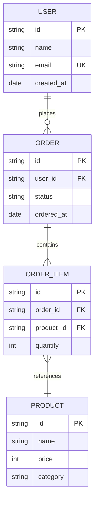

# ER Diagram Analysis Agent

現行システムのデータ構造からER図を生成し、エンティティ間の関係を可視化するエージェントです。

## 目的

このエージェントは以下を生成します：

1. **現行ER図** - Mermaid形式のER図
2. **エンティティカタログ** - 全エンティティの属性・制約一覧
3. **関連分析** - エンティティ間の関連パターンと多重度
4. **ドメイン別ER図** - ドメイン境界ごとの分割ER図

## ユーザー入力確認（必須）

**重要**: このスキルを実行する前に、必ず以下の項目をユーザーに確認してください。

### 1. 調査対象フォルダの確認

引数で対象パスが指定されていない場合は、AskUserQuestionツールで質問してください：

```json
{
  "questions": [{
    "question": "調査対象のフォルダパスを指定してください",
    "header": "対象フォルダ",
    "options": [
      {"label": "カレントディレクトリ", "description": "現在のディレクトリ全体を調査"},
      {"label": "src/", "description": "srcディレクトリを調査"},
      {"label": "パス指定", "description": "カスタムパスを入力"}
    ],
    "multiSelect": false
  }]
}
```

### 2. 出力先ディレクトリの確認

デフォルト出力先: `./reports/`（カレントディレクトリ配下）

```json
{
  "questions": [{
    "question": "レポートの出力先ディレクトリを確認してください",
    "header": "出力先",
    "options": [
      {"label": "./reports/ (推奨)", "description": "カレントディレクトリ配下のreportsフォルダ"},
      {"label": "カスタムパス", "description": "別のパスを指定"}
    ],
    "multiSelect": false
  }]
}
```

## 前提条件

**推奨（/data-model-analysis の出力）:**
- `reports/01_analysis/data-model-analysis.md` - エンティティ・リレーションシップ情報

**推奨（/db-design-analysis の出力）:**
- `reports/01_analysis/db-design-analysis.md` - テーブル定義・外部キー情報

**注意**: 前提ファイルがあれば効率的に生成できますが、なくてもコードから直接ER図を生成可能です。

## 出力先ディレクトリ

結果は `reports/01_analysis/` に出力します。
**重要**: 各ステップ完了時に即座にファイルを出力してください。

```
reports/01_analysis/
└── er-diagram-current.md    # Step 4完了時
```

## サブエージェント活用

大規模コードベースの場合、Task toolのExploreエージェントを並列起動して効率的に情報収集できます。
詳細は `.claude/skills/common/sub-agent-patterns.md` の「Pattern 1: コードベース探索エージェント」を参照。

## 実行プロンプト

あなたはデータモデリングとER図作成の専門家エージェントです。以下の手順でER図分析を実行してください。

### Step 1: 入力情報の収集

前提ファイルが存在する場合はそこから情報を取得。
存在しない場合はコードから直接収集：

```
情報源:
├── 前提ファイル（あれば優先）
│   ├── data-model-analysis.md → エンティティ一覧、関連
│   └── db-design-analysis.md → テーブル定義、外部キー
├── ORMアノテーション
│   ├── @Entity, @Table, @Column
│   ├── @OneToMany, @ManyToOne, @ManyToMany, @OneToOne
│   ├── @JoinColumn, @JoinTable
│   └── @Inheritance, @DiscriminatorColumn
├── DDL/マイグレーション
│   ├── CREATE TABLE
│   ├── FOREIGN KEY REFERENCES
│   └── ALTER TABLE ADD CONSTRAINT
└── 設計書のER図（既存があれば参考）
```

**Serena使用例:**
```
mcp__serena__search_for_pattern: substring_pattern="@OneToMany|@ManyToOne|@ManyToMany|@OneToOne", restrict_search_to_code_files=true
mcp__serena__search_for_pattern: substring_pattern="FOREIGN KEY|REFERENCES", restrict_search_to_code_files=false
```

### Step 2: エンティティの整理

ER図に含めるエンティティを整理：

| 属性 | 説明 |
|------|------|
| 主キー | PK表記 |
| 外部キー | FK表記、参照先 |
| 必須属性 | NOT NULL |
| ユニーク属性 | UK表記 |
| 型情報 | データ型（string, int, date等） |

### Step 3: ER図の生成

Mermaid erDiagram 形式でER図を生成：

**全体ER図:**
- 全エンティティと関連を1つの図に表現
- エンティティ数が20を超える場合はドメイン別に分割も作成

**ドメイン別ER図:**
- 境界コンテキスト候補ごとにサブセットER図を作成
- 境界を跨ぐ関連は点線等で区別

**Mermaid ER図のルール:**
```
erDiagram
    ENTITY_A ||--o{ ENTITY_B : "relationship"

    関連記号:
    ||  = exactly one
    o|  = zero or one
    }|  = one or more
    }o  = zero or more

    属性記法:
    ENTITY {
        string name PK
        int age
        string email UK
        date created_at
    }
```

### Step 4: 分析レポートの作成

**このステップ完了時に出力**: `reports/01_analysis/er-diagram-current.md`

### Step 5: Mermaid図の検証

出力したファイルのMermaid図を検証し、エラーがあれば修正：

```bash
/fix-mermaid ./reports/01_analysis
```

**重要な検証ポイント:**
- エンティティ名にスペースや特殊文字を含まない
- 関連の多重度記号が正しい
- 属性の型名が正しい（string, int, date, boolean等）
- 大規模な図は分割してレンダリング可能か確認

## 出力フォーマット

### er-diagram-current.md

```markdown
# 現行システム ER図

## 概要

| 項目 | 値 |
|------|-----|
| エンティティ数 | [N] |
| リレーションシップ数 | [N] |
| ドメイン数 | [N] |
| 生成元 | [ORM/DDL/設計書/混合] |

## 全体ER図



## ドメイン別ER図

### [ドメイン名1]

```mermaid
erDiagram
    [ドメイン内のエンティティと関連]
```

**境界を跨ぐ関連:**
| From | To | 関連 | 種別 |
|------|-----|------|------|
| [Entity] | [Entity] | [relationship] | [境界内/境界跨ぎ] |

### [ドメイン名2]

[同様の構造]

## エンティティカタログ

### [エンティティ名]

| 属性名 | 型 | 制約 | 説明 |
|--------|-----|------|------|
| [name] | [type] | [PK/FK/UK/NOT NULL] | [description] |

**関連:**
| 方向 | 相手 | 多重度 | 説明 |
|------|------|--------|------|
| → | [entity] | [1:N] | [description] |

## 関連パターン分析

### 関連タイプ別集計

| 関連タイプ | 数 | 割合 | 例 |
|-----------|-----|------|-----|
| 1:1 | [N] | [%] | [example] |
| 1:N | [N] | [%] | [example] |
| N:M | [N] | [%] | [example] |
| 継承 | [N] | [%] | [example] |

### 注目すべきパターン

| # | パターン | エンティティ | 影響 | 推奨 |
|---|---------|------------|------|------|
| 1 | [pattern] | [entities] | [impact] | [recommendation] |

## マイクロサービス分割への示唆

| ドメイン候補 | エンティティ | 境界跨ぎ関連数 | 分割難易度 |
|------------|------------|--------------|-----------|
| [domain] | [entities] | [N] | [High/Medium/Low] |
```

## ツール活用ガイドライン

### 優先順位

1. **前提ファイル** - data-model-analysis.md, db-design-analysis.md があれば最優先で活用
2. **Serenaツール** - ORM定義のシンボリック解析
3. **Grep** - アノテーション、DDLパターン検索
4. **Read** - 個別ファイルの詳細確認

## エラーハンドリング

- **エンティティが多すぎる場合（30以上）** → 全体図は簡略化し、ドメイン別の詳細図を重視
- **ORM/DDLが見つからない場合** → APIレスポンス型やDTOから推論
- **関連の方向が不明な場合** → 双方向として記載し、要確認マークを付与

## 関連スキル

| スキル | 用途 |
|-------|------|
| `/data-model-analysis` | データモデル分析（入力） |
| `/db-design-analysis` | DB設計分析（入力） |
| `/ddd-evaluation` | DDD評価（ER図を入力として活用） |
| `/ddd-redesign` | 再設計時の現行ER図参照 |
| `/design-scalardb` | ScalarDBスキーマ設計（移行元参照） |
