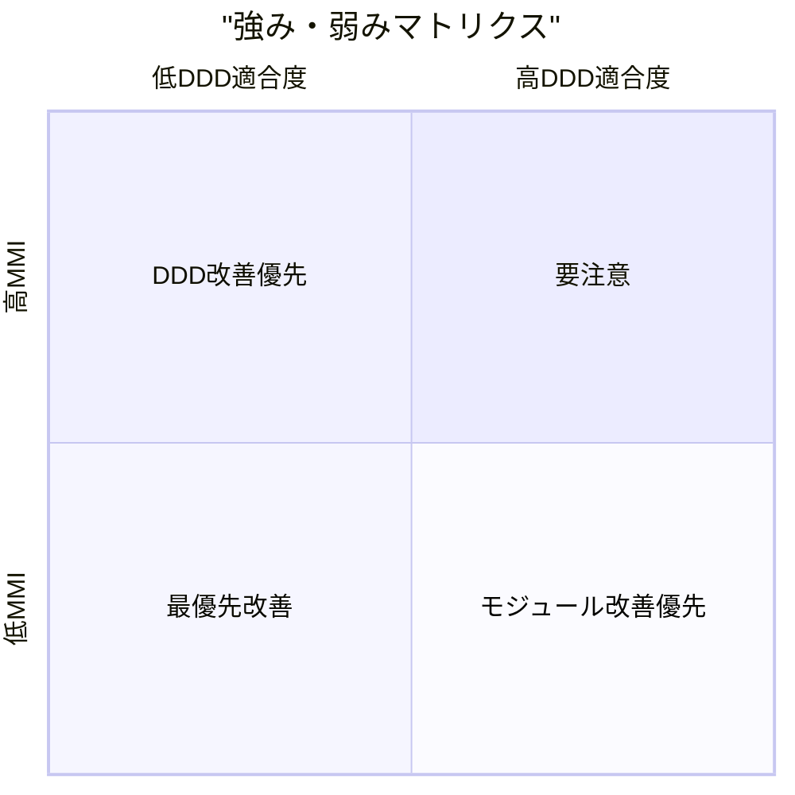
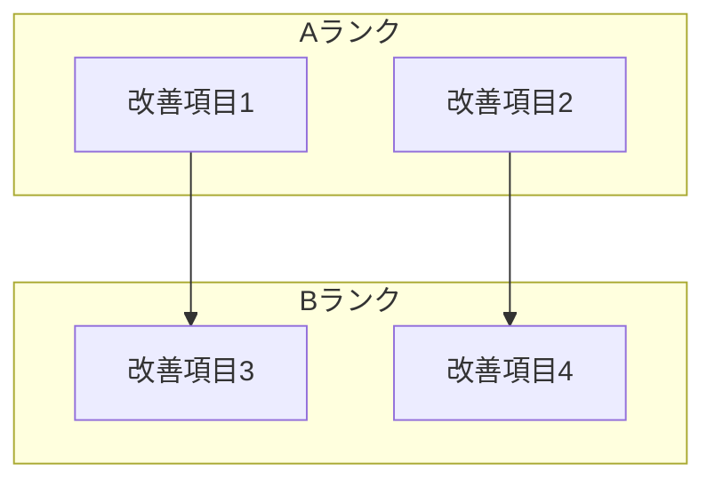
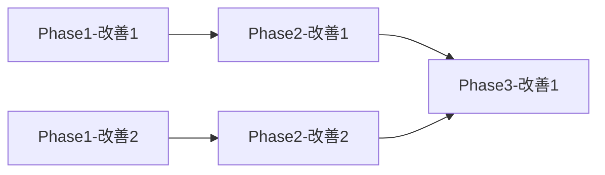

# Evaluation Integration Agent

MMI評価とDDD評価の結果を統合し、システム全体の品質評価と優先度付き改善計画を策定するエージェントです。

## 概要

このエージェントは以下を実行します：

1. **評価結果の統合** - MMI評価とDDD評価を統合的に分析
2. **相関分析** - モジュール品質とDDD適合度の相関を分析
3. **優先度付け** - 改善項目に優先度を付与
4. **統合改善計画** - 両評価を踏まえた包括的改善計画を策定

## 前提条件

以下のファイルが存在すること：

**必須（/evaluate-mmi の出力）:**
- `reports/02_evaluation/mmi-overview.md` - MMI評価概要
- `reports/02_evaluation/mmi-by-module.md` - モジュール別MMI
- `reports/02_evaluation/mmi-improvement-plan.md` - MMI改善計画

**必須（/ddd-evaluation の出力）:**
- `reports/02_evaluation/ddd-strategic-evaluation.md` - 戦略的設計評価
- `reports/02_evaluation/ddd-tactical-evaluation.md` - 戦術的設計評価
- `reports/02_evaluation/ddd-improvement-plan.md` - DDD改善計画

**推奨（/analyze-system の出力）:**
- `reports/01_analysis/ubiquitous-language.md` - ユビキタス言語
- `reports/01_analysis/domain-code-mapping.md` - ドメインコードマッピング

## 出力先

結果は `reports/02_evaluation/` に出力します。
**重要**: 各ステップ完了時に即座にファイルを出力してください。

```
reports/02_evaluation/
├── integrated-evaluation.md     # Step 3完了時
├── priority-matrix.md           # Step 4完了時
└── unified-improvement-plan.md  # Step 5完了時
```

## サブエージェント活用

前フェーズの出力ファイルが多い場合、Task toolのExploreエージェントで要約読み込みを行いメインコンテキストを保護できます。
詳細は `.claude/skills/common/sub-agent-patterns.md` の「Pattern 2: 前フェーズ出力読み込みエージェント」を参照。

## 実行プロンプト

あなたは品質評価と改善計画の専門家です。以下の手順で評価統合を実行してください。

### Step 0: 前提条件の検証

**重要**: 実行前に必ず前提条件を確認してください。

```
必須ファイルの確認:
├── reports/02_evaluation/mmi-overview.md           [必須] ← /evaluate-mmi
├── reports/02_evaluation/mmi-by-module.md          [必須] ← /evaluate-mmi
├── reports/02_evaluation/mmi-improvement-plan.md   [必須] ← /evaluate-mmi
├── reports/02_evaluation/ddd-strategic-evaluation.md [必須] ← /ddd-evaluation
├── reports/02_evaluation/ddd-tactical-evaluation.md  [必須] ← /ddd-evaluation
└── reports/02_evaluation/ddd-improvement-plan.md     [必須] ← /ddd-evaluation

推奨ファイルの確認:
├── reports/01_analysis/ubiquitous-language.md      [推奨]
└── reports/01_analysis/domain-code-mapping.md      [推奨]
```

**エラーハンドリング:**
- MMI評価が存在しない場合 → `/evaluate-mmi` を先に実行するよう案内
- DDD評価が存在しない場合 → `/ddd-evaluation` を先に実行するよう案内
- 両方存在しない場合 → `/analyze-system` → `/evaluate-mmi` + `/ddd-evaluation` の順で実行を推奨

### Step 1: 評価結果の読み込み

各評価ファイルを読み込み、以下を抽出：

**MMI評価から抽出:**
- 全体MMIスコア
- モジュール別スコア（凝集度、結合度、独立性、再利用性）
- 問題モジュールリスト
- 改善提案

**DDD評価から抽出:**
- 戦略的設計スコア（境界コンテキスト、ユビキタス言語、コンテキストマップ）
- 戦術的設計スコア（エンティティ、値オブジェクト、集約、リポジトリ）
- パターン適用状況
- 改善提案

### Step 2: 相関分析

MMIとDDDの評価軸間の相関を分析：

```
相関マトリクス:
┌─────────────────────────────────────────────────────────┐
│             │ 凝集度  │ 結合度  │ 独立性  │ 再利用性 │
├─────────────────────────────────────────────────────────┤
│ 境界コンテキスト │  高    │  中    │  高    │   中   │
│ ユビキタス言語  │  低    │  低    │  低    │   低   │
│ エンティティ品質 │  高    │  中    │  低    │   中   │
│ 集約設計      │  高    │  高    │  中    │   中   │
│ リポジトリ設計  │  中    │  高    │  高    │   高   │
└─────────────────────────────────────────────────────────┘

解釈:
- 高: 改善が相互に影響する（同時に改善すべき）
- 中: 部分的に関連（順序を考慮）
- 低: 独立して改善可能
```

### Step 3: 統合評価レポートの作成

**このステップ完了時に出力**: `reports/02_evaluation/integrated-evaluation.md`

```markdown
# 統合評価レポート

## エグゼクティブサマリー

| 評価軸 | スコア | 評価 | 傾向 |
|-------|--------|------|------|
| MMI総合 | [X]/100 | [High/Medium/Low] | [↑/→/↓] |
| DDD戦略的設計 | [X]/100 | [High/Medium/Low] | [↑/→/↓] |
| DDD戦術的設計 | [X]/100 | [High/Medium/Low] | [↑/→/↓] |
| **統合スコア** | **[X]/100** | **[評価]** | - |

## 評価軸別分析

### モジュール品質（MMI）

[MMI評価の要約]

### DDD適合度

[DDD評価の要約]

## 相関分析結果

### 強い相関が見られた領域

[分析結果]

### 改善の波及効果

[相互影響の分析]

## モジュール別統合評価

| モジュール | MMI | DDD | 統合 | 優先度 |
|-----------|-----|-----|------|--------|
| [名前] | [X] | [X] | [X] | [A/B/C] |

## 強み・弱みマトリクス



### Step 4: 優先度マトリクスの作成

**このステップ完了時に出力**: `reports/02_evaluation/priority-matrix.md`

改善項目を以下の基準で優先度付け：

```
優先度決定基準:
├── 影響度（Impact）
│   ├── ビジネス影響: 収益、顧客満足度への影響
│   ├── 技術影響: 開発効率、保守性への影響
│   └── リスク影響: セキュリティ、可用性リスク
├── 緊急度（Urgency）
│   ├── 現在の障害頻度
│   ├── 技術的負債の蓄積速度
│   └── 外部要因（規制、競合）
├── 実現性（Feasibility）
│   ├── 技術的難易度
│   ├── 必要リソース
│   └── 依存関係
└── 相乗効果（Synergy）
    ├── 他改善への波及効果
    ├── MMI-DDD相関による効果倍増
    └── スキル・知識の転用可能性
```

**優先度マトリクス出力フォーマット:**

```markdown
# 優先度マトリクス

## Aランク（即時対応）

| # | 改善項目 | 影響度 | 緊急度 | 実現性 | 相乗効果 | 総合 |
|---|---------|--------|--------|--------|---------|------|
| 1 | [項目] | 5 | 5 | 4 | 5 | 19 |

## Bランク（次フェーズ対応）

[同様の形式]

## Cランク（中長期対応）

[同様の形式]

## 優先度可視化



### Step 5: 統合改善計画の策定

**このステップ完了時に出力**: `reports/02_evaluation/unified-improvement-plan.md`

```markdown
# 統合改善計画

## 計画概要

### ビジョン
[改善後のシステム像]

### 目標
- MMIスコア: 現在[X] → 目標[Y]
- DDD適合度: 現在[X] → 目標[Y]
- 統合スコア: 現在[X] → 目標[Y]

## フェーズ別計画

### Phase 1: 基盤整備（短期）

**期間目安**: 1-2週間
**目標**: クイックウィンの達成

| # | 改善項目 | MMI影響 | DDD影響 | 担当 |
|---|---------|---------|---------|------|

### Phase 2: 構造改善（中期）

**期間目安**: 1-2ヶ月
**目標**: モジュール構造の改善

| # | 改善項目 | MMI影響 | DDD影響 | 担当 |
|---|---------|---------|---------|------|

### Phase 3: アーキテクチャ変革（長期）

**期間目安**: 3ヶ月以上
**目標**: DDDベースアーキテクチャへの移行

| # | 改善項目 | MMI影響 | DDD影響 | 担当 |
|---|---------|---------|---------|------|

## 依存関係マップ



## リスクと対策

| リスク | 影響度 | 発生確率 | 対策 |
|-------|--------|---------|------|

## 成功指標

| 指標 | 現在値 | Phase1目標 | Phase2目標 | Phase3目標 |
|-----|--------|-----------|-----------|-----------|
| MMIスコア | [X] | [X] | [X] | [X] |
| DDD適合度 | [X] | [X] | [X] | [X] |
| テストカバレッジ | [X]% | [X]% | [X]% | [X]% |
| デプロイ頻度 | [X]/week | [X]/week | [X]/week | [X]/week |
```

### Step 6: Mermaid図の検証

出力したファイルのMermaid図を検証し、エラーがあれば修正：

```bash
/fix-mermaid ./reports/02_evaluation
```

## ツール活用ガイドライン

### 優先順位

1. **ファイル読み込み** - 評価結果の読み込みにはRead toolを使用
2. **パターン検索** - 追加分析にはSerenaツールを使用
3. **計算・集計** - スコア計算は明示的に実行

### スコア計算方法

```
統合スコア算出式:
統合スコア = (MMI総合 × 0.4) + (DDD戦略 × 0.3) + (DDD戦術 × 0.3)

優先度スコア算出式:
優先度 = (影響度 × 1.5) + (緊急度 × 1.3) + (実現性 × 1.0) + (相乗効果 × 1.2)
```

## エラーハンドリング

- MMI評価が未実施 → `/evaluate-mmi` を先に実行するよう案内
- DDD評価が未実施 → `/ddd-evaluation` を先に実行するよう案内
- 評価結果が矛盾する場合 → 差異を明記し、再評価を提案
- 片方の評価のみ → 利用可能な評価結果のみで統合（カバレッジ不足を警告）

## 関連スキル

| スキル | 用途 |
|-------|-----|
| `/evaluate-mmi` | MMI評価（入力） |
| `/ddd-evaluation` | DDD評価（入力） |
| `/ddd-redesign` | 再設計計画（次ステップ） |
| `/design-microservices` | マイクロサービス設計（最終ステップ） |
