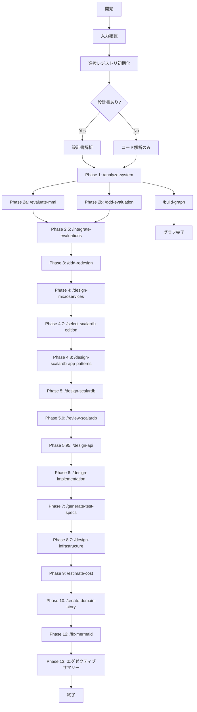

# System Refactoring Orchestrator

既存システムをマイクロサービスアーキテクチャにリファクタリングするための統合エージェントです。

## 概要

このスキルは、既存の設計書やコードを分析し、以下のプロセスを通じてマイクロサービスアーキテクチャへの変換計画を策定します：

1. **システム分析** - 既存コードと設計書の解析
2. **MMI評価** - Modularity Maturity Indexによる成熟度評価
3. **ドメインマッピング** - ビジネスドメインとコードの紐付け
4. **マイクロサービス設計** - ターゲットアーキテクチャの策定
5. **ScalarDB設計** - 分散トランザクション・データアーキテクチャの策定
6. **ドメインストーリー** - 各ドメインのユースケース整理

## 使用方法

```
/refactor-system [対象パス] [オプション]
```

### オプション
- `--analyze-only` - 分析のみ実行（設計書生成なし）
- `--skip-mmi` - MMI評価をスキップ
- `--domain=[ドメイン名]` - 特定ドメインのみ対象
- `--output=[出力パス]` - 出力先ディレクトリ指定（デフォルト: `./reports/`、カレントディレクトリ配下）

## ユーザー入力確認（必須）

**重要**: このスキルを実行する前に、必ず以下の項目をユーザーに確認してください。

### 1. 調査対象フォルダの確認

引数で対象パスが指定されていない場合は、AskUserQuestionツールで質問してください：

```json
{
  "questions": [{
    "question": "調査対象のフォルダパスを指定してください",
    "header": "対象フォルダ",
    "options": [
      {"label": "カレントディレクトリ", "description": "現在のディレクトリ全体を調査"},
      {"label": "src/", "description": "srcディレクトリを調査"},
      {"label": "パス指定", "description": "カスタムパスを入力"}
    ],
    "multiSelect": false
  }]
}
```

### 2. 出力先ディレクトリの確認

デフォルト出力先: `./reports/`（カレントディレクトリ配下）

```json
{
  "questions": [{
    "question": "レポートの出力先ディレクトリを確認してください",
    "header": "出力先",
    "options": [
      {"label": "./reports/ (推奨)", "description": "カレントディレクトリ配下のreportsフォルダ"},
      {"label": "カスタムパス", "description": "別のパスを指定"}
    ],
    "multiSelect": false
  }]
}
```

## 出力ファイル構造

```
reports/
├── 00_summary/
│   └── executive-summary.md          # エグゼクティブサマリー
├── 01_analysis/
│   ├── ubiquitous-language.md        # ユビキタス言語集
│   ├── actors-roles-permissions.md   # アクター・ロール・権限
│   ├── domain-code-mapping.md        # ドメイン-コード対応表
│   └── system-overview.md            # 現行システム概要
├── 02_evaluation/
│   ├── mmi-overview.md               # MMI全体サマリー
│   ├── mmi-by-module.md              # モジュール別MMI
│   └── mmi-improvement-plan.md       # MMI改善計画
├── 03_design/
│   ├── domain-analysis.md            # ドメイン分析
│   ├── system-mapping.md             # システムマッピング
│   ├── target-architecture.md        # ターゲットアーキテクチャ
│   ├── transformation-plan.md        # 変換計画
│   ├── operations-feedback.md        # 運用・フィードバック計画
│   ├── scalardb-architecture.md      # ScalarDBアーキテクチャ設計
│   ├── scalardb-schema.md            # ScalarDBスキーマ設計
│   ├── scalardb-transaction.md       # ScalarDBトランザクション設計
│   └── scalardb-migration.md         # ScalarDBマイグレーション計画
├── 04_stories/
│   └── [domain]-story.md             # ドメイン別ストーリー
├── 05_estimate/
│   ├── cost-summary.md               # コストサマリー
│   ├── infrastructure-detail.md      # インフラ詳細見積もり
│   ├── license-requirements.md       # ライセンス要件・問い合わせ情報
│   └── cost-assumptions.md           # 見積もり前提条件
├── 06_implementation/                # AIコーディング用実装仕様
│   ├── domain-services-spec.md       # ドメインサービスのメソッド仕様
│   ├── repository-interfaces-spec.md # リポジトリインターフェース仕様
│   ├── value-objects-spec.md         # 値オブジェクト詳細仕様
│   ├── exception-mapping.md          # 例外マッピング表
│   ├── saga-orchestration-spec.md    # Saga仕様
│   ├── implementation-checklist.md   # 実装チェックリスト
│   └── api-gateway-implementation-spec.md # API Gateway実装仕様
├── 07_test-specs/                    # テスト仕様
│   ├── bdd-scenarios/                # Gherkin形式のBDDシナリオ
│   ├── unit-test-specs.md            # ユニットテスト仕様
│   ├── integration-test-specs.md     # 統合テスト仕様
│   ├── edge-case-specs.md            # 境界値・エラーケース
│   ├── performance-test-specs.md     # パフォーマンステスト仕様
│   └── test-data-requirements.md     # テストデータ定義
└── 08_infrastructure/                # インフラ構成
    ├── infrastructure-architecture.md # アーキテクチャ総合図
    ├── deployment-guide.md           # デプロイ手順書
    ├── environment-matrix.md         # 環境比較マトリクス
    └── security-configuration.md     # セキュリティ設定ガイド
```

## 進捗追跡レジストリ

パイプラインの進捗は `work/{project}/pipeline-progress.json` に記録されます。
詳細は `.claude/skills/common/progress-registry.md` を参照してください。

### レジストリの活用

1. **中断からの再開**: レジストリを参照して完了済みフェーズをスキップ
2. **前提条件チェック**: 各フェーズの依存関係を検証
3. **進捗レポート**: 全体の完了状況を可視化

## 実行フロー



## 処理詳細

**重要**: 各Phaseは完了時に即座に対応するファイルを `reports/` ディレクトリに出力します。
最後にまとめて出力するのではなく、解析中にリアルタイムでファイルを生成してください。

### 初期化: 入力収集と初期分析

1. 出力ディレクトリの作成: `mkdir -p reports/{00_summary,01_analysis,02_evaluation,03_design,04_stories,05_estimate,06_implementation,07_test-specs,graph/data,graph/visualizations,sizing-estimates}`
2. 対象ディレクトリのスキャン
3. 設計書ファイルの特定（`.md`, `.docx`, `.xlsx`, `.pdf` など）
4. ソースコードの構造解析
5. 使用技術スタックの特定

**初期化完了時に出力**: `reports/00_summary/project_metadata.json`

### Phase 1: システム分析

Taskツールで `/analyze-system` スキルを実行し、以下を抽出：
- ユビキタス言語の抽出
- アクター・ロール・権限の整理
- ドメイン境界の初期推定

**Phase 1完了時に出力**:
- `reports/01_analysis/system-overview.md`
- `reports/01_analysis/ubiquitous-language.md`
- `reports/01_analysis/actors-roles-permissions.md`
- `reports/01_analysis/domain-code-mapping.md`

### Phase 2a/2b: MMI評価・DDD評価（並行実行）

Taskツールで `mmi-evaluator` と `ddd-evaluator` エージェントを並行起動。

**MMI評価 (Phase 2a)**:
- **Cohesion（凝集度）** - 30%
- **Coupling（結合度）** - 30%
- **Independence（独立性）** - 20%
- **Reusability（再利用性）** - 20%

**Phase 2a完了時に出力**:
- `reports/02_evaluation/mmi-overview.md`
- `reports/02_evaluation/mmi-by-module.md`
- `reports/02_evaluation/mmi-improvement-plan.md`

**DDD評価 (Phase 2b)完了時に出力**:
- `reports/02_evaluation/ddd-strategic-evaluation.md`
- `reports/02_evaluation/ddd-tactical-evaluation.md`
- `reports/02_evaluation/ddd-improvement-plan.md`

### Phase 2.5: 評価統合

**スキル**: `/integrate-evaluations`

Phase 2a と Phase 2b の結果を統合し、優先度付き改善計画を策定。

**Phase 2.5完了時に出力**:
- `reports/02_evaluation/integrated-evaluation.md`
- `reports/02_evaluation/unified-improvement-plan.md`

### Phase 3: DDD再設計・ドメインマッピング

Taskツールで `domain-mapper` エージェントを起動し、以下を実行：
- 設計書の概念とコードの対応付け
- ドメインタイプの分類（Pipeline/Blackboard/Dialogue）
- マイクロサービス境界の分類（Process/Master/Integration/Supporting）
- 境界コンテキスト、集約の再設計

**Phase 3完了時に出力**:
- `reports/03_design/domain-analysis.md`
- `reports/03_design/context-map.md`
- `reports/03_design/bounded-contexts-redesign.md`
- `reports/03_design/aggregate-redesign.md`

### Phase 4: マイクロサービス設計

Taskツールで `microservice-architect` エージェントを起動し、以下を策定：
- コンテキストマップ
- マクロアーキテクチャ
- データストレージ設計
- 移行計画

**Phase 4完了時に出力**:
- `reports/03_design/target-architecture.md`
- `reports/03_design/transformation-plan.md`
- `reports/03_design/operations-feedback.md`

### Phase 4.7: ScalarDBエディション選定

**スキル**: `/select-scalardb-edition`

対話形式でScalarDBエディション（OSS/Community, Enterprise Standard, Enterprise Premium）を選定。

**Phase 4.7完了時に出力**:
- `work/{project}/scalardb-edition-config.md`

### Phase 4.8: ScalarDBアプリケーション設計パターン

**スキル**: `/design-scalardb-app-patterns`

**前提**: Phase 4.7（エディション選定）が完了していること。

**Phase 4.8完了時に出力**:
- `reports/03_design/scalardb-app-patterns.md`

### Phase 5: ScalarDB設計

Taskツールで `scalardb-architect` エージェントを起動し、以下を策定：
- **デプロイモード選定** - ScalarDB Core（ライブラリ）vs Cluster（サーバー）
- **ストレージバックエンド設計** - 各サービスに適したDB選定（PostgreSQL, DynamoDB, Cassandra等）
- **スキーマ設計** - Namespace、テーブル定義、パーティションキー、クラスタリングキー
- **トランザクション設計** - Consensus Commit、Two-Phase Commit、Sagaパターン
- **マイグレーション計画** - 既存DBからの移行戦略

**Phase 5完了時に出力**:
- `reports/03_design/scalardb-architecture.md`
- `reports/03_design/scalardb-schema.md`
- `reports/03_design/scalardb-transaction.md`
- `reports/03_design/scalardb-migration.md`

### Phase 5.9: ScalarDB設計レビュー

**スキル**: `/review-scalardb --mode=design`

**前提**: Phase 5（ScalarDB設計）が完了していること。

**Phase 5.9完了時に出力**:
- `reports/03_design/scalardb-design-review.md`

### Phase 5.95: API設計

**スキル**: `/design-api`

**前提**: Phase 5.9（ScalarDB設計レビュー）が完了していること。ScalarDBスキーマ設計の結果を踏まえてAPI設計を行う。

**Phase 5.95完了時に出力**:
- `reports/03_design/api-design-overview.md`
- `reports/03_design/api-gateway-design.md`
- `reports/03_design/api-security-design.md`
- `reports/03_design/api-specifications/*.yaml`

### Phase 6: 実装仕様生成

Taskツールで `implementation-designer` エージェントを起動し、AIコーディング用の詳細仕様を策定：
- **ドメインサービス仕様** - メソッドシグネチャ、バリデーション、イベント発行
- **リポジトリインターフェース仕様** - メソッド、クエリ、キャッシュ設定
- **値オブジェクト詳細仕様** - 型定義、バリデーション、操作メソッド
- **例外マッピング表** - ドメイン例外 → HTTPステータス変換
- **Sagaオーケストレーション仕様** - ステップ定義、補償トランザクション
- **API Gateway実装仕様** - Kong設定、認証プラグイン、レート制限、サーキットブレーカー

**Phase 6完了時に出力**:
- `reports/06_implementation/domain-services-spec.md`
- `reports/06_implementation/repository-interfaces-spec.md`
- `reports/06_implementation/value-objects-spec.md`
- `reports/06_implementation/exception-mapping.md`
- `reports/06_implementation/saga-orchestration-spec.md`
- `reports/06_implementation/implementation-checklist.md`
- `reports/06_implementation/api-gateway-implementation-spec.md`

### Phase 7: テスト仕様生成

Taskツールで `test-spec-generator` エージェントを起動し、テストコード実装用の仕様を策定：
- **BDDシナリオ** - Gherkin形式のビジネスシナリオ
- **ユニットテスト仕様** - クラス・メソッド単位のテストケース
- **統合テスト仕様** - サービス間連携のテスト
- **エッジケース仕様** - 境界値・異常系テスト
- **パフォーマンステスト仕様** - 負荷・応答時間テスト

**Phase 7完了時に出力**:
- `reports/07_test-specs/bdd-scenarios/*.feature`
- `reports/07_test-specs/unit-test-specs.md`
- `reports/07_test-specs/integration-test-specs.md`
- `reports/07_test-specs/edge-case-specs.md`
- `reports/07_test-specs/performance-test-specs.md`
- `reports/07_test-specs/test-data-requirements.md`

### Phase 8: コード生成（スキップ）

**注意**: `/refactor-system` はコード生成なしの分析・設計オーケストレーターです。
コード生成（Phase 8: `/generate-scalardb-code`）が必要な場合は `/full-pipeline` を使用してください。

### Phase 8.7: インフラ基盤構成設計（オプション）

**スキル**: `/design-infrastructure`

**前提**: Phase 4（`target-architecture.md`）が完了していること。

Taskツールで `infrastructure-designer` エージェントを起動し、以下を策定：
- **Kubernetesアーキテクチャ** - クラスタ構成、ネームスペース、ネットワーク設計
- **IaC構成** - Terraform/Helm/Kustomize/OpenShift設定
- **セキュリティ設計** - mTLS、Network Policy、Secret管理
- **マルチ環境戦略** - dev/staging/production環境設定

**Phase 8.7完了時に出力**:
- `reports/08_infrastructure/infrastructure-architecture.md`
- `reports/08_infrastructure/deployment-guide.md`
- `reports/08_infrastructure/environment-matrix.md`
- `reports/08_infrastructure/security-configuration.md`
- `generated/infrastructure/` - IaC & K8sマニフェスト

### Phase 9: コスト見積もり

Taskツールで `cost-estimator` エージェントを起動し、以下を策定：
- **クラウドインフラ費用** - Kubernetes、データベース、ネットワーク、ストレージ
- **ライセンス費用** - ScalarDB、その他商用ソフトウェア
- **運用費用** - 監視、バックアップ、サポート
- **初期構築費用** - 移行、開発、トレーニング

**Phase 9完了時に出力**:
- `reports/05_estimate/cost-summary.md`
- `reports/05_estimate/infrastructure-detail.md`
- `reports/05_estimate/license-requirements.md`
- `reports/05_estimate/cost-assumptions.md`

### Phase 10: ドメインストーリー

Taskツールで `domain-storyteller` エージェントを起動し、各ドメインについて：
- アクター特定
- ワークアイテム整理
- アクティビティフロー記述
- 例外シナリオ検討

**Phase 10完了時に出力**: `reports/04_stories/[domain]-story.md`

### Phase 12: Mermaid図の検証・修正

全レポートのMermaid図を検証し、シンタックスエラーがあれば修正：

1. Mermaid図を含むMarkdownファイルを検索
2. 各図の構文を検証
3. エラーを発見した場合は自動修正
4. 修正結果をログ出力

```bash
# /fix-mermaid スキルを使用
/fix-mermaid ./reports
```

**検証項目:**
- サブグラフ名の引用符
- 日本語ラベルの引用符
- `<br/>`を含むノードの引用符
- エッジラベルの特殊文字
- sequenceDiagramの予約語（BOX等）

**Phase 12完了時に出力**: 修正ログ（コンソール出力）

### Phase 13: エグゼクティブサマリー

全Phaseの結果を統合し、エグゼクティブサマリーを作成。

**Phase 13完了時に出力**: `reports/00_summary/executive-summary.md`

## 依存スキル

このスキルは以下のサブスキルを使用します：

### コア分析スキル
- `/system-investigation` - 現行システム調査（オプション）
- `/security-analysis` - セキュリティ分析（OWASP Top 10、ゼロトラスト準備度）
- `/access-control-analysis` - アクセス制御分析（ゼロトラストモデル）
- `/analyze-system` - システム分析
- `/data-model-analysis` - データモデル分析（エンティティ、リレーションシップ、ドメインルール）
- `/db-design-analysis` - DB設計分析（テーブル定義、インデックス、正規化）
- `/er-diagram-analysis` - ER図分析（現行ER図の生成）

### 評価スキル
- `/evaluate-mmi` - MMI評価
- `/ddd-evaluation` - DDD評価
- `/integrate-evaluations` - 評価統合

### 設計スキル
- `/ddd-redesign` - DDD再設計（境界コンテキスト、集約、コンテキストマップ）
- `/design-microservices` - マイクロサービス設計
- `/select-scalardb-edition` - ScalarDBエディション選定（OSS/Enterprise Standard/Premium）
- `/design-scalardb-app-patterns` - ScalarDBアプリケーション設計パターン（ドメインタイプ判別・DB選定）
- `/design-scalardb` - ScalarDB設計（分散トランザクション・データアーキテクチャ）
- `/design-scalardb-analytics` - ScalarDB Analytics設計（Apache Spark分析基盤）
- `/review-scalardb` - ScalarDB設計/コードレビュー（エディション整合性・Key設計・トランザクション検証）
- `/design-api` - API設計（REST/GraphQL/gRPC/AsyncAPI）

### 実装仕様スキル
- `/design-implementation` - 実装仕様（ドメインサービス、リポジトリ、値オブジェクト、例外マッピング）
- `/generate-test-specs` - テスト仕様（BDDシナリオ、ユニットテスト、統合テスト）

### インフラ設計スキル
- `/design-infrastructure` - インフラ基盤構成設計（Kubernetes・IaC、オプション）

### 補助スキル
- `/create-domain-story` - ドメインストーリー作成
- `/estimate-cost` - コスト見積もり（クラウドインフラ・ライセンス）
- `/build-graph` - ナレッジグラフ構築
- `/fix-mermaid` - Mermaid図の検証・修正

## 使用例

### 基本的な使用

```
/refactor-system ./src
```

### 特定ドメインのみ分析

```
/refactor-system ./src --domain=Order
```

### 分析のみ実行

```
/refactor-system ./src --analyze-only
```

## 注意事項

- 大規模なコードベースの場合、処理に時間がかかる場合があります
- 中間ファイルは `reports/` に保存されます
- 既存の出力ファイルは上書きされます（バックアップ推奨）
- 設計書がない場合でもコードから推論可能ですが、精度が低下する可能性があります
