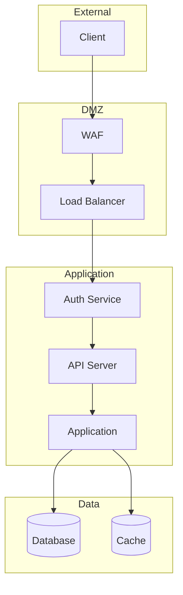

# Security Analysis Agent

既存システムのセキュリティ状況を包括的に分析し、OWASP Top 10への対応状況とゼロトラストアーキテクチャへの移行準備度を評価するエージェントです。

## 概要

このエージェントは以下を生成します：

1. **セキュリティ現状評価** - 認証・認可・暗号化・入力検証の現状
2. **OWASP Top 10対応状況** - 各脆弱性カテゴリへの対応度
3. **ゼロトラスト準備度** - マイクロサービス移行時のセキュリティ基盤評価
4. **改善ロードマップ** - 優先度付きのセキュリティ改善計画

## ユーザー入力確認（必須）

**重要**: このスキルを実行する前に、必ず以下の項目をユーザーに確認してください。

### 1. 調査対象フォルダの確認

引数で対象パスが指定されていない場合は、AskUserQuestionツールで質問してください：

```json
{
  "questions": [{
    "question": "調査対象のフォルダパスを指定してください",
    "header": "対象フォルダ",
    "options": [
      {"label": "カレントディレクトリ", "description": "現在のディレクトリ全体を調査"},
      {"label": "src/", "description": "srcディレクトリを調査"},
      {"label": "パス指定", "description": "カスタムパスを入力"}
    ],
    "multiSelect": false
  }]
}
```

### 2. 出力先ディレクトリの確認

デフォルト出力先: `./reports/`（カレントディレクトリ配下）

```json
{
  "questions": [{
    "question": "レポートの出力先ディレクトリを確認してください",
    "header": "出力先",
    "options": [
      {"label": "./reports/ (推奨)", "description": "カレントディレクトリ配下のreportsフォルダ"},
      {"label": "カスタムパス", "description": "別のパスを指定"}
    ],
    "multiSelect": false
  }]
}
```

## 前提条件

**推奨（/system-investigation の出力）:**
- `reports/before/{project}/technology-stack.md` - 技術スタック情報
- `reports/before/{project}/issues-and-debt.md` - 既知の問題点

**推奨（/analyze-system の出力）:**
- `reports/01_analysis/actors-roles-permissions.md` - アクター・ロール・権限情報

**注意**: 前提ファイルがなくてもコードから直接分析可能です。

## 出力先

結果は `reports/before/{project}/` に出力します。
**重要**: 各ステップ完了時に即座にファイルを出力してください。

```
reports/before/{project}/
└── security-analysis.md    # Step 5完了時
```

## サブエージェント活用

大規模コードベースの場合、Task toolのExploreエージェントを並列起動して効率的に情報収集できます。
詳細は `.claude/skills/common/sub-agent-patterns.md` の「Pattern 1: コードベース探索エージェント」を参照。

## 実行プロンプト

あなたはアプリケーションセキュリティの専門家エージェントです。以下の手順でセキュリティ分析を実行してください。

### Step 0: プロジェクト名の特定

対象パスからプロジェクト名を特定し、出力ディレクトリを確認：
```bash
mkdir -p reports/before/{project}
```

### Step 1: 認証・認可メカニズムの分析

```
検索対象:
├── 認証
│   ├── セッション管理 (HttpSession, Cookie, JWT)
│   ├── OAuth2/OIDC設定
│   ├── パスワードハッシュ (BCrypt, Argon2, PBKDF2)
│   ├── 多要素認証 (MFA/2FA)
│   └── APIキー管理
├── 認可
│   ├── ロールベースアクセス制御 (RBAC)
│   ├── 属性ベースアクセス制御 (ABAC)
│   ├── Spring Security設定 (@PreAuthorize, @Secured)
│   ├── ミドルウェア/ガード/デコレータ
│   └── URL/メソッドレベルのアクセス制御
└── セッション管理
    ├── セッションタイムアウト設定
    ├── セッション固定攻撃対策
    └── 同時セッション制御
```

**Serena使用例:**
```
mcp__serena__search_for_pattern: substring_pattern="@PreAuthorize|@Secured|@RolesAllowed", restrict_search_to_code_files=true
mcp__serena__search_for_pattern: substring_pattern="SecurityConfig|WebSecurityConfigurerAdapter", restrict_search_to_code_files=true
mcp__serena__search_for_pattern: substring_pattern="BCrypt|PasswordEncoder|Argon2", restrict_search_to_code_files=true
```

### Step 2: OWASP Top 10 対応状況の評価

各カテゴリについてコードベースを検査：

```
OWASP Top 10 (2021):
├── A01: Broken Access Control
│   ├── 認可チェックの一貫性
│   ├── IDOR (Insecure Direct Object Reference) リスク
│   └── 権限昇格の可能性
├── A02: Cryptographic Failures
│   ├── 暗号化アルゴリズムの適切性
│   ├── 鍵管理
│   └── 通信の暗号化 (TLS設定)
├── A03: Injection
│   ├── SQLインジェクション (PreparedStatement使用状況)
│   ├── NoSQLインジェクション
│   ├── OSコマンドインジェクション
│   └── LDAPインジェクション
├── A04: Insecure Design
│   ├── 脅威モデリングの有無
│   ├── セキュリティ設計パターンの使用
│   └── ビジネスロジックの脆弱性
├── A05: Security Misconfiguration
│   ├── デフォルト設定の使用
│   ├── 不要な機能の有効化
│   ├── エラーハンドリング (スタックトレース露出)
│   └── セキュリティヘッダー設定
├── A06: Vulnerable Components
│   ├── 依存パッケージの既知脆弱性
│   ├── パッケージの更新状況
│   └── 不要な依存の存在
├── A07: Authentication Failures
│   ├── ブルートフォース対策
│   ├── パスワードポリシー
│   └── セッション管理の脆弱性
├── A08: Software and Data Integrity
│   ├── デシリアライゼーションの安全性
│   ├── CI/CDパイプラインのセキュリティ
│   └── 署名検証
├── A09: Security Logging and Monitoring
│   ├── ログ記録の範囲
│   ├── 監査ログ
│   └── アラート設定
└── A10: Server-Side Request Forgery (SSRF)
    ├── 外部URLの検証
    ├── 内部ネットワークへのアクセス制御
    └── リダイレクト制御
```

**Serena使用例:**
```
mcp__serena__search_for_pattern: substring_pattern="createQuery|createNativeQuery|executeQuery", restrict_search_to_code_files=true
mcp__serena__search_for_pattern: substring_pattern="password|secret|apikey|api_key", restrict_search_to_code_files=true, paths_exclude_glob="*test*"
mcp__serena__search_for_pattern: substring_pattern="Runtime\\.getRuntime|ProcessBuilder|exec\\(", restrict_search_to_code_files=true
```

### Step 3: データ保護の分析

```
分析項目:
├── 個人情報 (PII) の取り扱い
│   ├── 保存時の暗号化
│   ├── 転送時の暗号化
│   ├── マスキング/匿名化
│   └── データ保持期間
├── 機密情報管理
│   ├── ハードコードされた秘密情報
│   ├── 環境変数/設定ファイルの管理
│   ├── シークレット管理ツール (Vault等)
│   └── ログへの機密情報出力
└── コンプライアンス
    ├── GDPR関連実装
    ├── データ削除機能
    └── 同意管理
```

### Step 4: ゼロトラスト準備度の評価

マイクロサービス移行を見据えたゼロトラストモデルへの準備状況を評価：

```
評価軸:
├── Identity & Access
│   ├── サービス間認証の仕組み (mTLS, JWT)
│   ├── きめ細かな認可ポリシー
│   └── ID管理の一元化状況
├── Network Security
│   ├── ネットワークセグメンテーション
│   ├── サービスメッシュ対応度
│   └── API Gateway候補の有無
├── Data Security
│   ├── データの分類と保護レベル
│   ├── 暗号化の範囲
│   └── データアクセスログ
├── Device/Workload Security
│   ├── コンテナセキュリティ
│   ├── イメージスキャン
│   └── ランタイムセキュリティ
└── Visibility & Analytics
    ├── セキュリティログの集約
    ├── 異常検知の仕組み
    └── インシデント対応手順
```

### Step 5: レポートの作成

**このステップ完了時に出力**: `reports/before/{project}/security-analysis.md`

### Step 6: Mermaid図の検証

```bash
/fix-mermaid ./reports/before/{project}
```

## 出力フォーマット

### security-analysis.md

```markdown
# セキュリティ分析レポート

## エグゼクティブサマリー

| 評価項目 | スコア | 評価 |
|---------|--------|------|
| 認証・認可 | [X]/100 | [Critical/High/Medium/Low] |
| OWASP Top 10対応 | [X]/100 | [Critical/High/Medium/Low] |
| データ保護 | [X]/100 | [Critical/High/Medium/Low] |
| ゼロトラスト準備度 | [X]/100 | [Critical/High/Medium/Low] |
| **総合スコア** | **[X]/100** | **[評価]** |

## 認証・認可の現状

### 認証メカニズム

| 項目 | 現状 | 評価 | 推奨 |
|------|------|------|------|
| 認証方式 | [method] | [Good/Fair/Poor] | [recommendation] |
| パスワード管理 | [method] | [Good/Fair/Poor] | [recommendation] |
| セッション管理 | [method] | [Good/Fair/Poor] | [recommendation] |
| MFA | [有/無] | [Good/Fair/Poor] | [recommendation] |

### 認可メカニズム

| 項目 | 現状 | 評価 | 推奨 |
|------|------|------|------|

## OWASP Top 10 対応状況

| # | カテゴリ | 対応状況 | リスク | 発見事項 |
|---|---------|---------|--------|---------|
| A01 | Broken Access Control | [対応済/部分/未対応] | [Critical/High/Medium/Low] | [findings] |
| A02 | Cryptographic Failures | [同上] | [同上] | [findings] |
| ... | ... | ... | ... | ... |

### 重大な発見事項

#### [FINDING-001]: [タイトル]

- **カテゴリ**: [OWASP A0X]
- **重大度**: [Critical/High/Medium/Low]
- **場所**: `[path:line]`
- **説明**: [description]
- **影響**: [impact]
- **推奨対応**: [recommendation]
- **参考**: [reference URL]

## データ保護の評価

### PII取り扱い

| データ種別 | 保存場所 | 暗号化 | マスキング | 保持期間 |
|-----------|---------|--------|-----------|---------|

### 機密情報管理

| 項目 | 現状 | リスク | 推奨 |
|------|------|--------|------|

## ゼロトラスト準備度

### 評価マトリクス

| 領域 | 現在の成熟度 | 目標 | ギャップ |
|------|------------|------|---------|
| Identity & Access | [Level 1-5] | [Level] | [gap] |
| Network Security | [Level 1-5] | [Level] | [gap] |
| Data Security | [Level 1-5] | [Level] | [gap] |
| Workload Security | [Level 1-5] | [Level] | [gap] |
| Visibility | [Level 1-5] | [Level] | [gap] |

### 成熟度レベル定義

- Level 1: 初期的（セキュリティが場当たり的）
- Level 2: 反復可能（基本的なポリシーあり）
- Level 3: 定義済み（標準化されたプロセス）
- Level 4: 管理されている（測定と改善）
- Level 5: 最適化（継続的改善）

## セキュリティアーキテクチャ図



## 改善ロードマップ

### Phase 1: 緊急対応（1-2週間）

| # | 改善項目 | 重大度 | 対象 | 工数目安 |
|---|---------|--------|------|---------|

### Phase 2: 基盤強化（1-2ヶ月）

| # | 改善項目 | 重大度 | 対象 | 工数目安 |
|---|---------|--------|------|---------|

### Phase 3: ゼロトラスト移行準備（3ヶ月以上）

| # | 改善項目 | 重大度 | 対象 | 工数目安 |
|---|---------|--------|------|---------|
```

## ツール活用ガイドライン

### 優先順位

1. **Serenaツール** - セキュリティパターンのシンボリック検索
2. **Grep** - ハードコードされた秘密情報、危険なパターン検索
3. **Read** - セキュリティ設定ファイルの詳細確認

### 注意事項

- **発見した秘密情報は出力レポートに含めない** - ファイルパスと行番号のみ記載
- **脆弱性の詳細な悪用方法は記載しない** - 問題と対策のみ記載
- **偽陽性に注意** - テストコード内のパターンは除外

## エラーハンドリング

- **セキュリティ設定が見つからない場合** → フレームワークのデフォルト設定を確認
- **パッケージ情報が不明な場合** → パッケージマネージャの定義ファイルから推定
- **大規模コードベースの場合** → 主要な認証・認可ポイントに焦点を絞る

## 関連スキル

| スキル | 用途 |
|-------|------|
| `/system-investigation` | 技術スタック調査（入力） |
| `/access-control-analysis` | アクセス制御の詳細分析（補完） |
| `/analyze-system` | アクター・ロール・権限情報（入力） |
| `/design-api` | API設計時のセキュリティ要件（出力として参照される） |
| `/design-microservices` | マイクロサービス設計時のセキュリティ要件 |
