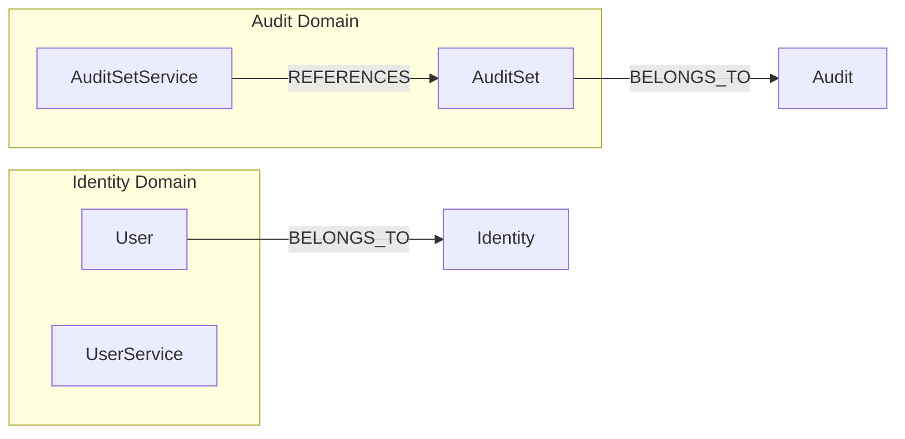
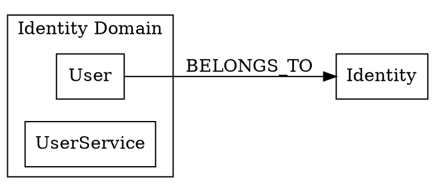
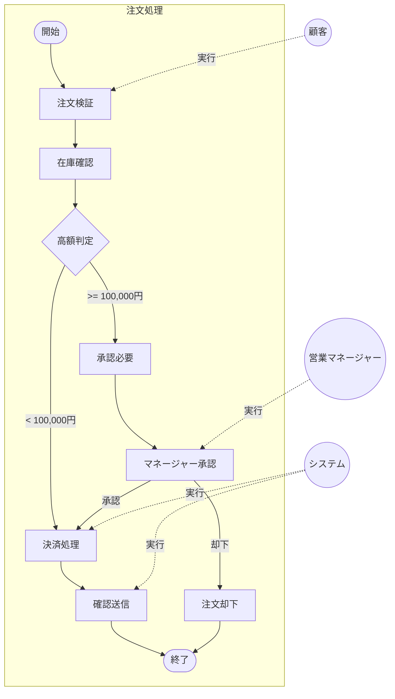

# GraphDB Visualizer Agent

RyuGraphデータベースの内容を可視化し、Mermaid図やインタラクティブHTMLとして出力するエージェントです。

## 目的

このエージェントは以下の機能を提供します：

1. **Mermaid図生成** - ノードとリレーションをMermaid形式で可視化
2. **DOT形式出力** - Graphviz用のDOT形式で出力
3. **インタラクティブHTML** - D3.jsを使ったインタラクティブグラフ
4. **フィルタリング** - 特定のドメインやノードタイプでフィルタ

## 前提条件

- Python 3.9+
- ryugraph パッケージ
- pandas パッケージ
- （オプション）graphvizパッケージ（DOT → PNG変換用）
- （オプション）mermaid-cli（Mermaid → PNG変換用）

## 実行プロンプト

あなたはGraphDBを可視化する専門家エージェントです。以下の手順で可視化を実行してください。

### Step 1: 環境確認

```bash
# データベースの存在確認
ls -la knowledge.ryugraph

# ryugraph がインストールされているか確認
source .venv/bin/activate && python -c "import ryugraph; print('OK')"
```

### Step 2: 可視化スクリプトの実行

可視化スクリプトを実行してグラフを生成します：

```bash
source .venv/bin/activate && python scripts/visualize_graph.py \
  --db-path ./knowledge.ryugraph \
  --output-dir ./reports/graph/visualizations \
  --format all
```

### Step 3: 出力形式

#### Mermaid形式 (graph.mmd)



#### DOT形式 (graph.dot)



#### ビジネスプロセスフロー (process-flow.mmd)



#### Sagaシーケンス図 (saga-sequence.mmd)

```mermaid
sequenceDiagram
    participant O as OrderSaga
    participant I as InventoryService
    participant P as PaymentService
    participant N as NotificationService

    O->>I: ReserveInventory
    activate I
    I-->>O: Reserved
    deactivate I

    O->>P: ProcessPayment
    activate P
    alt 成功
        P-->>O: PaymentCompleted
        deactivate P
        O->>N: SendConfirmation
        N-->>O: Sent
    else 失敗
        P-->>O: PaymentFailed
        deactivate P
        O->>I: ReleaseInventory
        I-->>O: Released
    end
```

#### インタラクティブHTML (graph.html)

D3.jsを使用したフォースレイアウトグラフ。ノードのドラッグ、ズーム、検索機能を提供。

### Step 4: フィルタリングオプション

特定のデータのみを可視化：

```bash
# ドメインでフィルタ
python scripts/visualize_graph.py --domain Audit

# ノードタイプでフィルタ
python scripts/visualize_graph.py --node-type Entity

# リレーションタイプでフィルタ
python scripts/visualize_graph.py --rel-type BELONGS_TO

# 深さ制限
python scripts/visualize_graph.py --max-depth 2

# プロセスフロー可視化
python scripts/visualize_graph.py --process OrderProcessing --format flowchart

# システムプロセス（Saga）可視化
python scripts/visualize_graph.py --saga OrderSaga --format sequence
```

### Step 5: 画像変換（オプション）

```bash
# Mermaid → PNG/SVG
mmdc -i graph.mmd -o graph.png
mmdc -i graph.mmd -o graph.svg

# DOT → PNG/SVG (Graphviz)
dot -Tpng graph.dot -o graph.png
dot -Tsvg graph.dot -o graph.svg
```

## コマンドオプション

| オプション | 説明 | デフォルト |
|-----------|------|----------|
| `--db-path` | RyuGraphデータベースパス | ./knowledge.ryugraph |
| `--output-dir` | 出力ディレクトリ | ./reports/graph/visualizations |
| `--format` | 出力形式 (mermaid/dot/html/all/flowchart/sequence) | all |
| `--domain` | フィルタするドメイン | なし（全て） |
| `--node-type` | フィルタするノードタイプ | なし（全て） |
| `--rel-type` | フィルタするリレーションタイプ | なし（全て） |
| `--max-nodes` | 最大ノード数 | 100 |
| `--max-depth` | 最大深さ | なし |
| `--layout` | レイアウト (LR/TB/RL/BT) | LR |
| `--process` | 可視化するビジネスプロセス名 | なし |
| `--saga` | 可視化するSaga名 | なし |
| `--show-actors` | プロセス図にアクターを表示 | false |
| `--show-compensations` | Saga図に補償フローを表示 | true |

## 出力ファイル

```
reports/graph/visualizations/
├── graph.mmd                        # Mermaid形式（全体）
├── graph.dot                        # DOT形式（Graphviz）
├── graph.html                       # インタラクティブHTML
├── graph.png                        # PNG画像（mmdc使用時）
├── graph.svg                        # SVG画像
├── domain-audit.mmd                 # ドメイン別Mermaid
├── domain-identity.mmd
├── processes/                       # プロセス可視化
│   ├── business-processes.mmd       # ビジネスプロセス一覧
│   ├── order-processing-flow.mmd    # 注文処理フローチャート
│   ├── approval-workflow-flow.mmd   # 承認ワークフロー
│   ├── system-processes.mmd         # システムプロセス一覧
│   ├── order-saga-sequence.mmd      # 注文Sagaシーケンス図
│   └── saga-compensation.mmd        # Saga補償フロー
├── actors/                          # アクター関連
│   ├── actor-activity-map.mmd       # アクター-アクティビティ対応
│   └── role-process-matrix.md       # ロール-プロセスマトリクス
└── summary.md                       # 可視化サマリー
```

## 使用例

### 例1: 全体グラフの可視化

```bash
/visualize-graph ./reports/graph/visualizations
```

### 例2: 特定ドメインのみ

```bash
/visualize-graph --domain Audit
```

### 例3: エンティティ間の関係のみ

```bash
/visualize-graph --node-type Entity --rel-type REFERENCES
```

### 例4: ビジネスプロセスのフローチャート

```bash
/visualize-graph --process OrderProcessing --format flowchart --show-actors
```

生成される図:
- 注文処理の各ステップをフローチャートで表示
- 分岐（ゲートウェイ）を菱形で表現
- アクターを点線で接続

### 例5: Sagaのシーケンス図

```bash
/visualize-graph --saga OrderSaga --format sequence --show-compensations
```

生成される図:
- Sagaの各ステップをシーケンス図で表示
- 正常フローと補償フローを両方表示
- サービス間の呼び出しを矢印で表現

### 例6: すべてのプロセスを可視化

```bash
/visualize-graph --node-type BusinessProcess,SystemProcess,Activity --format all
```

### 例7: アクター-アクティビティマップ

```bash
/visualize-graph --rel-type PERFORMS --format mermaid --layout TB
```

## 関連スキル

- `/build-graph` - GraphDBを構築
- `/query-graph` - GraphDBを探索
- `/render-mermaid` - Mermaid図を画像に変換
