# Refactoring Agent for Claude Code

既存システムをマイクロサービスアーキテクチャにリファクタリングするための Claude Code エージェント群です。

## 概要

このツールキットは、以下のプロセスを自動化・支援します：

1. **既存システムの分析** - コードと設計書からドメイン知識を抽出
2. **MMI評価** - Modularity Maturity Index によるモジュール成熟度評価
3. **ドメインマッピング** - ビジネスドメインとコードの紐付け
4. **マイクロサービス設計** - ターゲットアーキテクチャと移行計画の策定
5. **API設計** - REST/GraphQL/gRPC/AsyncAPI仕様、API Gateway、セキュリティ設計
6. **ScalarDB設計** - ScalarDB Clusterを使用した分散トランザクション設計
7. **ScalarDBサイジング** - Pod数、Kubernetes構成、データベース、コスト見積もり
8. **分析基盤設計** - ScalarDB Analyticsを使用したHTAP基盤設計
9. **ドメインストーリー作成** - 各ドメインのビジネスプロセス可視化
10. **コスト見積もり** - インフラ、ライセンス、運用コストの算出
11. **HTMLレポート生成** - 分析結果の統合HTMLレポート出力

## 前提条件

- [Claude Code CLI](https://docs.anthropic.com/claude-code) がインストールされていること
- 対象プロジェクトへのアクセス権限

## インストール

```bash
# このリポジトリをクローン
git clone https://github.com/wfukatsu/refactoring-agent-for-claude-code.git
cd refactoring-agent-for-claude-code

# Claude Code でプロジェクトを開く
claude
```

## クイックスタート

### 1. フルリファクタリング分析

対象ディレクトリに対して、すべての分析・設計工程を実行します。

```bash
/refactor-system ./path/to/your/project
```

### 2. 出力確認

分析結果は `reports/` ディレクトリに出力されます。

```
reports/
├── before/{project}/
│   ├── system-overview.md            # システム調査結果
│   └── security-analysis.md          # セキュリティ分析結果
├── 00_summary/
│   ├── executive-summary.md          # エグゼクティブサマリー
│   ├── project_metadata.json         # プロジェクトメタデータ
│   └── full-report.html              # 統合HTMLレポート
├── 01_analysis/
│   ├── system-overview.md            # 現行システム概要
│   ├── ubiquitous-language.md        # ユビキタス言語集
│   ├── actors-roles-permissions.md   # アクター・ロール・権限
│   └── domain-code-mapping.md        # ドメイン-コード対応表
├── 02_evaluation/
│   ├── mmi-overview.md               # MMI全体サマリー
│   ├── mmi-by-module.md              # モジュール別MMI
│   └── mmi-improvement-plan.md       # MMI改善計画
├── 03_design/
│   ├── domain-analysis.md            # ドメイン分析
│   ├── context-map.md                # コンテキストマップ
│   ├── target-architecture.md        # ターゲットアーキテクチャ
│   ├── transformation-plan.md        # 変換計画
│   ├── operations-feedback.md        # 運用・フィードバック計画
│   ├── api-design-overview.md        # API設計概要
│   ├── api-gateway-design.md         # API Gateway設計
│   ├── api-security-design.md        # APIセキュリティ設計
│   ├── api-specifications/           # API仕様書
│   │   ├── openapi/*.yaml            # REST API (OpenAPI 3.0)
│   │   ├── graphql/*.graphql         # GraphQLスキーマ
│   │   ├── grpc/*.proto              # gRPC (Protocol Buffers)
│   │   └── asyncapi/*.yaml           # AsyncAPI (イベント駆動)
│   ├── scalardb-architecture.md      # ScalarDB Clusterアーキテクチャ
│   ├── scalardb-schema-design.md     # ScalarDBスキーマ設計
│   ├── scalardb-transaction-design.md # ScalarDBトランザクション設計
│   └── scalardb-analytics-*.md       # ScalarDB Analytics設計（オプション）
├── 04_stories/
│   └── [domain]-story.md             # ドメイン別ストーリー
├── 05_estimate/
│   ├── cost-summary.md               # コストサマリー
│   └── infrastructure-detail.md      # インフラ詳細
├── sizing-estimates/                 # ScalarDBサイジング見積もり
│   ├── scalardb-*-sizing-estimate.md  # 詳細見積もり（Markdown）
│   ├── scalardb-*-sizing-estimate.html # HTMLレポート
│   └── README.md                     # 見積もり概要
└── graph/                            # ナレッジグラフ用データ
    ├── data/                         # CSVファイル
    ├── visualizations/               # 可視化ファイル（Mermaid/DOT/HTML）
    ├── schema.md                     # グラフスキーマ
    └── statistics.md                 # 統計情報

<プロジェクトルート>/
├── knowledge.ryugraph                # RyuGraphデータベース
├── generated/{service}/              # 生成されたSpring Bootコード
├── work/{project}/                   # 中間状態（git-ignored）
└── workspace/                        # 代替作業ディレクトリ（git-ignored）
```

## 利用可能なスキル

### メインオーケストレーター (3)

| コマンド | 説明 |
|---------|------|
| `/workflow` | 🎯 **NEW** インタラクティブワークフロー選択。実行タイプを対話的に選択して段階的実行 |
| `/full-pipeline` | 完全パイプライン実行。調査→設計→コード生成まで全フェーズを一括実行 |
| `/refactor-system` | レガシーオーケストレーター。コード生成なしで調査・設計までを実行 |

### 調査・分析スキル (7)

| コマンド | 説明 |
|---------|------|
| `/system-investigation` | システム調査。コードベースの構造・技術スタック・問題点を調査 |
| `/analyze-system` | システム分析。ユビキタス言語、アクター、ドメイン-コード対応表を抽出 |
| `/security-analysis` | セキュリティ分析。OWASP Top 10対応状況とゼロトラスト準備度を評価 |
| `/access-control-analysis` | アクセス制御分析。ゼロトラストモデルに基づく現状分析 |
| `/data-model-analysis` | データモデル分析。エンティティ・リレーションシップ・ドメインルールを抽出 |
| `/db-design-analysis` | DB設計分析。テーブル定義、インデックス、制約、問題点を抽出 |
| `/er-diagram-analysis` | ER図分析。現行ER図の生成・可視化 |

### 評価スキル (4)

| コマンド | 説明 |
|---------|------|
| `/evaluate-mmi` | MMI評価。モジュール成熟度を4軸で定性評価 |
| `/mmi-analyzer` | MMI自動分析。Lilienthal 3軸で定量評価（Pythonプロジェクト向け） |
| `/ddd-evaluation` | DDD評価。戦略的・戦術的設計の適合度を評価 |
| `/integrate-evaluations` | 評価統合。MMI+DDD評価結果を統合し改善計画を策定 |

### 設計スキル (11)

| コマンド | 説明 |
|---------|------|
| `/ddd-redesign` | DDD再設計。境界コンテキスト、集約、値オブジェクトを再設計 |
| `/map-domains` | ドメインマッピング。境界づけられたコンテキストとコンテキストマップを作成 |
| `/design-microservices` | マイクロサービス設計。ターゲットアーキテクチャと移行計画を策定 |
| `/select-scalardb-edition` | ScalarDBエディション選定。OSS/Standard/Premiumを対話的に選定 |
| `/design-api` | API設計。REST/GraphQL/gRPC/AsyncAPI仕様、Gateway、セキュリティを策定 |
| `/design-scalardb` | ScalarDB Cluster設計。分散トランザクション、スキーマ設計を策定 |
| `/design-scalardb-app-patterns` | ScalarDBアプリケーション設計パターン。ドメインタイプ別設計パターンを選定 |
| `/design-scalardb-analytics` | ScalarDB Analytics設計。分析基盤、データカタログを策定 |
| `/review-scalardb` | ScalarDB設計・コードレビュー。設計またはコード生成後のレビュー |
| `/design-implementation` | 実装仕様生成。AIエージェント向け詳細実装仕様を生成 |
| `/create-domain-story` | ドメインストーリー作成。ビジネスプロセスを物語形式で整理 |

### コード生成・テストスキル (2)

| コマンド | 説明 |
|---------|------|
| `/generate-test-specs` | テスト仕様生成。BDDシナリオ・ユニット・統合テスト仕様を生成 |
| `/generate-scalardb-code` | コード生成。ScalarDB/Spring Bootのコードを自動生成 |

### 見積もりスキル (2)

| コマンド | 説明 |
|---------|------|
| `/estimate-cost` | コスト見積もり。インフラ、ライセンス、運用コストを算出 |
| `/scalardb-sizing-estimator` | ScalarDBサイジング。Pod数、K8s構成、DB、コストを対話的に見積もり |

### ナレッジグラフスキル (3)

| コマンド | 説明 |
|---------|------|
| `/build-graph` | グラフ構築。分析結果からRyuGraphデータベースを生成 |
| `/query-graph` | グラフ探索。自然言語またはCypherでクエリを実行 |
| `/visualize-graph` | グラフ可視化。Mermaid/DOT/HTML形式で出力 |

### ユーティリティスキル (4)

| コマンド | 説明 |
|---------|------|
| `/init-output` | 出力初期化。リファクタリング分析用ディレクトリ構造を作成 |
| `/compile-report` | レポートコンパイル。Markdownを統合HTMLレポートに変換 |
| `/render-mermaid` | Mermaidレンダリング。Mermaid図をPNG/SVGに変換 |
| `/fix-mermaid` | Mermaid修正。Mermaid図のシンタックスエラーを修正 |

## 使用例

### インタラクティブワークフロー（推奨）

```bash
# 対話的にワークフロータイプを選択して実行
/workflow ./src

# 実行タイプ選択:
# - 完全パイプライン実行
# - 分析のみ実行
# - 設計のみ実行
# - 実装仕様生成
# - コード生成のみ
# - サイジング見積もり
# - 個別フェーズ選択
```

### 基本的な使用

```bash
# 完全パイプライン実行（調査→設計→コード生成）
/full-pipeline ./src

# レガシーオーケストレーター（コード生成なし）
/refactor-system ./src

# 分析のみ実行（設計書生成なし）
/refactor-system ./src --analyze-only

# 出力先を指定
/refactor-system ./src --output=./my-output/
```

### 個別スキルの使用

```bash
# システム分析のみ
/analyze-system ./src

# MMI評価のみ
/evaluate-mmi ./src

# 特定ドメインのストーリー作成（インタラクティブ）
/create-domain-story --domain=Order

# ドメインマッピング
/map-domains ./src

# API設計
/design-api ./src

# ScalarDB Clusterを使用したデータアーキテクチャ設計
/design-scalardb ./src

# ScalarDB Analyticsを使用した分析基盤設計
/design-scalardb-analytics ./src

# コスト見積もり
/estimate-cost ./reports
```

### サイジング・見積もり

```bash
# ScalarDBサイジング（対話形式）
/scalardb-sizing-estimator

# 質問に回答してサイジング見積もりを生成
# → 環境構成（開発・テスト・ステージング・本番）
# → クラウドプロバイダー（AWS/Azure/GCP）
# → ライセンス形態（直接契約/マーケットプレイス）
# → 性能要件（TPS、可用性目標）
# → v3.17最適化有無
# → DB構成（単一/異種複数）
# → アーキテクチャ（モノリス/マイクロサービス/Event Driven）
# → API Gateway使用有無
# → ScalarDB Analytics使用有無、稼働時間、SDBU数
# → Pod数、K8s構成、DB構成、コスト、削減オプションを算出

# 出力:
# - reports/sizing-estimates/scalardb-*-sizing-estimate.md（詳細見積もり）
# - reports/sizing-estimates/scalardb-*-sizing-estimate.html（HTMLレポート）
# - reports/sizing-estimates/README.md（概要）

# HTMLレポートをブラウザで確認
open reports/sizing-estimates/scalardb-*-sizing-estimate.html
```

### ナレッジグラフの使用

```bash
# ナレッジグラフを構築（分析結果から）
/build-graph ./src

# グラフを探索（自然言語）
/query-graph 「注文」に関連するクラスを教えて

# グラフを探索（Cypher）
/query-graph MATCH (e:Entity)-[:HAS_TERM]->(t:UbiquitousTerm) RETURN e, t LIMIT 10

# グラフを可視化
/visualize-graph ./reports/graph/visualizations
```

### レポート生成・Mermaid変換

```bash
# Markdownレポートを統合HTMLに変換（単一ファイル）
/compile-report

# または Nextra形式で静的サイト生成（44ページ分割）
python scripts/compile_report.py --input-dir ./reports --format nextra

# HTMLレポートをブラウザで開く
open reports/00_summary/full-report.html

# Nextra形式のレポートをプレビュー
cd reports/nextra-site && npx serve out/

# reports/ 内の全Mermaid図を PNG と SVG に変換
/render-mermaid ./reports/

# Mermaid図のシンタックスエラーを修正
/fix-mermaid ./reports/
```

**レポート形式の選択**:
- **HTML形式**: 単一ファイル配布向け（1.3MB、Lunr.js検索付き）
- **Nextra形式**: Webホスティング向け（44ページ分割、23MB、検索・Mermaid・GraphDB可視化付き）

### 特定ドメインのみ対象

```bash
# Order と Customer ドメインのみ分析
/refactor-system ./src --domain=Order,Customer
```

## MMI（Modularity Maturity Index）評価

### 評価軸

| 軸 | 重み | 説明 | スコア基準 |
|---|-----|------|----------|
| **Cohesion** | 30% | 単一責務性 | 5=完全単責、0=責務不明瞭 |
| **Coupling** | 30% | 疎結合性 | 5=独立、0=強結合+循環依存 |
| **Independence** | 20% | デプロイ独立性 | 5=完全独立、0=一体化 |
| **Reusability** | 20% | 再利用性 | 5=汎用、0=再利用不可 |

### 計算式

```
MMI = (0.3×Cohesion + 0.3×Coupling + 0.2×Independence + 0.2×Reusability) / 5 × 100
```

### 成熟度レベル

| スコア | レベル | 説明 |
|-------|-------|------|
| 80-100 | 高成熟 | マイクロサービス化の準備完了 |
| 60-80 | 中成熟 | 一部改善でマイクロサービス化可能 |
| 40-60 | 低中成熟 | 大幅なリファクタリングが必要 |
| 0-40 | 未成熟 | モノリス分解の計画策定から |

## ドメイン分類

### ビジネス構造軸

| タイプ | 特徴 | 例 |
|-------|-----|-----|
| **Pipeline** | 順序的なデータ/処理フロー | 注文処理、ワークフロー |
| **Blackboard** | 共有データへの協調的アクセス | 在庫管理、予約システム |
| **Dialogue** | 双方向のインタラクション | チャット、通知システム |

### マイクロサービス境界軸

| カテゴリ | 責務 | 特徴 |
|---------|-----|------|
| **Process** | ビジネスプロセスの実行 | ステートフル、サガ管理 |
| **Master** | マスタデータの管理 | CRUD中心、データ整合性 |
| **Integration** | 外部システム連携 | アダプタ、変換処理 |
| **Supporting** | 横断的機能の提供 | 認証、ログ、通知 |

## ドメインストーリーテリング

対話的にビジネスプロセスを引き出し、可視化します。

### 3つの構成要素

| 要素 | 説明 |
|-----|------|
| **アクター** | 登場人物（人、役割、システム） |
| **ワークアイテム** | 扱うモノや情報 |
| **アクティビティ** | 実行する行動 |

### 7段階のプロセス

1. **舞台設定** - スコープを決定
2. **物語開始** - 最初のアクターと行動を特定
3. **展開** - 時系列でアクティビティの連鎖を追跡
4. **確認** - 整理した内容をレビュー
5. **例外検討** - うまくいかないパターンを確認
6. **可視化** - Mermaid図を生成
7. **クロージング** - 調整確認と終了判断

## ワークフロー

```mermaid
graph TD
    A["開始"] --> P0["/system-investigation"]
    P0 --> P1["/analyze-system"]
    P1 --> P2a["/evaluate-mmi"]
    P1 --> P2b["/ddd-evaluation"]
    P2a --> P2c["/integrate-evaluations"]
    P2b --> P2c
    P2c --> P3["/ddd-redesign"]
    P3 --> P4["/map-domains"]
    P4 --> P5["/design-microservices"]
    P5 --> P5a["/design-api"]
    P5a --> P5b["/design-scalardb"]
    P5b --> P5c{"分析要件あり?"}
    P5c -->|Yes| P5d["/design-scalardb-analytics"]
    P5c -->|No| P6
    P5d --> P6["/design-implementation"]
    P6 --> P7["/generate-test-specs"]
    P7 --> P8["/generate-scalardb-code"]
    P8 --> P9["/create-domain-story"]
    P9 --> P10["/estimate-cost"]
    P10 --> P11["Executive Summary"]
    P11 --> P12["/compile-report"]
    P12 --> P13["終了"]

    P1 --> G1["/build-graph"]
    G1 --> G2["/query-graph"]
    G2 --> G3["/visualize-graph"]
```



## ナレッジグラフ

分析結果をRyuGraphデータベースに格納し、ドメイン知識を探索可能にします。

### セットアップ

```bash
# RyuGraphのインストール
pip install ryugraph pandas
```

### グラフ構築ワークフロー

```mermaid
graph LR
    A["/analyze-system"] --> B["分析結果MD"]
    B --> C[parse_analysis.py]
    C --> D["CSVファイル"]
    D --> E[build_graph.py]
    E --> F[knowledge.ryugraph]
    F --> G["/query-graph"]
    G --> H["関連コード・仕様"]
```



### スキルによる構築

```bash
# 1. システム分析を実行（必須）
/analyze-system ./src

# 2. グラフを構築
/build-graph ./src

# 3. グラフを探索
/query-graph 顧客に関連するエンティティを教えて
```

### 手動でのグラフ構築

```bash
# 1. 分析結果からCSVを生成
python scripts/parse_analysis.py \
  --input-dir ./reports/01_analysis \
  --output-dir ./reports/graph/data

# 2. GraphDBを構築
python scripts/build_graph.py \
  --data-dir ./reports/graph/data \
  --db-path ./knowledge.ryugraph

# 3. クエリを実行
python scripts/query_graph.py \
  --db-path ./knowledge.ryugraph \
  --interactive
```

### クエリ例

```bash
# 自然言語クエリ
/query-graph 「注文」に関連するすべてのクラスを教えて
/query-graph 在庫管理ドメインのエンティティ一覧

# Cypherクエリ
/query-graph MATCH (e:Entity)-[:BELONGS_TO]->(d:Domain) RETURN e.name, d.name
/query-graph MATCH (a:Actor)-[:PERFORMS]->(act:Activity) RETURN a, act
/query-graph MATCH (t:UbiquitousTerm) WHERE t.name CONTAINS '注文' RETURN t
```

### グラフスキーマ

| ノードタイプ | 説明 | 主なプロパティ |
|------------|------|--------------|
| Entity | ドメインエンティティ | name, description |
| UbiquitousTerm | ユビキタス言語 | name, definition, examples |
| Actor | アクター | name, role |
| Domain | ドメイン | name, type, category |
| Activity | アクティビティ | name, description |

| リレーションシップ | 説明 |
|------------------|------|
| HAS_TERM | エンティティがユビキタス用語を持つ |
| BELONGS_TO | エンティティがドメインに属する |
| PERFORMS | アクターがアクティビティを実行する |
| DEPENDS_ON | エンティティが他のエンティティに依存する |

## ScalarDB設計

ScalarDB Clusterを使用して、マイクロサービス間の分散トランザクションを実現するデータアーキテクチャを設計します。

### ScalarDB Clusterとは

ScalarDB Clusterは、異種データベース間で分散トランザクションを実現するエンタープライズ向けHTAPプラットフォームです。gRPCベースの集中型トランザクションコーディネーターとして動作し、マイクロサービスアーキテクチャに最適化されています。

| 機能 | 説明 |
|-----|------|
| **Consensus Commit** | 単一ストレージでのACIDトランザクション |
| **Two-Phase Commit** | 複数ストレージ間の分散トランザクション |
| **Multi-Storage** | 異種DB間のアトミック操作（PostgreSQL + DynamoDB等） |
| **gRPC API** | 高性能なサービス間通信 |
| **SQL/GraphQL** | 標準的なクエリインターフェース |
| **High Availability** | クラスター構成による高可用性 |

### サポートストレージ

| カテゴリ | データベース |
|---------|------------|
| **JDBC** | MySQL, PostgreSQL, Oracle, SQL Server, Db2 |
| **NoSQL** | Cassandra, DynamoDB, Cosmos DB, YugabyteDB |
| **Object Storage** | S3, Azure Blob, GCS |

### 使用方法

```bash
# マイクロサービス設計後にScalarDB Cluster設計を実行
/design-scalardb ./src

# 分析要件がある場合はScalarDB Analytics設計も実行
/design-scalardb-analytics ./src
```

### 出力ファイル

| ファイル | 内容 |
|---------|------|
| `scalardb-architecture.md` | クラスター構成、接続方式、セキュリティ設計 |
| `scalardb-schema.md` | Namespace、テーブル定義、パーティション戦略 |
| `scalardb-transaction.md` | トランザクションパターン、Saga設計、例外処理 |
| `scalardb-migration.md` | フェーズ別計画、データ移行手順、ロールバック |
| `scalardb-analytics-*.md` | 分析基盤設計（Analytics使用時） |

### トランザクションパターン

```mermaid
sequenceDiagram
    participant Client
    participant OrderSvc as Order Service
    participant InvSvc as Inventory Service
    participant ScalarDB as ScalarDB Cluster

    Client->>OrderSvc: 注文作成
    OrderSvc->>ScalarDB: Begin 2PC
    OrderSvc->>ScalarDB: Insert Order
    OrderSvc->>InvSvc: Reserve Inventory
    InvSvc->>ScalarDB: Update Inventory
    OrderSvc->>ScalarDB: Prepare & Commit
    OrderSvc->>Client: 注文完了
```



## ScalarDB Analytics

ScalarDB Analyticsを使用して、HTAP（Hybrid Transactional/Analytical Processing）アーキテクチャの分析基盤を設計します。

### 主要機能

| 機能 | 説明 |
|-----|------|
| **Federated Query** | 複数DBにまたがる統合クエリ |
| **Spark SQL** | Apache Sparkによる分散処理 |
| **Data Catalog** | 論理スキーマの一元管理 |
| **Read Consistency** | トランザクション状態を考慮した読み取り |

### 使用方法

```bash
# 分析要件がある場合に実行
/design-scalardb-analytics ./src
```

## ScalarDBサイジング見積もり

ScalarDB Cluster環境のサイジングとコスト見積もりを対話形式で行います。

### 見積もり項目

| 項目 | 説明 |
|-----|------|
| **Pod数計算** | 性能要件（TPS）と可用性要件からPod数を算出 |
| **Kubernetes構成** | Node数、Instance Type、Node Pool構成 |
| **バックエンドDB** | Aurora PostgreSQL等のサイジング |
| **コスト算出** | ライセンス費用 + インフラ費用（月額/年額） |

### 使用方法

```bash
# 対話形式で見積もりを実行
/scalardb-sizing-estimator

# 質問に回答:
# 1. 環境構成（開発のみ/本番のみ/全環境セット）
# 2. 想定TPS（小規模〜500 / 中規模500-2000 / 大規模2000+）
# 3. 目標可用性（99.9% / 99.99% / 99%）
# 4. ScalarDB Analytics使用有無
```

### 出力例

```markdown
## 費用サマリー（月額）
| 環境 | ライセンス | インフラ | 合計 |
|------|-----------|---------|------|
| 開発 | ¥200,000 | ¥45,000 | ¥245,000 |
| 本番 | ¥300,000 | ¥180,000 | ¥480,000 |
```

## HTMLレポート生成

分析結果のMarkdownファイルを統合HTMLレポートに変換します。

### 機能

| 機能 | 説明 |
|-----|------|
| **Markdown統合** | 各ディレクトリのMarkdownを自動検出・統合 |
| **Mermaidレンダリング** | Mermaid図をインライン埋め込み |
| **D3.jsグラフ** | ナレッジグラフをインタラクティブに可視化 |
| **目次生成** | サイドバー目次を自動生成 |
| **テーマ対応** | ライト/ダークテーマ |

### 使用方法

```bash
# 基本的なコンパイル
/compile-report

# カスタムオプション
/compile-report --theme dark

# 結果を確認
open reports/00_summary/full-report.html
```

## 入力ファイル形式

以下の形式の設計書・ドキュメントを解析できます：

- Markdown (`.md`)
- Word (`.docx`) ※テキスト抽出
- Excel (`.xlsx`) ※テーブルデータ
- PDF (`.pdf`) ※テキスト抽出
- PlantUML (`.puml`)
- ソースコード（各種言語）

## 設定

### 出力先の変更

```bash
/refactor-system ./src --output=./custom-output/
```

### スキップオプション

```bash
# MMI評価をスキップ（/refactor-system）
/refactor-system ./src --skip-mmi

# ドメインストーリーをスキップ（/full-pipeline のみ）
/full-pipeline ./src --skip-stories
```

## トラブルシューティング

### 設計書が見つからない場合

コードのみから推論を行いますが、精度が低下する可能性があります。可能な限り設計書を用意してください。

### 大規模コードベースの場合

処理に時間がかかる場合があります。`--domain` オプションで対象を絞ることを推奨します。

### 言語が非対応の場合

Serenaツールが対応していない言語の場合、Grep/Glob による基本的な解析のみとなります。

## ファイル構成

```
refactoring-agent/
├── README.md                              # このファイル
├── CLAUDE.md                              # プロジェクト設定
├── .claude/
│   ├── settings.json                      # Hook設定
│   ├── hooks/
│   │   └── validate-mermaid.sh           # Mermaid検証フック
│   ├── rules/                             # コーディングパターン・ルール
│   │   ├── scalardb-coding-patterns.md
│   │   ├── spring-boot-integration.md
│   │   ├── mermaid-best-practices.md
│   │   ├── output-conventions.md
│   │   ├── evaluation-frameworks.md
│   │   └── examples/                     # 実装例
│   ├── skills/                            # スキル定義（36スキル）
│   │   ├── workflow/                     # インタラクティブワークフロー
│   │   ├── full-pipeline/                # 完全パイプライン実行
│   │   ├── refactor-system/              # 統合リファクタリング
│   │   ├── system-investigation/         # システム調査
│   │   ├── analyze-system/               # システム分析
│   │   ├── evaluate-mmi/                 # MMI評価
│   │   ├── mmi-analyzer/                 # MMI自動分析
│   │   ├── ddd-evaluation/               # DDD評価
│   │   ├── integrate-evaluations/        # 評価統合
│   │   ├── ddd-redesign/                 # DDD再設計
│   │   ├── map-domains/                  # ドメインマッピング
│   │   ├── design-microservices/         # マイクロサービス設計
│   │   ├── design-api/                   # API設計
│   │   ├── design-scalardb/              # ScalarDB Cluster設計
│   │   ├── design-scalardb-analytics/    # ScalarDB Analytics設計
│   │   ├── design-implementation/        # 実装仕様生成
│   │   ├── generate-test-specs/          # テスト仕様生成
│   │   ├── generate-scalardb-code/       # コード生成
│   │   ├── scalardb-sizing-estimator/    # ScalarDBサイジング見積もり
│   │   ├── create-domain-story/          # ドメインストーリー
│   │   ├── estimate-cost/                # コスト見積もり
│   │   ├── security-analysis/            # セキュリティ分析
│   │   ├── access-control-analysis/      # アクセス制御分析
│   │   ├── data-model-analysis/          # データモデル分析
│   │   ├── db-design-analysis/           # DB設計分析
│   │   ├── er-diagram-analysis/          # ER図分析
│   │   ├── build-graph/                  # グラフ構築
│   │   ├── query-graph/                  # グラフ探索
│   │   ├── visualize-graph/              # グラフ可視化
│   │   ├── compile-report/               # レポートコンパイル
│   │   ├── fix-mermaid/                  # Mermaid修正
│   │   ├── render-mermaid/               # Mermaidレンダリング
│   │   ├── init-output/                  # 出力ディレクトリ初期化
│   │   └── common/                       # 共通パターン
│   └── templates/                         # 出力テンプレート
├── scripts/                               # ユーティリティスクリプト
│   ├── parse_analysis.py                 # 分析結果パーサー
│   ├── build_graph.py                    # グラフ構築スクリプト
│   ├── query_graph.py                    # グラフクエリスクリプト
│   ├── visualize_graph.py                # グラフ可視化スクリプト
│   ├── compile_report.py                 # レポートコンパイルスクリプト
│   ├── setup_nextra.py                   # Nextraセットアップ
│   └── convert_to_nextra.py              # Nextra変換
├── .serena/                               # Serena MCP設定
└── reports/                               # 分析結果出力先（git-ignored）
```

## 参考資料

- [ScalarDB Documentation](https://scalardb.scalar-labs.com/docs/)
- [ScalarDB Analytics](https://scalardb.scalar-labs.com/docs/latest/scalardb-analytics/)
- [RyuGraph Documentation](https://ryugraph.io/docs/)
- [Modularity Maturity Index テンプレート](https://github.com/wfukatsu/Prompt-Templates/blob/main/system-design/modularity-maturity-index.md)
- [Domain-Driven Transformation テンプレート](https://github.com/wfukatsu/Prompt-Templates/blob/main/system-design/domain-driven-transformation.md)
- [Domain Storytelling テンプレート](https://github.com/wfukatsu/Prompt-Templates/blob/main/system-design/domain-storytelling.md)
- [Domain Refactoring Agent テンプレート](https://github.com/wfukatsu/Prompt-Templates/blob/main/system-design/domain-refactering-agent.md)

## 変更履歴

| バージョン | 日付 | 変更内容 |
|-----------|------|---------|
| 1.0.0 | 2024 | 初版リリース |
| 1.1.0 | 2025-01 | ナレッジグラフ機能追加、ScalarDB Analytics対応 |
| 1.2.0 | 2026-01 | API設計、ScalarDBサイジング、HTMLレポート生成追加 |

## ライセンス

MIT License

## 貢献

Issue や Pull Request を歓迎します。

---

Created with Claude Code
