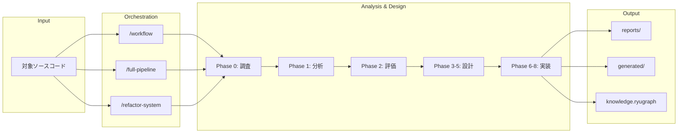

# Architecture Redesign Agent ドキュメント

**architecture-redesign-agent** は、Claude Code 上で動作するレガシーシステム分析・マイクロサービスリファクタリングエージェントシステムです。37のスキル（Skills）を備え、既存のコードベースを調査・分析・評価し、DDD（Domain-Driven Design）とマイクロサービスアーキテクチャに基づくリファクタリング計画・コード生成までを一貫して実行できます。

## ドキュメント一覧

| ドキュメント | 対象読者 | 内容 |
|------------|---------|------|
| [クイックスタートガイド](getting-started.md) | 入門者 | セットアップから初回実行まで |
| [システムアーキテクチャ](architecture.md) | 上級者 | 内部構造・設計思想の詳細解説 |
| [スキルリファレンス](skill-reference.md) | 全員 | 全37スキルの一覧と詳細 |
| [パイプライン実行ガイド](pipeline-guide.md) | 全員 | フェーズ構成・実行方法・再開方法 |
| [高度な使い方](advanced-usage.md) | 上級者 | グラフ活用・評価フレームワーク・拡張方法 |

## 全体像



## はじめ方

最も簡単な使い方は、Claude Code のターミナルで以下を実行することです：

```bash
# 対話的に処理を選択
/workflow ./path/to/source

# または、全フェーズを一括実行
/full-pipeline ./path/to/source
```

詳しくは [クイックスタートガイド](getting-started.md) をご覧ください。
