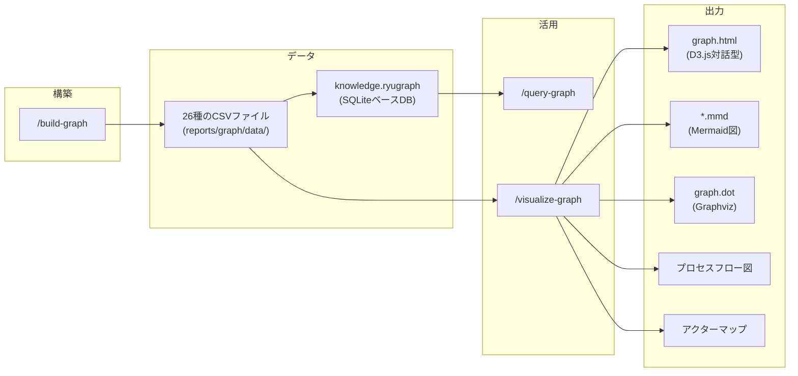

# 高度な使い方

ナレッジグラフの活用、評価フレームワークの詳細、スキルのカスタマイズ方法など、上級者向けのトピックを解説します。

## ナレッジグラフの活用

### 概要

ナレッジグラフは、分析結果をグラフデータベース（RyuGraph）に格納し、エンティティ間の関係を探索・可視化できる機能です。



### グラフ構築

```bash
/build-graph ./src
```

以下の情報がグラフに格納されます：

| ノードタイプ | 抽出元 | 例 |
|------------|--------|-----|
| Domain | ドメインマッピング | OrderManagement, CustomerManagement |
| Entity | DDD分析 | Order, OrderItem, Customer |
| Method | コード解析 | createOrder(), save() |
| File | ファイル構造 | OrderService.java |
| Term | ユビキタス言語 | 注文, 顧客, 商品 |
| Actor | アクター分析 | Customer, Admin, System |
| Role | 権限分析 | ROLE_CUSTOMER, ROLE_ADMIN |
| BusinessProcess | プロセス分析 | 注文作成プロセス |
| Activity | アクティビティ | 注文リクエスト受信, 注文確定 |
| SystemProcess | システム処理 | OrderPersistence, OrderValidation |

### 自然言語クエリ

```bash
/query-graph "Orderエンティティに関連する全てのエンティティを表示"
/query-graph "CustomerアクターがPERFORMSするアクティビティの一覧"
/query-graph "注文作成プロセスに含まれるアクティビティとその順序"
```

### 可視化

```bash
/visualize-graph
```

生成されるファイル：

| ファイル | 形式 | 用途 |
|---------|------|------|
| `graph.html` | HTML (D3.js) | ブラウザでインタラクティブ操作（検索、フィルタ、ズーム、ドラッグ） |
| `graph.mmd` | Mermaid | ドキュメント埋め込み用の全体グラフ |
| `graph.dot` | DOT | Graphvizでの高品質画像生成 |
| `domain-*.mmd` | Mermaid | ドメイン別のサブグラフ |
| `call-graph.mmd` | Mermaid | メソッド呼び出し関係 |
| `processes/*.mmd` | Mermaid | ビジネスプロセスフロー |
| `actors/*.mmd` | Mermaid | アクター-アクティビティマップ |

#### HTMLビューアの操作

`graph.html` をブラウザで開くと、D3.js の力学シミュレーションベースのグラフビューアが利用できます：

- **検索**: ノード名で検索してハイライト表示
- **フィルタ**: ノードタイプ別に表示/非表示を切り替え
- **ズーム**: マウスホイールで拡大・縮小
- **ドラッグ**: ノードをドラッグして配置を調整
- **ツールチップ**: ノードにホバーすると詳細情報を表示

#### DOT → PNG 変換

```bash
dot -Tpng reports/graph/visualizations/graph.dot -o graph.png
```

## 評価フレームワーク

### MMI（Modularity Maturity Index）

2つのバリアントで評価できます。

#### バリアントA: 4軸定性評価（`/evaluate-mmi`）

手動の定性評価で、マイクロサービス移行準備度を判定します。

| 軸 | 重み | 評価観点 |
|----|------|----------|
| **Cohesion（凝集度）** | 30% | 単一責任原則の遵守度、モジュール内の機能的凝集度 |
| **Coupling（結合度）** | 30% | 他モジュールへの依存度、インターフェースの明確さ |
| **Independence（独立性）** | 20% | 独立デプロイ・スケーリング可能性 |
| **Reusability（再利用性）** | 20% | 他ドメインでの再利用可能性 |

**スコア計算式**:
```
MMI = (0.3 * Cohesion + 0.3 * Coupling + 0.2 * Independence + 0.2 * Reusability) / 5 * 100
```

| スコア | レベル | 意味 |
|--------|--------|------|
| 80-100 | High | マイクロサービス化準備完了 |
| 60-80 | Medium | 軽微なリファクタリングで移行可能 |
| 40-60 | Low-Medium | 大幅なリファクタリングが必要 |
| 0-40 | Immature | 全面再設計が必要 |

#### バリアントB: Lilienthal 3軸定量評価（`/mmi-analyzer`）

Dr. Carola Lilienthal の手法に基づく自動定量評価です。Pythonプロジェクト向け。

| カテゴリ | 重み | 主な評価対象 |
|---------|------|------------|
| **Modularity（モジュール性）** | 45% | モジュール分割、インターフェース、プロポーション |
| **Hierarchy（階層性）** | 30% | レイヤー違反、循環依存 |
| **Pattern Consistency（パターン一貫性）** | 25% | パターン適用率、DDD分離 |

**スコア計算式**:
```
MMI = Modularity * 0.45 + Hierarchy * 0.30 + Pattern * 0.25
```

| スコア | レベル | 意味 |
|--------|--------|------|
| 8-10 | Good | 技術的負債が少ない |
| 4-8 | Warning | 段階的リファクタリングを推奨 |
| 0-4 | Critical | リファクタリング vs 置換の判断が必要 |

#### 使い分け

| 観点 | バリアントA (`/evaluate-mmi`) | バリアントB (`/mmi-analyzer`) |
|------|------------------------------|-------------------------------|
| 対象言語 | 言語非依存 | Python専用 |
| 評価方法 | 手動定性評価 | 自動定量評価 |
| 結果用途 | マイクロサービス移行判断 | 技術的負債の数値化 |
| スコア範囲 | 0-100 | 0-10 |

両方を実行し、`/integrate-evaluations` で結果を統合することを推奨します。

### DDD評価

`/ddd-evaluation` は以下の観点で評価します。

**戦略的設計:**
- 境界コンテキスト（Bounded Context）の明確さ
- ユビキタス言語（Ubiquitous Language）のコードとの一貫性
- コンテキストマップ（Context Map）の定義状態
- コンテキスト間関係パターン（Shared Kernel / Customer-Supplier / ACL）

**戦術的設計:**
- エンティティ（Entity）のID識別とライフサイクル管理
- 値オブジェクト（Value Object）の不変性とバリデーション
- 集約（Aggregate）のトランザクション境界
- リポジトリ（Repository）のドメイン層/インフラ層分離
- ドメインサービス（Domain Service）の配置

### ドメイン分類マトリクス

`/map-domains` では、ドメインを2つの軸で分類します。

**ビジネス構造軸:**

| タイプ | 特徴 | 例 |
|--------|------|-----|
| Pipeline | 順次的なデータ/プロセスフロー | 注文処理、ワークフロー |
| Blackboard | 共有データに対する協調作業 | 在庫管理、監査 |
| Dialogue | 双方向の対話・インタラクション | チャット、承認フロー |

**マイクロサービス境界軸:**

| タイプ | 特徴 | トランザクション |
|--------|------|-----------------|
| Process | ビジネスプロセス実行 | Saga/2PC |
| Master | マスターデータ管理 | CRUD中心 |
| Integration | 外部システム連携 | アダプター |
| Supporting | 横断的関心事 | 軽量 |

## ScalarDBエディション選定

### 3つのエディション

| 機能 | OSS/Community | Enterprise Standard | Enterprise Premium |
|------|---------------|--------------------|--------------------|
| ライセンス | Apache 2.0 | 商用 | 商用 (AWS Marketplace) |
| デプロイ | 組み込み (Javaライブラリ) | ScalarDB Cluster | ScalarDB Cluster |
| SQL Interface | なし | あり | あり |
| Spring Data JDBC | なし | あり | あり |
| GraphQL | なし | なし | あり |
| 認証・認可 | なし | あり | あり |
| ScalarDB Analytics | なし | あり | あり |

### 選定フロー

```bash
/select-scalardb-edition
```

対話形式で以下を確認し、最適なエディションを選定します：
1. SQL Interface が必要か
2. GraphQL が必要か
3. 分散デプロイ（Cluster）が必要か
4. 認証・認可が必要か
5. 商用サポートが必要か

選定結果は `work/{project}/scalardb-edition-config.md` に保存され、以降のScalarDB関連スキルが自動的に参照します。

## カスタムスキルの追加

### スキル定義ファイルの構造

新しいスキルは `.claude/skills/{skill-name}/SKILL.md` にファイルを作成するだけで追加できます。

```markdown
---
name: my-custom-skill
description: カスタムスキルの説明
user_invocable: true
---

# My Custom Skill

## 概要
このスキルの目的

## 使用方法
/my-custom-skill [引数]

## 実行プロンプト

あなたは...エージェントです。以下のステップを実行してください：

### Step 0: 前提条件チェック
[前提条件の検証ロジック]

### Step 1: データ収集
[Task(Explore) でコードベース探索]

### Step 2: 分析・生成
[メインの処理ロジック]

### Step 3: 出力
[ファイル出力の指示]

## 出力ファイル
- `reports/xx_custom/output.md`
```

### ベストプラクティス

1. **Step 0 で前提条件を検証する**: 必須入力ファイルの存在確認
2. **サブエージェントパターンを活用する**: Exploreエージェントでコンテキストを保護
3. **即時出力ルールに従う**: 各ステップ完了時にファイルを出力
4. **Markdownフロントマターを付与する**: `title`, `phase`, `skill`, `generated_at`
5. **Mermaidルールに従う**: 日本語テキストはダブルクオートで囲む

## 大規模コードベースでの実行Tips

### スコープを限定する

```bash
# 特定ドメインのみ分析
/full-pipeline ./src --domain=Order,Customer

# サブディレクトリに限定
/system-investigation ./src/main/java/com/example/order
```

### フェーズを分割する

大規模プロジェクトでは全フェーズ一括ではなく、段階的に実行することをおすすめします。

```bash
# Step 1: まず調査と分析
/system-investigation ./src
/analyze-system ./src

# Step 2: 結果を確認してから評価
/evaluate-mmi ./src
/ddd-evaluation ./src
/integrate-evaluations ./src

# Step 3: 評価結果を確認してから設計
/ddd-redesign ./src
/design-microservices ./src
```

### サブエージェントのスコープ指示

大規模コードベースでは、サブエージェントに「主要なファイルを最大20件調査」等のサンプリング指示を行うことで、コンテキストの肥大化を防ぎます。

## トラブルシューティング

### Python環境のエラー

**症状**: `ModuleNotFoundError: No module named 'ryugraph'`

**解決方法**:
```bash
source .venv/bin/activate  # venvを使っている場合
pip install ryugraph pandas markdown pymdown-extensions radon networkx
```

### `python` コマンドが見つからない

**症状**: `command not found: python`

**解決方法**: macOSでは `python3` を使用してください。スクリプトは `python3` で実行されます。

### Mermaid CLIのエラー

**症状**: `mmdc: command not found`

**解決方法**:
```bash
npm install -g @mermaid-js/mermaid-cli
```

### Mermaidシンタックスエラー

**症状**: Mermaid図のレンダリングに失敗する

**解決方法**:
```bash
/fix-mermaid ./reports/  # 自動修正
```

よくある原因:
- 日本語テキストがダブルクオートで囲まれていない
- ノードIDが数字で始まっている
- サブグラフ名にスペースが含まれている（ダブルクオート必要）

### 前提条件チェックのエラー

**症状**: `必須ファイル reports/02_evaluation/mmi-overview.md が見つかりません`

**解決方法**: 前提となるフェーズを先に実行してください。

```bash
# 例: ddd-redesign の前に評価フェーズを実行
/evaluate-mmi ./src
/ddd-evaluation ./src
/integrate-evaluations ./src
```

### グラフ構築のエラー

**症状**: `/build-graph` でCSVの読み込みに失敗する

**解決方法**: 分析フェーズ（Phase 1）が正常に完了しているか確認してください。

```bash
ls reports/01_analysis/  # 出力ファイルの存在確認
```

### 中間状態の確認

パイプラインのデバッグには中間状態ファイルが役立ちます。

```bash
# 進捗状態
cat work/{project}/pipeline-progress.json

# 各フェーズの中間状態
cat work/{project}/{phase}/_state.md
```

### パイプラインのリセット

完全にやり直したい場合：

```bash
# 出力ファイルを削除
rm -rf reports/ generated/ work/ knowledge.ryugraph

# 出力ディレクトリを再初期化
/init-output ./reports

# パイプラインを再実行
/full-pipeline ./src
```
