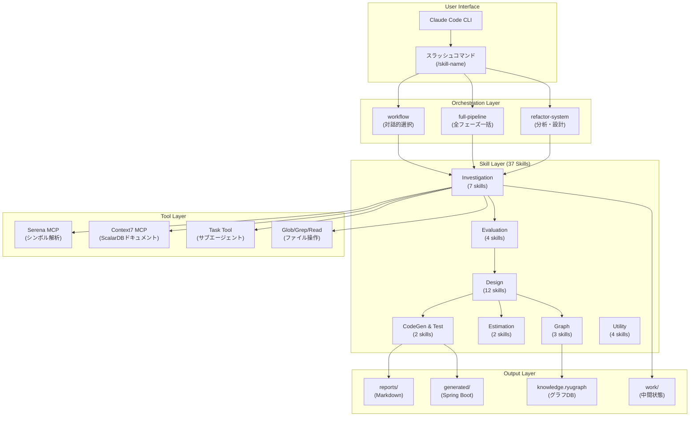
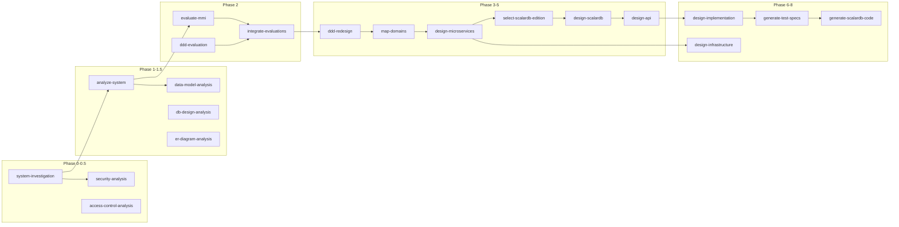
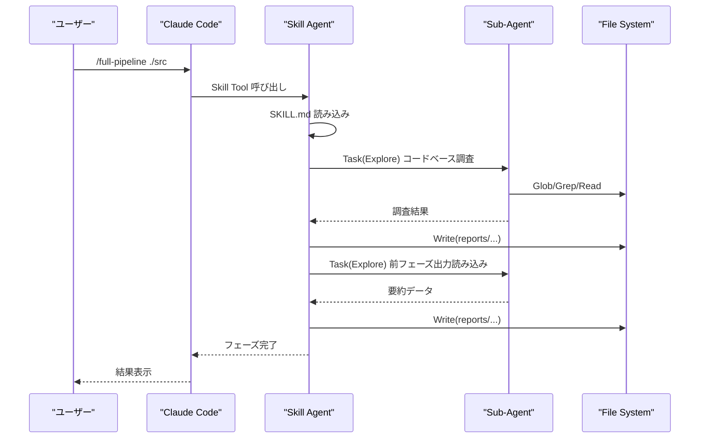
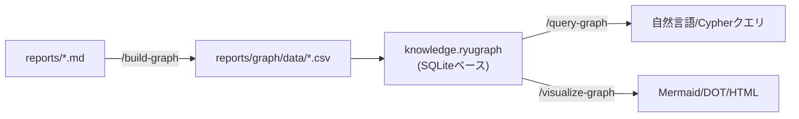

# システムアーキテクチャ

architecture-redesign-agent の内部構造と設計思想を解説します。

## 全体アーキテクチャ



## 3層スキルアーキテクチャ

スキルは3つの層に分類されます。

### Layer 1: オーケストレーションスキル（Orchestration）

複数のフェーズスキルを順番に呼び出す統括スキルです。

| スキル | 役割 | 特徴 |
|--------|------|------|
| `/workflow` | 対話的ワークフロー選択 | AskUserQuestion で実行タイプを質問 |
| `/full-pipeline` | 全フェーズ一括実行 | Phase 0〜13 を自動順次実行 |
| `/refactor-system` | 分析・設計の統合実行 | コード生成を除くフェーズを実行 |

### Layer 2: フェーズスキル（Phase-specific）

各分析・設計フェーズを担当する専門スキルです。27スキルが該当します。



### Layer 3: ユーティリティスキル（Utility）

パイプラインを補助するツール系スキルです。

| スキル | 役割 |
|--------|------|
| `/init-output` | 出力ディレクトリ構造の初期化 |
| `/compile-report` | Markdown → HTML統合レポート変換 |
| `/render-mermaid` | Mermaid図 → PNG/SVG画像変換 |
| `/fix-mermaid` | Mermaid図のシンタックスエラー検出・修正 |

## スキル定義の構造

各スキルは `.claude/skills/{skill-name}/SKILL.md` に定義されています。

### SKILL.md の構造

```markdown
---
name: skill-name
description: スキルの説明
user_invocable: true
---

# Skill Title

## 概要
スキルの目的と機能

## 前提条件
- 必須入力ファイル
- 推奨入力ファイル

## 使用方法
/skill-name [引数] [オプション]

## 実行プロンプト
エージェントへの詳細指示（Step 0〜N）

## 出力ファイル
生成されるファイル一覧
```

### フロントマター（YAML）

| フィールド | 型 | 説明 |
|-----------|-----|------|
| `name` | string | スキルの一意識別子 |
| `description` | string | スキルの概要説明 |
| `user_invocable` | boolean | `/skill-name` で直接呼び出し可能か |

## 実行モデル



### 実行フロー

1. **ユーザー入力**: `/skill-name [args]` でスキルを呼び出し
2. **スキル読み込み**: Claude Code が SKILL.md を読み込み、エージェントに指示
3. **前提条件チェック**: 必須入力ファイルの存在確認
4. **サブエージェント起動**: Task tool でExplore/Bash等のサブエージェントを並列起動
5. **データ収集**: コードベース探索、前フェーズ出力の読み込み
6. **分析・生成**: メインエージェントが結果を統合し、出力ファイルを生成
7. **進捗更新**: `pipeline-progress.json` を更新
8. **即時出力**: 各ステップ完了時にファイルを即座に書き出し

## サブエージェントパターン

Task tool を使って起動するサブエージェントには8つの標準パターンがあります。

### Pattern 1: コードベース探索（Explore）

コードベースを直接スキャンし、メインエージェントのコンテキストを保護します。

```
Task(
  subagent_type="Explore",
  prompt="対象ディレクトリのコードベースを探索し、パッケージ構造を調査...",
  description="コードベース探索"
)
```

**使用スキル**: system-investigation, analyze-system, evaluate-mmi, ddd-evaluation 等

### Pattern 2: 前フェーズ出力読み込み（Explore）

前フェーズの出力ファイルを読み込み、必要な情報のみを抽出・要約します。

**使用スキル**: integrate-evaluations, ddd-redesign, design-microservices 等

### Pattern 3: 並列探索

複数のExploreエージェントを同時に起動し、異なる観点を同時に調査します。

```
# 1つのメッセージで複数のTask呼び出し
Task(subagent_type="Explore", prompt="パッケージ構造を調査...", description="構造調査")
Task(subagent_type="Explore", prompt="ドメイン用語を抽出...", description="用語抽出")
Task(subagent_type="Explore", prompt="外部連携を調査...", description="外部連携調査")
```

### その他のパターン

| Pattern | サブエージェント | 用途 |
|---------|----------------|------|
| Pattern 4 | Bash | Python スクリプト実行（グラフ構築、MMI計算） |
| Pattern 5 | general-purpose | 複雑な多段階タスク |
| Pattern 6 | Explore (Context7) | ScalarDB最新ドキュメント取得 |
| Pattern 7 | Explore (Serena) | シンボルレベルJavaコード解析 |
| Pattern 8 | Plan | 設計アプローチの検討 |

## 進捗管理

パイプラインの進捗は `work/{project}/pipeline-progress.json` で管理されます。

### スキーマ

```json
{
  "$schema": "progress-registry-v1",
  "project_name": "sample-project",
  "target_path": "./SampleCode/sample-project",
  "created_at": "2025-01-20T10:00:00Z",
  "updated_at": "2025-01-20T12:30:00Z",
  "phases": {
    "system-investigation": {
      "status": "completed",
      "started_at": "2025-01-20T10:00:00Z",
      "completed_at": "2025-01-20T10:30:00Z",
      "outputs": [
        "reports/before/sample-project/technology-stack.md",
        "reports/before/sample-project/codebase-structure.md"
      ]
    }
  }
}
```

### ステータス

| status | 意味 |
|--------|------|
| `pending` | 未実行 |
| `in_progress` | 実行中 |
| `completed` | 完了 |
| `skipped` | スキップ |
| `failed` | エラー |

### 再開（Resume）機能

`--resume-from=phase-N` を指定すると、指定フェーズの直前から再開します。完了済みフェーズの出力は再利用されます。

## ナレッジグラフ

分析結果をグラフデータベース（RyuGraph）に格納し、エンティティ間の関係を探索できます。

### データフロー



### ノードタイプ（10種）

| タイプ | 説明 | 例 |
|--------|------|-----|
| Domain | ビジネスドメイン | OrderManagement |
| Entity | DDDエンティティ | Order, OrderItem |
| Method | メソッド | createOrder(), save() |
| File | ソースファイル | OrderService.java |
| Term | ユビキタス言語の用語 | 注文, 顧客 |
| Actor | アクター | Customer, Admin |
| Role | システムロール | ROLE_CUSTOMER |
| BusinessProcess | ビジネスプロセス | 注文作成プロセス |
| Activity | アクティビティ | 注文リクエスト受信 |
| SystemProcess | システムプロセス | OrderPersistence |

### リレーションタイプ（17種）

BELONGS_TO, DEFINED_IN, METHOD_DEFINED_IN, REFERENCES, CALLS, IMPLEMENTS, HAS_TERM, METHOD_HAS_TERM, HAS_ROLE, HAS_ACTIVITY, NEXT_ACTIVITY, PERFORMS, TRIGGERS, INVOKES, PARTICIPATES_IN 等

## MCP統合

### Serena MCP

Javaコードのシンボルレベル解析に使用します。

- **シンボル探索**: クラス、メソッド、フィールドの定義を検索
- **参照解析**: シンボルの参照元を追跡
- **シンボル編集**: コード生成時の精密な編集

設定ファイル: `.serena/project.yml`

### Context7 MCP

ScalarDBの最新ドキュメントをリアルタイムに取得します。

```
Library ID: /llmstxt/scalardb_scalar-labs_llms-full_txt
```

**使用スキル**: design-scalardb, generate-scalardb-code, review-scalardb 等

## 出力規約

### ファイル命名規則

- **小文字ケバブケース**: `ubiquitous-language.md`, `mmi-overview.md`
- **サフィックス**: `-analysis.md`（分析）、`-evaluation.md`（評価）、`-design.md`（設計）、`-specs.md`（仕様）

### Markdownフロントマター

各出力ファイルの先頭にメタデータを付与：

```yaml
---
title: ドキュメントタイトル
phase: "Phase 2: Evaluation"
skill: evaluate-mmi
generated_at: 2025-01-20T10:30:00Z
input_files:
  - reports/01_analysis/ubiquitous-language.md
---
```

### 即時出力ルール

各ステップ完了時に即座にファイルを出力します。全ステップ完了後にまとめて出力することはしません。これにより、パイプラインが途中で中断しても途中成果物が残ります。

### Mermaid図の規約

- 日本語テキストは必ずダブルクオートで囲む: `A["注文作成"]`
- HTMLタグ（`<br/>`等）はダブルクオート必須
- サブグラフ名はダブルクオートで囲む: `subgraph "Phase 1"`
- ノードIDは英数字のみ（数字始まり不可）

詳細: `.claude/rules/mermaid-best-practices.md`
