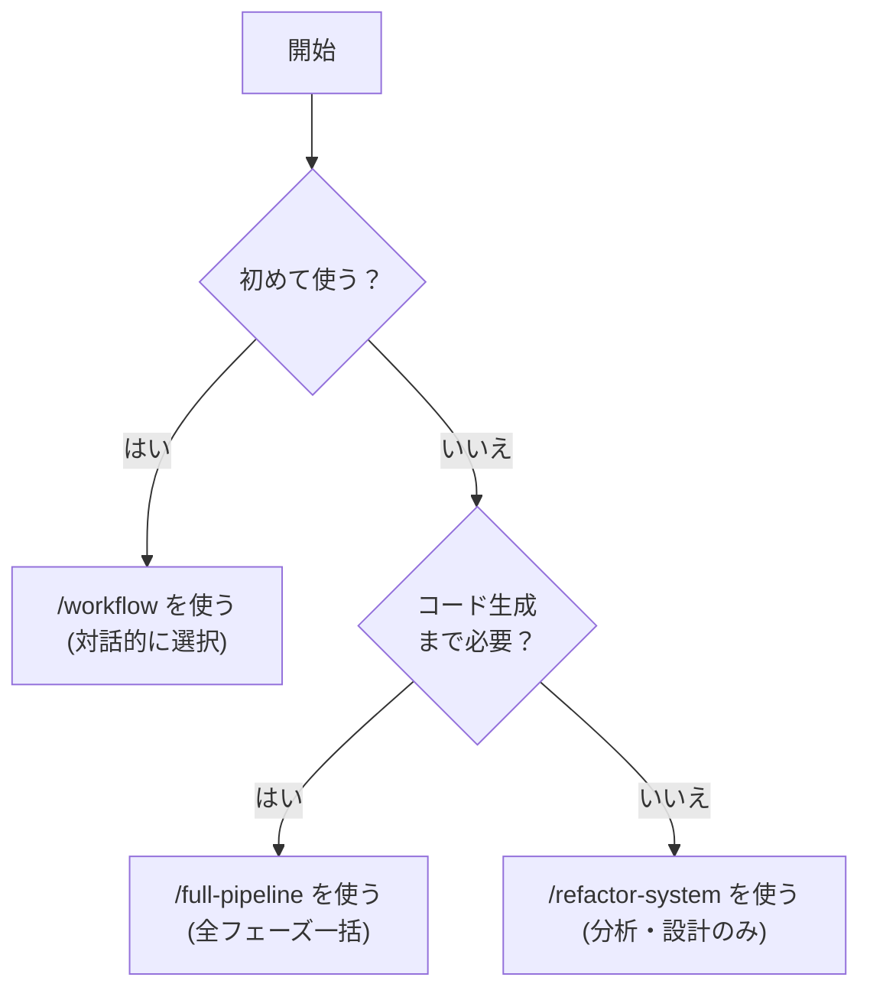
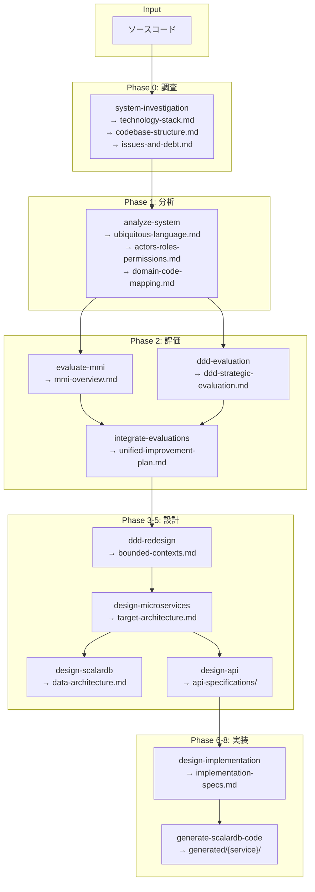

# パイプライン実行ガイド

rearchitect-agent のパイプライン（フェーズ構成）と実行方法を解説します。

## 3つのオーケストレーション方法

| 方法 | コマンド | 用途 | 特徴 |
|------|---------|------|------|
| **対話的選択** | `/workflow` | 必要な処理のみ実行したいとき | 4つの実行タイプから選択 |
| **完全パイプライン** | `/full-pipeline` | 全フェーズを一括実行したいとき | Phase 0〜13の26+フェーズを自動実行 |
| **分析・設計のみ** | `/refactor-system` | コード生成不要のとき | 分析→評価→設計まで |

### どれを使うべきか？



## full-pipeline のフェーズ一覧

`/full-pipeline` は以下のフェーズを順番に実行します。

### Phase 0: システム調査

| フェーズ | スキル | 出力先 | 内容 |
|---------|--------|--------|------|
| 0 | `/system-investigation` | `reports/before/{project}/` | 構造・技術スタック・問題点調査 |
| 0.5a | `/security-analysis` | `reports/before/{project}/` | OWASP Top 10・ゼロトラスト準備度 |
| 0.5b | `/access-control-analysis` | `reports/before/{project}/` | アクセス制御・ゼロトラスト分析 |

### Phase 1: 分析

| フェーズ | スキル | 出力先 | 内容 |
|---------|--------|--------|------|
| 1 | `/analyze-system` | `reports/01_analysis/` | ユビキタス言語・アクター・ドメインマッピング |
| 1.5a | `/data-model-analysis` | `reports/01_analysis/` | エンティティ・リレーションシップ抽出 |
| 1.5b | `/db-design-analysis` | `reports/01_analysis/` | テーブル定義・インデックス分析 |
| 1.5c | `/er-diagram-analysis` | `reports/01_analysis/` | ER図生成 |

### Phase 2: 評価

| フェーズ | スキル | 出力先 | 内容 |
|---------|--------|--------|------|
| 2a | `/evaluate-mmi` | `reports/02_evaluation/` | MMI 4軸モジュール成熟度評価 |
| 2b | `/ddd-evaluation` | `reports/02_evaluation/` | DDD戦略的・戦術的設計評価 |
| 2.5 | `/integrate-evaluations` | `reports/02_evaluation/` | MMI+DDD統合改善計画 |

### Phase 3-5: 設計

| フェーズ | スキル | 出力先 | 内容 |
|---------|--------|--------|------|
| 3 | `/ddd-redesign` | `reports/03_design/` | 境界コンテキスト・集約再設計 |
| 4 | `/design-microservices` | `reports/03_design/` | ターゲットアーキテクチャ策定 |
| 4.7 | `/select-scalardb-edition` | `work/{project}/` | ScalarDBエディション選定 |
| 4.8 | `/design-scalardb-app-patterns` | `reports/03_design/` | ドメインタイプ別設計パターン |
| 5 | `/design-scalardb` | `reports/03_design/` | スキーマ・トランザクション設計 |
| 5.5 | `/design-scalardb-analytics` | `reports/03_design/` | Analytics基盤設計（optional） |
| 5.9 | `/review-scalardb --mode=design` | `reports/03_design/` | ScalarDB設計レビュー |
| 5.95 | `/design-api` | `reports/03_design/api-specifications/` | REST/GraphQL/gRPC/AsyncAPI仕様 |

### Phase 6-8: 実装・コード生成

| フェーズ | スキル | 出力先 | 内容 |
|---------|--------|--------|------|
| 6 | `/design-implementation` | `reports/06_implementation/` | AI向け詳細実装仕様 |
| 7 | `/generate-test-specs` | `reports/07_test-specs/` | BDD/ユニット/統合テスト仕様 |
| 8 | `/generate-scalardb-code` | `generated/{service}/` | Spring Boot コード生成 |
| 8.5 | `/review-scalardb --mode=code` | `reports/03_design/` | ScalarDBコードレビュー |
| 8.7 | `/design-infrastructure` | `reports/08_infrastructure/` | Kubernetes・IaC設計 |

### Phase 9-13: 見積もり・ドキュメント・グラフ

| フェーズ | スキル | 出力先 | 内容 |
|---------|--------|--------|------|
| 9 | `/estimate-cost` | `reports/05_estimate/` | インフラ・ライセンスコスト見積もり |
| 10 | `/create-domain-story` | `reports/04_stories/` | ドメインストーリー作成 |
| 11 | `/build-graph` | `reports/graph/` | ナレッジグラフ構築 |
| 12 | `/fix-mermaid` | （検証のみ） | Mermaid図シンタックス検証 |
| 13 | Executive Summary | `reports/00_summary/` | エグゼクティブサマリー生成 |

## フェーズ間データフロー



## オプションフラグ

`/full-pipeline` で使用可能なオプション：

| フラグ | 説明 | スキップされるフェーズ |
|--------|------|---------------------|
| `--skip-security` | セキュリティ分析をスキップ | Phase 0.5a, 0.5b |
| `--skip-data-model` | データモデル詳細分析をスキップ | Phase 1.5a, 1.5b, 1.5c |
| `--skip-analytics` | ScalarDB Analytics をスキップ | Phase 5.5 |
| `--skip-codegen` | コード生成をスキップ | Phase 8, 8.5 |
| `--skip-stories` | ドメインストーリーをスキップ | Phase 10 |
| `--skip-infrastructure` | インフラ設計をスキップ | Phase 8.7 |
| `--skip-graph` | グラフ構築をスキップ | Phase 11 |
| `--analyze-only` | 分析フェーズのみ実行 | Phase 3以降すべて |
| `--domain=Order,Customer` | 特定ドメインのみ対象 | - |
| `--resume-from=phase-N` | 指定フェーズから再開 | 完了済みフェーズ |

### 使用例

```bash
# 最小実行（セキュリティ・データモデル・ストーリー・インフラなし）
/full-pipeline ./src --skip-security --skip-data-model --skip-stories --skip-infrastructure

# 分析のみ
/full-pipeline ./src --analyze-only

# 特定ドメインに限定
/full-pipeline ./src --domain=Order

# Phase 6（実装設計）から再開
/full-pipeline ./src --resume-from=phase-6
```

## 中断と再開

### 進捗状態の確認

パイプラインの進捗は `work/{project}/pipeline-progress.json` に記録されています。

```bash
# 進捗ファイルの確認
cat work/{project}/pipeline-progress.json
```

各フェーズの `status` フィールドで状態を確認できます：
- `completed`: 完了（再実行不要）
- `in_progress`: 実行中（中断された可能性あり）
- `pending`: 未実行
- `skipped`: スキップ済み
- `failed`: エラー発生

### 再開方法

```bash
# 最後に成功したフェーズの次から再開
/full-pipeline ./src --resume-from=phase-6

# 特定のフェーズだけ再実行
/ddd-redesign ./src
```

再開時、完了済みフェーズの出力ファイル（`reports/` 内）はそのまま再利用されます。

## 個別フェーズ実行

パイプラインを使わず、特定のフェーズだけを実行することもできます。

### よくあるパターン

```bash
# パターン1: 調査と分析だけ
/system-investigation ./src
/analyze-system ./src

# パターン2: 評価だけ再実行
/evaluate-mmi ./src
/ddd-evaluation ./src
/integrate-evaluations ./src

# パターン3: 設計だけ再実行
/ddd-redesign ./src
/design-microservices ./src

# パターン4: グラフだけ構築・可視化
/build-graph ./src
/visualize-graph

# パターン5: レポートだけ再生成
/compile-report
```

### 注意事項

個別フェーズを実行する場合、前提となるフェーズの出力ファイルが `reports/` に存在する必要があります。例えば `/ddd-redesign` を実行するには、Phase 2（評価）の出力が必要です。

前提ファイルが不足している場合、スキルは Step 0（前提条件検証）でエラーを報告します。
