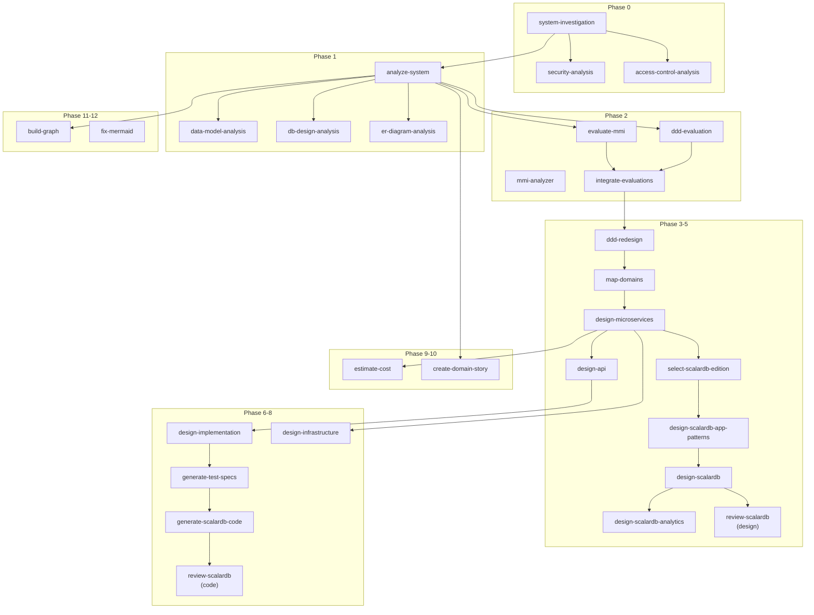

# スキルリファレンス

rearchitect-agent が備える全37スキルの一覧と詳細です。各スキルは Claude Code のスラッシュコマンド `/skill-name` で呼び出せます。

## カテゴリ一覧

| カテゴリ | スキル数 | 概要 |
|---------|---------|------|
| [Orchestration（統括）](#orchestration統括) | 3 | 複数フェーズの統合実行 |
| [Investigation（調査）](#investigation調査) | 7 | コードベース・セキュリティ・データの調査 |
| [Evaluation（評価）](#evaluation評価) | 4 | MMI/DDD評価・統合改善計画 |
| [Design（設計）](#design設計) | 12 | DDD再設計・アーキテクチャ・データ・API設計 |
| [Code Generation & Test（実装）](#code-generation--test実装) | 2 | コード生成・テスト仕様 |
| [Estimation（見積もり）](#estimation見積もり) | 2 | コスト・サイジング見積もり |
| [Knowledge Graph（グラフ）](#knowledge-graphグラフ) | 3 | グラフ構築・クエリ・可視化 |
| [Utility（ユーティリティ）](#utilityユーティリティ) | 4 | レポート・Mermaid・初期化 |

---

## Orchestration（統括）

### `/workflow` — インタラクティブワークフロー選択

| 項目 | 内容 |
|------|------|
| **概要** | 実行したい処理を対話的に選択して段階的に実行 |
| **入力** | `./path/to/source`（任意） |
| **出力先** | 選択したフェーズに応じて異なる |
| **特徴** | AskUserQuestion で4つの実行タイプから選択 |

```bash
/workflow ./src
```

### `/full-pipeline` — 完全パイプライン実行

| 項目 | 内容 |
|------|------|
| **概要** | 調査から設計・コード生成まで全26+フェーズを一括実行 |
| **入力** | `./path/to/source`（必須） |
| **出力先** | `reports/`, `generated/`, `knowledge.ryugraph` |
| **オプション** | `--skip-*`, `--resume-from`, `--domain=`, `--analyze-only` |

```bash
/full-pipeline ./src
/full-pipeline ./src --skip-security --skip-analytics
/full-pipeline ./src --resume-from=phase-6
```

### `/refactor-system` — 統合リファクタリング分析・設計

| 項目 | 内容 |
|------|------|
| **概要** | 分析・評価・設計を統合実行（コード生成なし） |
| **入力** | `./path/to/source`（必須） |
| **出力先** | `reports/` |
| **オプション** | `--analyze-only`, `--skip-mmi`, `--domain=` |

```bash
/refactor-system ./src
```

---

## Investigation（調査）

### `/system-investigation` — システム調査

| 項目 | 内容 |
|------|------|
| **概要** | コードベースの構造・技術スタック・問題点・DDD適合性を調査 |
| **入力** | 対象ソースコードディレクトリ |
| **出力先** | `reports/before/{project}/` |
| **出力ファイル** | technology-stack.md, codebase-structure.md, issues-and-debt.md, ddd-readiness.md, investigation-summary.md |

### `/security-analysis` — セキュリティ分析

| 項目 | 内容 |
|------|------|
| **概要** | OWASP Top 10 対応状況・ゼロトラスト準備度を評価 |
| **入力** | 対象ソースコードディレクトリ |
| **出力先** | `reports/before/{project}/` |
| **依存** | system-investigation の後に実行推奨 |

### `/access-control-analysis` — アクセス制御分析

| 項目 | 内容 |
|------|------|
| **概要** | ゼロトラストモデルに基づくアクセス制御の現状分析と移行準備評価 |
| **入力** | 対象ソースコードディレクトリ |
| **出力先** | `reports/before/{project}/` |

### `/analyze-system` — システム分析

| 項目 | 内容 |
|------|------|
| **概要** | ユビキタス言語、アクター、ロール、権限、ドメイン-コード対応表を抽出 |
| **入力** | 対象ソースコードディレクトリ |
| **出力先** | `reports/01_analysis/` |
| **出力ファイル** | system-overview.md, ubiquitous-language.md, actors-roles-permissions.md, domain-code-mapping.md |

### `/data-model-analysis` — データモデル分析

| 項目 | 内容 |
|------|------|
| **概要** | エンティティ・リレーションシップ・ドメインルールを抽出 |
| **入力** | 対象ソースコードディレクトリ |
| **出力先** | `reports/01_analysis/` |

### `/db-design-analysis` — DB設計分析

| 項目 | 内容 |
|------|------|
| **概要** | テーブル定義、インデックス、制約、正規化状態を分析 |
| **入力** | 対象ソースコードディレクトリ |
| **出力先** | `reports/01_analysis/` |

### `/er-diagram-analysis` — ER図分析

| 項目 | 内容 |
|------|------|
| **概要** | 現行システムのER図をMermaid形式で生成・可視化 |
| **入力** | 対象ソースコードディレクトリ |
| **出力先** | `reports/01_analysis/` |

---

## Evaluation（評価）

### `/evaluate-mmi` — MMI評価（4軸定性）

| 項目 | 内容 |
|------|------|
| **概要** | Cohesion/Coupling/Independence/Reusability の4軸でモジュール成熟度を評価 |
| **入力** | 対象ソースコードディレクトリ |
| **出力先** | `reports/02_evaluation/` |
| **出力ファイル** | mmi-overview.md, mmi-by-module.md, mmi-improvement-plan.md |
| **スコア範囲** | 0-100（80+: High, 60-80: Medium, 40-60: Low-Medium, 0-40: Immature） |

### `/mmi-analyzer` — MMI自動定量評価（Lilienthal 3軸）

| 項目 | 内容 |
|------|------|
| **概要** | Pythonスクリプトによる自動定量評価（Modularity/Hierarchy/Pattern Consistency） |
| **入力** | Pythonプロジェクトディレクトリ |
| **出力先** | `reports/02_evaluation/` |
| **スコア範囲** | 0-10（8+: Good, 4-8: Warning, 0-4: Critical） |
| **注意** | Python プロジェクト専用 |

### `/ddd-evaluation` — DDD評価

| 項目 | 内容 |
|------|------|
| **概要** | 戦略的設計（境界コンテキスト、ユビキタス言語）と戦術的設計（エンティティ、値オブジェクト）の評価 |
| **入力** | 対象ソースコードディレクトリ |
| **出力先** | `reports/02_evaluation/` |

### `/integrate-evaluations` — 評価統合

| 項目 | 内容 |
|------|------|
| **概要** | MMI評価とDDD評価の結果を統合し、優先度付き改善計画を策定 |
| **入力** | `reports/02_evaluation/` の各評価ファイル |
| **出力先** | `reports/02_evaluation/` |
| **依存** | evaluate-mmi, ddd-evaluation の完了が必要 |

---

## Design（設計）

### `/ddd-redesign` — DDD再設計

| 項目 | 内容 |
|------|------|
| **概要** | 境界コンテキスト・集約・値オブジェクトの再設計計画を生成 |
| **入力** | 評価結果（`reports/02_evaluation/`） |
| **出力先** | `reports/03_design/` |

### `/map-domains` — ドメインマッピング

| 項目 | 内容 |
|------|------|
| **概要** | ドメイン分類（Pipeline/Blackboard/Dialogue）、コンテキストマップ作成 |
| **入力** | DDD再設計結果 |
| **出力先** | `reports/03_design/` |

### `/design-microservices` — マイクロサービス設計

| 項目 | 内容 |
|------|------|
| **概要** | ターゲットアーキテクチャ、変換計画、運用計画の策定 |
| **入力** | ドメインマッピング結果 |
| **出力先** | `reports/03_design/` |

### `/select-scalardb-edition` — ScalarDBエディション選定

| 項目 | 内容 |
|------|------|
| **概要** | 対話形式でOSS/Enterprise Standard/Enterprise Premiumから最適エディションを選定 |
| **入力** | プロジェクト要件（対話で収集） |
| **出力先** | `work/{project}/scalardb-edition-config.md` |
| **特徴** | 以降のScalarDB関連スキルが参照 |

### `/design-scalardb-app-patterns` — ScalarDBアプリケーション設計パターン

| 項目 | 内容 |
|------|------|
| **概要** | ドメインタイプ別（Process/Master/Integration/Supporting）の設計パターン選択 |
| **入力** | エディション設定、マイクロサービス設計結果 |
| **出力先** | `reports/03_design/` |

### `/design-scalardb` — ScalarDBデータアーキテクチャ

| 項目 | 内容 |
|------|------|
| **概要** | 分散トランザクション設計、スキーマ定義、マルチストレージ構成 |
| **入力** | エディション設定、アプリケーション設計パターン |
| **出力先** | `reports/03_design/` |

### `/design-scalardb-analytics` — ScalarDB Analytics設計

| 項目 | 内容 |
|------|------|
| **概要** | Apache Sparkを使用した分析基盤の設計（Enterprise版のみ） |
| **入力** | ScalarDBデータアーキテクチャ |
| **出力先** | `reports/03_design/` |

### `/review-scalardb` — ScalarDBレビュー

| 項目 | 内容 |
|------|------|
| **概要** | 設計レビュー（`--mode=design`）またはコードレビュー（`--mode=code`） |
| **入力** | 設計ドキュメントまたは生成コード |
| **出力先** | `reports/03_design/` |

### `/design-api` — API設計

| 項目 | 内容 |
|------|------|
| **概要** | REST/GraphQL/gRPC/AsyncAPIの仕様書を生成 |
| **入力** | マイクロサービス設計結果 |
| **出力先** | `reports/03_design/api-specifications/` |

### `/design-implementation` — 実装設計

| 項目 | 内容 |
|------|------|
| **概要** | AIコーディングエージェント向けの詳細実装仕様を生成 |
| **入力** | 設計ドキュメント一式 |
| **出力先** | `reports/06_implementation/` |

### `/design-infrastructure` — インフラ基盤設計

| 項目 | 内容 |
|------|------|
| **概要** | Kubernetes・IaC構成（Terraform/Helm/Kustomize/OpenShift） |
| **入力** | マイクロサービス設計結果 |
| **出力先** | `reports/08_infrastructure/`, `generated/infrastructure/` |

### `/create-domain-story` — ドメインストーリー作成

| 項目 | 内容 |
|------|------|
| **概要** | ドメインストーリーテリングでビジネスプロセスを可視化（対話形式） |
| **入力** | `--domain=Order` 等でドメイン指定 |
| **出力先** | `reports/04_stories/` |

---

## Code Generation & Test（実装）

### `/generate-test-specs` — テスト仕様生成

| 項目 | 内容 |
|------|------|
| **概要** | BDDシナリオ・ユニットテスト・統合テストの仕様を生成 |
| **入力** | 実装仕様（`reports/06_implementation/`） |
| **出力先** | `reports/07_test-specs/` |

### `/generate-scalardb-code` — ScalarDBコード生成

| 項目 | 内容 |
|------|------|
| **概要** | ScalarDB/Spring Bootのコード（エンティティ、リポジトリ、サービス等）を自動生成 |
| **入力** | 設計仕様、エディション設定 |
| **出力先** | `generated/{service}/` |

---

## Estimation（見積もり）

### `/estimate-cost` — コスト見積もり

| 項目 | 内容 |
|------|------|
| **概要** | クラウドインフラ・ScalarDB・その他ライセンスの月額コスト見積もり |
| **入力** | 設計ドキュメント（`reports/`） |
| **出力先** | `reports/05_estimate/` |

### `/scalardb-sizing-estimator` — ScalarDBサイジング見積もり

| 項目 | 内容 |
|------|------|
| **概要** | Cluster構成のPod数・ノードサイジング・コスト見積もり（対話形式） |
| **入力** | ワークロード情報（対話で収集） |
| **出力先** | `reports/sizing-estimates/` |

---

## Knowledge Graph（グラフ）

### `/build-graph` — グラフ構築

| 項目 | 内容 |
|------|------|
| **概要** | 分析結果からRyuGraphデータベースを構築 |
| **入力** | `reports/01_analysis/` のCSV/Markdownデータ |
| **出力先** | `knowledge.ryugraph`, `reports/graph/data/` |

### `/query-graph` — グラフ探索

| 項目 | 内容 |
|------|------|
| **概要** | 自然言語またはCypherでグラフを探索 |
| **入力** | クエリ文字列 |
| **出力** | 検索結果（関連エンティティ、関係性） |

```bash
/query-graph "Orderエンティティに関連する全てのエンティティを表示"
```

### `/visualize-graph` — グラフ可視化

| 項目 | 内容 |
|------|------|
| **概要** | Mermaid/DOT/HTML形式でグラフを可視化 |
| **入力** | `reports/graph/data/` のCSVデータ |
| **出力先** | `reports/graph/visualizations/` |
| **出力形式** | graph.html（D3.js対話型）、graph.mmd、graph.dot、プロセスフロー図、アクターマップ等 |

---

## Utility（ユーティリティ）

### `/init-output` — 出力ディレクトリ初期化

| 項目 | 内容 |
|------|------|
| **概要** | `reports/` の標準ディレクトリ構造を作成 |

### `/compile-report` — レポートコンパイル

| 項目 | 内容 |
|------|------|
| **概要** | `reports/` 内のMarkdownファイルを統合HTMLレポートに変換 |
| **出力先** | `reports/00_summary/full-report.html` |

### `/render-mermaid` — Mermaidレンダリング

| 項目 | 内容 |
|------|------|
| **概要** | Mermaid図をPNG/SVG/PDF画像に変換 |
| **依存** | `@mermaid-js/mermaid-cli` (mmdc) |

### `/fix-mermaid` — Mermaid修正

| 項目 | 内容 |
|------|------|
| **概要** | Mermaid図のシンタックスエラーを検出・修正 |
| **入力** | Mermaid図を含むMarkdownファイル |

---

## スキル依存関係図


